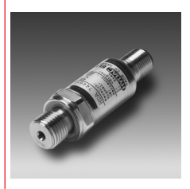
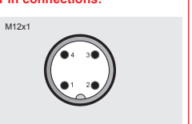
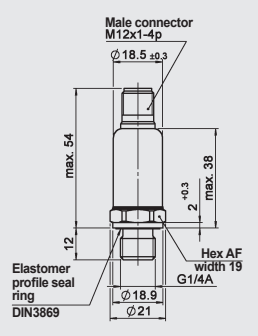

[table_1][{0: 'combines excellent technical data with highly  compact design. The HDA 7446 was specifically developed  for OEM applications, especially for use  in confined cavities. A sensor cell with a  thin-film strain gauge on a stainless steel  membrane is the basis for a robust, long-life  pressure transmitter. Various pressure ranges between  0 .. 40 bar and 0 .. 1000 bar provide  versatility when adapting to particular  applications. For integration into controls (e.g. with PLC),  the analogue output signals 4 .. 20 mA  or 0 .. 10 V are available on the standard  version.'}][/table_1]

Pressure Transmitter

 HDA 7446 Relative pressure **Accuracy 0.5 %**

21

1

EN 18.326.3/02.18

[table_0][{0: 'Technical data: Input data Measuring ranges bar', 1: '40', 2: '60', 3: '100', 4: '250', 5: '400', 6: '600', 7: '1000', 8: ''}, {0: 'Overload pressures', 1: 'bar', 2: '80', 3: '120', 4: '200', 5: '500', 6: '800', 7: '1000', 8: '1600'}, {0: 'Burst pressure', 1: 'bar', 2: '200', 3: '300', 4: '500', 5: '1000', 6: '2000', 7: '2000', 8: '3000'}, {0: 'Mechanical connection', 1: 'G1/4 A ISO 1179-2', 2: '', 3: '', 4: '', 5: '', 6: '', 7: '', 8: ''}, {0: 'Tightening torque, recommended', 1: '20 Nm', 2: '', 3: '', 4: '', 5: '', 6: '', 7: '', 8: ''}, {0: 'Parts in contact with fluid', 1: 'Mech. connection: Stainless steel Seal: FKM', 2: '', 3: '', 4: '', 5: '', 6: '', 7: '', 8: ''}, {0: 'Output data Output signal, permitted load resistance', 1: '4 .. 20 mA, 2-conductor RLmax. = (UB - 8 V) / 20 mA [kΩ] 0 .. 10 V, 3-conductor RLmin = 2 kΩ', 2: '', 3: '', 4: '', 5: '', 6: '', 7: '', 8: ''}, {0: 'Accuracy acc. to DIN 16086,', 1: '≤ ± 0.5 % FS typ.', 2: '', 3: '', 4: '', 5: '', 6: '', 7: '', 8: ''}, {0: 'terminal based', 1: '≤ ± 1 % FS max.', 2: '', 3: '', 4: '', 5: '', 6: '', 7: '', 8: ''}, {0: 'Accuracy, B.F.S.L.', 1: '≤ ± 0.25 % FS typ. ≤ ± 0.5 % FS max.', 2: '', 3: '', 4: '', 5: '', 6: '', 7: '', 8: ''}, {0: 'Temperature compensation', 1: '≤ ± 0.015 % FS / °C typ.', 2: '', 3: '', 4: '', 5: '', 6: '', 7: '', 8: ''}, {0: 'Zero point', 1: '≤ ± 0.025 % FS / °C max.', 2: '', 3: '', 4: '', 5: '', 6: '', 7: '', 8: ''}, {0: 'Temperature compensation', 1: '≤ ± 0.015 % FS / °C typ.', 2: '', 3: '', 4: '', 5: '', 6: '', 7: '', 8: ''}, {0: 'Span', 1: '≤ ± 0.025 % FS / °C max.', 2: '', 3: '', 4: '', 5: '', 6: '', 7: '', 8: ''}, {0: 'Non-linearity acc. to DIN 16086,', 1: '≤ ± 0.3 % FS max.', 2: '', 3: '', 4: '', 5: '', 6: '', 7: '', 8: ''}, {0: 'terminal based Hysteresis', 1: '≤ ± 0.4 % FS max.', 2: '', 3: '', 4: '', 5: '', 6: '', 7: '', 8: ''}, {0: 'Repeatability', 1: '≤ ± 0.1 % FS', 2: '', 3: '', 4: '', 5: '', 6: '', 7: '', 8: ''}, {0: 'Rise time', 1: '≤ 2 ms', 2: '', 3: '', 4: '', 5: '', 6: '', 7: '', 8: ''}, {0: 'Long-term drift', 1: '≤ ± 0.3 % FS typ. / year', 2: '', 3: '', 4: '', 5: '', 6: '', 7: '', 8: ''}, {0: 'Environmental conditions Compensated temperature range', 1: '-25 .. +85 °C', 2: '', 3: '', 4: '', 5: '', 6: '', 7: '', 8: ''}, {0: 'Operating temperature range1)', 1: '-40 .. +85 °C / -25 .. +85 °C', 2: '', 3: '', 4: '', 5: '', 6: '', 7: '', 8: ''}, {0: 'Storage temperature range', 1: '-40 .. +100 °C', 2: '', 3: '', 4: '', 5: '', 6: '', 7: '', 8: ''}, {0: 'Medium temperature range1)', 1: '-40 .. +100 °C / -25 .. +100 °C', 2: '', 3: '', 4: '', 5: '', 6: '', 7: '', 8: ''}, {0: '', 1: 'mark', 2: 'EN 61000-6-1 / 2 / 3 / 4', 3: '', 4: '', 5: '', 6: '', 7: '', 8: ''}, {0: '', 1: 'mark2)', 2: 'Certificate no.: E318391', 3: '', 4: '', 5: '', 6: '', 7: '', 8: ''}, {0: 'Vibration resistance acc. to', 1: '≤ 20 g', 2: '', 3: '', 4: '', 5: '', 6: '', 7: '', 8: ''}, {0: 'DIN EN 60068-2-6 at 10 .. 500 Hz Shock resistance acc. to DIN EN 60068-2-27', 1: '≤ 100 g / 6 ms', 2: '', 3: '', 4: '', 5: '', 6: '', 7: '', 8: ''}, {0: 'Protection class acc. to DIN EN 605293)', 1: 'IP 67', 2: '', 3: '', 4: '', 5: '', 6: '', 7: '', 8: ''}, {0: 'Other data Supply voltage', 1: '8 .. 30 V DC 2-conductor 12 .. 30 V DC 3-conductor', 2: '', 3: '', 4: '', 5: '', 6: '', 7: '', 8: ''}, {0: 'when applied acc. to UL specifications', 1: '- limited energy - acc. to 9.3 UL 61010; Class 2; UL 1310/1585; LPS UL 60950', 2: '', 3: '', 4: '', 5: '', 6: '', 7: '', 8: ''}, {0: 'Residual ripple of supply voltage', 1: '≤ 5 %', 2: '', 3: '', 4: '', 5: '', 6: '', 7: '', 8: ''}, {0: 'Current consumption', 1: '≤ 25 mA', 2: '', 3: '', 4: '', 5: '', 6: '', 7: '', 8: ''}, {0: 'Life expectancy4)', 1: '> 10 million cycles 0 .. 100 % FS', 2: '', 3: '', 4: '', 5: '', 6: '', 7: '', 8: ''}, {0: 'Weight', 1: '~ 60 g', 2: '', 3: '', 4: '', 5: '', 6: '', 7: '', 8: ''}, {0: 'Note:', 1: 'Reverse polarity protection of the supply voltage, excess voltage, override and short  circuit protection are provided. FS (Full Scale) = relative to complete measuring range', 2: '', 3: '', 4: '', 5: '', 6: '', 7: '', 8: ''}][/table_0]

Model code:
HDA 7 4 4 6 - X - XXX - 000 Mechanical connection 4 = G1/4 A ISO 1179-2 Electrical connection 6 = male M12x1, 4 pole (mating connector not supplied) Output signal A = 4 .. 20 mA, 2-conductor B = 0 .. 10 V, 3-conductor Measuring ranges in bar 040; 060; 100; 250; 400; 600; 1000 Modification number 000 = standard

[table_2][{0: 'Pin', 1: 'HDA 7446-A', 2: 'HDA 7446-B'}, {0: '1', 1: 'Signal +', 2: '+UB'}, {0: '2', 1: 'n.c.', 2: 'n.c.'}, {0: '3', 1: 'Signal -', 2: '0 V'}, {0: '4', 1: 'n.c.', 2: 'Signal'}][/table_2]

Accessories: Appropriate accessories, such as mating connectors, can be found in the Accessories brochure. 

Dimensions:

Note:
The information in this brochure relates to the operating conditions and applications described. For applications or operating conditions not described, please contact the relevant technical department. Subject to technical modifications. HYDAC ELECTRONIC GMBH Hauptstr. 27, 66128 Saarbrücken Germany Phone +49 (0)6897 509-01 Fax +49 (0)6897 509-1726 e-mail: electronic@hydac.com Internet: www.hydac.com EN 18.326.3/02.18