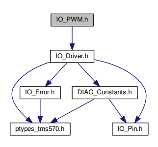

320 **7 File Documentation**
Remarks
- The parameters edge_count and inc_count are optional. If not needed, these parameters can be set to NULL **to ignore them.**

## 7.19 Io_Pwm.H File Reference

IO Driver functions for PWM channels. Include dependency graph for IO_PWM.h:

## Data Structures

- struct **io_pwm_current_queue_**
PWM current measurement queue.

- struct **io_pwm_safety_conf_**
Safety configuration for the PWM outputs.

## Typedefs

- typedef struct **io_pwm_current_queue_ IO_PWM_CURRENT_QUEUE**
PWM current measurement queue.

- typedef struct **io_pwm_safety_conf_ IO_PWM_SAFETY_CONF**
Safety configuration for the PWM outputs.