Bedienungsanleitung 
(Originalanleitung) 
Ölzustandssensor HYDACLAB **HLB 1400** 
Operating Instructions 
(Translation of original instructions) 
Oil Condition Sensor HYDACLAB **HLB 1400** 

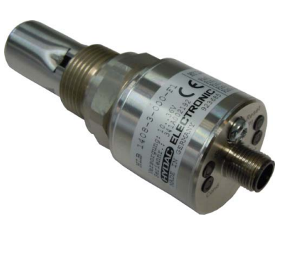

## Inhalt

[table_0][{0: 'A A STATE IN THE S', 1: ''}, {0: '1', 1: ''}, {0: '2', 1: 'Sicherheitshinweise'}, {0: '3', 1: 'Montage'}, {0: 'Begriffsbestimmung', 1: ''}, {0: '4', 1: ''}, {0: '5', 1: 'Funktionsweise'}, {0: 'SCHALTAUSGANG', 1: ''}, {0: '5.1', 1: ''}, {0: '5.2', 1: 'Analogausgang'}, {0: 'Übersicht der Kontroll-LEDs.', 1: ''}, {0: '5.3', 1: ''}, {0: '5.4', 1: 'Parametereinstellung über HMG/ CMWIN (Anschluss siehe Kap.13.2.1)............................................. 7'}, {0: '5.4.1', 1: 'Grundeinstellungen (Basic settings)'}, {0: '5.4.2', 1: 'Ausgangsfunktionen'}, {0: 'Schaltausgänge (Switching output)', 1: ''}, {0: '5.4.3', 1: ''}, {0: '5.4.4', 1: 'Betriebszustand und Betriebsstunden (Operating state and Operating hours)............................. 10'}, {0: '5.4.5', 1: 'Ölzustandsanzeige (Oil condition indicator)'}, {0: 'Erweiterte Einstellungen "Lab Mode" (Extended setting "Lab Mode") .............................................. 11', 1: ''}, {0: '5.4.6', 1: ''}, {0: '5.4.7', 1: 'Leitfähigkeit Einstellungen  (Conductivity settings)'}, {0: 'Zurücksetzen (Reset)', 1: ''}, {0: '5.4.8', 1: ''}, {0: '5.5', 1: 'Schnittstellenbeschreibung HSP'}, {0: '6', 1: 'Erstinbetriebnahme .'}, {0: 'Fittabelle', 1: ''}, {0: '6.1', 1: ''}, {0: '6.2', 1: 'Referenzzyklus'}, {0: '7', 1: 'Zurücksetzen-Funktion'}, {0: '7.1', 1: 'Zurücksetzen -Taster .'}, {0: '7.2', 1: 'Zurücksetzen mit HMG 4000'}, {0: 'Zurücksetzen mit PC-Software CMWIN', 1: ''}, {0: '7.3', 1: ''}, {0: '8', 1: 'Elektrischer Anschluss .'}, {0: '9', 1: 'Technische Daten für Standard-Ausführung ............................................................................................................... 15'}, {0: '10', 1: 'Bestellangaben'}, {0: 'Geräteabmessungen', 1: ''}, {0: '11', 1: ''}, {0: '12', 1: 'Zubehör'}, {0: 'Mechanisch .', 1: ''}, {0: '12.1', 1: 'Elektrisch'}, {0: '12.2', 1: ''}, {0: '13 Anzeigen', 1: ''}, {0: 'HMG 510', 1: ''}, {0: '13.1', 1: ''}, {0: '13.1.1', 1: 'Anschluss an ein HMG 510'}, {0: 'HMG 4000 .', 1: ''}, {0: '13.2', 1: 'Anschluss an ein HMG 4000.'}, {0: '13.2.1', 1: ''}, {0: 'CMWIN', 1: ''}, {0: '13.3', 1: ''}, {0: '13.4', 1: 'CSI B2 .'}, {0: '14', 1: 'Lieferumfang'}, {0: '15', 1: 'Wichtige Hinweise auf einen Blick'}, {0: 'Haftung .', 1: ''}, {0: '16', 1: ''}][/table_0]

1 Allgemeines Falls Sie Fragen bezüglich der technischen Daten oder Eignung des Gerätes für Ihre Anwendungen haben, wenden Sie sich bitte an unseren **Technischen Vertrieb**. Das HYDACLAB® wird einzeln auf rechnergesteuerten Prüfplätzen abgeglichen und einem Endtest unterzogen. Es arbeitet beim Einsatz innerhalb der vorgegebenen Spezifikationen (siehe Technische Daten Kapitel 9) 
einwandfrei. 

Falls trotzdem Fehler auftreten sollten, wenden Sie sich bitte an den **HYDAC Service**. 

Fremdeingriffe in das Gerät führen zum Erlöschen jeglicher Gewährleistungsansprüche. 

## 2 Sicherheitshinweise

Der Ölzustandssensor HYDACLAB ist bei bestimmungsgemäßer Verwendung grundsätzlich betriebssicher. Um jedoch Gefahren für Benutzer und Sachschäden infolge falscher Handhabung des Gerätes zu vermeiden, beachten Sie bitte die folgenden Sicherheitshinweise: 
 Überprüfen Sie vor der Inbetriebnahme den ordnungsgemäßen Zustand des Gerätes Lesen Sie vor der Inbetriebnahme die Bedienungsanleitung und stellen Sie sicher, dass das Gerät für Ihre Anwendung geeignet ist.

 Während des Transportes ist die Vibrations- und Schockfestigkeit deutlich eingeschränkt.

 Das HYDACLAB darf nur in technisch einwandfreiem Zustand benutzt werden.

 Die Montagehinweise sind einzuhalten. Die Angaben auf dem Typenschild sind zu beachten. Nach einem Ölwechsel ist ein RESET durchzuführen.

 Der Sensor sollte nicht in altes Öl montiert werden, ansonsten sind die relativen Änderungsdaten ungültig.

 Störungssuche und Reparatur sind nur von unserem Kundendienst HYDAC Service durchzuführen.

 Alle einschlägigen und allgemein anerkannten sicherheitstechnischen Bestimmungen sind einzuhalten.

 Falsche Handhabung bzw. die Nichteinhaltung von Gebrauchshinweisen oder technischen Angaben kann zu Sach- und / oder Personenschäden führen.

3 Montage Der Sensor kann über den Gewindeanschluss G ¾ direkt in die Hydraulikanlage montiert werden. Es ist darauf zu achten, dass der Sensor nicht in stehendes Öl montiert wird. Es wird empfohlen den Sensor in schräger Lage zu montieren, Einbauwinkel ≥ 30°. Ein senkrechter Einbau mit dem Sensorelement nach unten ist zu vermeiden. 

Beim Einbau ist darauf zu achten, dass der Sensor vollständig in das Medium eintaucht und dieses frei durch den Sensor zirkulieren kann. Die maximale Strömungsgeschwindigkeit darf 5 m/s nicht überschreiten. 

Zum Einbau des HYDACLAB bietet HYDAC 
ELECTRONIC entsprechendes Einbauzubehör an (siehe Kap. 12.1, Zubehör Mechanisch). Der elektrische Anschluss sollte von einem Fachmann nach den jeweiligen Landesvorschriften durchgeführt werden (VDE 0100 in Deutschland). 

Die HYDACLAB - Sensoren tragen das CE - Zeichen. 

Eine Konformitätserklärung ist auf Anfrage erhältlich. Die EMV-Normen: EN 61000-6-1, EN 61000-6-2, EN 610006-3 und EN 61000-6-4 werden erfüllt. Die Forderungen der Normen werden nur bei ordnungsgemäßer und fachmännischer Erdung des Sensorgehäuses erreicht. Beim Einschrauben in einen Hydraulikblock ist es ausreichend, wenn der Block über das Hydrauliksystem geerdet ist.

1400 Seite 3 Zusätzliche Montagehinweise, die erfahrungsgemäß den Einfluss elektromagnetischer Störungen reduzieren: 
 Möglichst kurze Leitungsverbindungen herstellen. Leitungen mit Schirm verwenden (z.B. LIYCY 5 x 0,5 mm²). 

 Der Kabelschirm ist in Abhängigkeit der Umgebungsbedingungen fachmännisch und zum Zweck der Störunterdrückung einzusetzen. 

 Direkte Nähe zu Verbindungsleitungen von Leistungsverbrauchern und störenden Elektrooder Elektronikgeräten ist möglichst zu vermeiden. 

## 4 Begriffsbestimmung

In dieser Bedienungsanleitung wird der Begriff relative Dielektrizitätskonstante  = / verwendet. 

Diese ist ein Maß für die Durchlässigkeit eines Stoffes für elektrische Felder in Bezug auf die Durchlässigkeit von Vakuum ሺ). Andere zulässige Bezeichnungen sind relative Permittivität, Permittivitätszahl oder Dielektrizitätszahl. Die relative Dielektrizitätskonstante wird im weiteren Verlauf mit DK abgekürzt. Ein weiterer verwendeter Begriff ist die relative Änderung der Dielektrizitätskonstante = relative Änderung der DK. 

Die elektrische Leitfähigkeit des Öls wird in nS/m ausgegeben, die Änderung der Leitfähigkeit in %.

Der Sättigungsgrad ist ein Maß für den Anteil von Wasser in Öl: Er wird relativ in % dargestellt. 100% entsprechen dabei dem Punkt, bei dem das Öl vollständig mit Wasser gesättigt ist. Weiteres Wasser wird nicht mehr gelöst und liegt als freies Wasser vor. 

## 5 Funktionsweise

Das HYDACLAB ist ein multifunktionaler Sensor in kompakter Bauform, mit dem eine Zustandserfassung von Ölen online durchgeführt werden kann. Der Anwender wird damit zeitnah über Änderungen des Fluides informiert und kann unzulässigen Betriebsbedingungen umgehend entgegenwirken. Aus den Messwerten für Temperatur, Sättigungsgrad, der relativen Änderung der elektrischen Leitfähigkeit sowie der relativen Änderung der DK ist eine Aussage über die Zustandsänderung eines Öles, z.B. Alterung oder Vermischung mit Fremdfluiden möglich. 

Die Leitfähigkeits- und DK- Änderung gibt die prozentuale Abweichung von einem am Anfang 

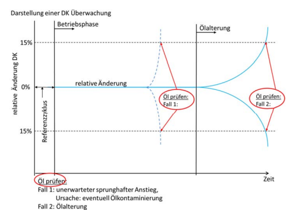 ermittelten Bezugswert an. 

Die LEDs des HYDACLAB geben sowohl Aussagen über die Messwerte des Analog- und Schaltsignals (z.B. Warnung, Alarm) als auch Informationen über den Sensor- und Ölzustand. 

5.1 Schaltausgang Der Schaltausgang (Öffner-Funktion in der Standardausführung PIN 2) stellt eine Alarmfunktion dar, die durch eine kritische Veränderung des Ölzustandes verursacht wird. 

Der Ausgang schaltet bei folgenden Messwertänderungen, werkseitig voreingestellt: 

Rel. Änderung der Dielektrizitätskonstante  15 % (temperaturkompensiert) Rel. Änderung der Leitfähigkeit  15 % (temperaturkompensiert) Sättigungsgrad  85 % Temperatur  80 °C 

5.2 Analogausgang Das Analogausgangssignal der Messwerte wird als Analogsequenz, an PIN 4 in der Standardvoreinstellung, ausgegeben, wobei eine Decodierung mit der nachgeschalteten Steuerung Voraussetzung ist. Die Änderung der Analogsequenz wird in Kap.5.4 Parametereinstellungen beschrieben. 

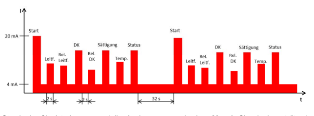

Die Ausgabe des Signals stellt sich, in der Werksvoreinstellung, wie folgt dar: 
Standardmäßig ist der sequenzielle Analogausgang als 4 .. 20 mA Signal eingestellt, eine Konfiguration auf 0 .. 10 V ist ebenfalls möglich. Die einzelnen Signale sind wie folgt sequenziert: 

[table_1][{0: 'Ausgangssignal', 1: 'Dauer', 2: '', 3: ''}, {0: 'Startsignal:', 1: '20 mA', 2: '2 s', 3: ''}, {0: '______________________________________________', 1: 'Pause (4 mA)', 2: '2 s', 3: ''}, {0: 'Signal 1:', 1: 'Absolutwert der el. Leitfähigkeit', 2: '0 .. 100 nS/m', 3: '2 s'}, {0: 'Pause (4 mA)', 1: '2 s', 2: '', 3: ''}, {0: 'Signal 2:', 1: 'relative Änderung der el. Leitfähigkeit', 2: '-100 .. 200%', 3: '2 s'}, {0: 'Pause (4 mA)', 1: '2 s', 2: '', 3: ''}, {0: 'Signal 3:', 1: 'Absolutwert der DK', 2: '1 .. 10', 3: '2 s'}, {0: 'Pause (4 mA)', 1: '2 s', 2: '', 3: ''}, {0: 'Signal 4:', 1: 'rel. Änderung der DK', 2: '-30% ... +30%', 3: '2 s'}, {0: 'Pause (4 mA)', 1: '2 s', 2: '', 3: ''}, {0: 'Signal 5:', 1: 'Sättigungsgrad', 2: '0% ... +100%', 3: '2 s'}, {0: 'Pause (4 mA)', 1: '2 s', 2: '', 3: ''}, {0: 'Signal 6:', 1: 'Temperatur', 2: '-25°C... +100°C', 3: '2 s'}, {0: 'Pause (4 mA)', 1: '2 s', 2: '', 3: ''}, {0: 'Signal 7:', 1: 'Statussignal', 2: 'Pegel siehe Tabelle folgend', 3: '2 s'}, {0: 'Pause vor nächstem Zyklus:', 1: '4 mA', 2: '32 s', 3: ''}][/table_1]

[table_2][{0: 'Erläuterung Statussignal:  Die Informationen aus dem Statussignal sind in der Tabelle aufgeführt:  mA V Zustand/Phase Arbeitstemperaturbereich  verlassen Schaltzustand 1', 1: 'Schaltzustand 2', 2: '', 3: '', 4: '', 5: ''}, {0: '< 4.0', 1: '- - -', 2: 'Fehler', 3: 'egal', 4: 'egal', 5: 'egal'}, {0: '4.0-4.5', 1: '0.00-0.31', 2: 'Betriebsphase', 3: 'nein', 4: 'nein', 5: 'nein'}, {0: '4.5-5.0', 1: '0.31-0.62', 2: 'Betriebsphase', 3: 'nein', 4: 'nein', 5: 'ja'}, {0: '5.0-5.5', 1: '0.62-0.94', 2: 'Betriebsphase', 3: 'nein', 4: 'ja', 5: 'nein'}, {0: '5.5-6.0', 1: '0.94-1.25', 2: 'Betriebsphase', 3: 'nein', 4: 'ja', 5: 'ja'}, {0: '6.0-6.5', 1: '1.25-1.56', 2: 'Betriebsphase', 3: 'ja', 4: 'nein', 5: 'nein'}, {0: '6.5-7.0', 1: '1.56-1.87', 2: 'Betriebsphase', 3: 'ja', 4: 'nein', 5: 'ja'}, {0: '7.0-7.5', 1: '1.87-2.19', 2: 'Betriebsphase', 3: 'ja', 4: 'ja', 5: 'nein'}, {0: '7.5-8.0', 1: '2.19-2.50', 2: 'Betriebsphase', 3: 'ja', 4: 'ja', 5: 'ja'}, {0: '8.0-8.5', 1: '2.50-2.81', 2: 'Homogenisierungsphase', 3: 'nein', 4: 'nein', 5: 'nein'}, {0: '8.5-9.0', 1: '2.81-3.12', 2: 'Homogenisierungsphase', 3: 'nein', 4: 'nein', 5: 'ja'}, {0: '9.0-9.5', 1: '3.12-3.44', 2: 'Homogenisierungsphase', 3: 'nein', 4: 'ja', 5: 'nein'}, {0: '9.5-10.0', 1: '3.44-3.75', 2: 'Homogenisierungsphase', 3: 'nein', 4: 'ja', 5: 'ja'}, {0: '10.0-10.5', 1: '3.75-4.06', 2: 'Homogenisierungsphase', 3: 'ja', 4: 'nein', 5: 'nein'}, {0: '10.5-11.0', 1: '4.06-4.37', 2: 'Homogenisierungsphase', 3: 'ja', 4: 'nein', 5: 'ja'}, {0: '11.0-11.5', 1: '4.37-4.69', 2: 'Homogenisierungsphase', 3: 'ja', 4: 'ja', 5: 'nein'}, {0: '11.5-12.0', 1: '4.69-5.00', 2: 'Homogenisierungsphase', 3: 'ja', 4: 'ja', 5: 'ja'}, {0: '12.0-12.5', 1: '5.00-5.31', 2: 'Orientierungsphase', 3: 'nein', 4: 'nein', 5: 'nein'}, {0: '12.5-13.0', 1: '5.31-5.62', 2: 'Orientierungsphase', 3: 'nein', 4: 'nein', 5: 'ja'}, {0: '13.0-13.5', 1: '5.62-5.94', 2: 'Orientierungsphase', 3: 'nein', 4: 'ja', 5: 'nein'}, {0: '13.5-14.0', 1: '5.94-6.25', 2: 'Orientierungsphase', 3: 'nein', 4: 'ja', 5: 'ja'}, {0: '14.0-14.5', 1: '6.25-6.56', 2: 'Orientierungsphase', 3: 'ja', 4: 'nein', 5: 'nein'}, {0: '14.5-15.0', 1: '6.56-6.87', 2: 'Orientierungsphase', 3: 'ja', 4: 'nein', 5: 'ja'}, {0: '15.0-15.5', 1: '6.87-7.19', 2: 'Orientierungsphase', 3: 'ja', 4: 'ja', 5: 'nein'}, {0: '15.5-16.0', 1: '7.19-7.50', 2: 'Orientierungsphase', 3: 'ja', 4: 'ja', 5: 'ja'}, {0: '16.0-16.5', 1: '7.50-7.81', 2: 'Wartephase', 3: 'nein', 4: 'nein', 5: 'nein'}, {0: '16.5-17.0', 1: '7.81-8.12', 2: 'Wartephase', 3: 'nein', 4: 'nein', 5: 'ja'}, {0: '17.0-17.5', 1: '8.12-8.44', 2: 'Wartephase', 3: 'nein', 4: 'ja', 5: 'nein'}, {0: '17.5-18.0', 1: '8.44-8.75', 2: 'Wartephase', 3: 'nein', 4: 'ja', 5: 'ja'}, {0: '18.0-18.5', 1: '8.75-9.06', 2: 'Wartephase', 3: 'ja', 4: 'nein', 5: 'nein'}, {0: '18.5-19.0', 1: '9.06-9.37', 2: 'Wartephase', 3: 'ja', 4: 'nein', 5: 'ja'}, {0: '19.0-19.5', 1: '9.37-9.69', 2: 'Wartephase', 3: 'ja', 4: 'ja', 5: 'nein'}, {0: '19.5-20.0', 1: '9.69-10.00', 2: 'Wartephase', 3: 'ja', 4: 'ja', 5: 'ja'}, {0: '- - -', 1: '> 10.00', 2: 'Fehler', 3: 'egal', 4: 'egal', 5: 'egal'}][/table_2]

Anmerkung: Wegen möglicher Toleranzen wird empfohlen, in der Auswerteelektronik die Schwelle ca. 0,25 mA, bzw. 0,15 V, unter den in der Tabelle angegebenen Idealwert zu setzen. 

5.3 Übersicht der Kontroll-LEDs

Parameter änderbar unter Ölzustandsanzeige; Warnschwelle Kap. 5.4.5. 

[table_3][{0: 'Parameter änderbar unter Ölzustandsanzeige; Warnschwelle Kap. 5.4.5.', 1: '', 2: '', 3: '', 4: '', 5: ''}, {0: 'LED 1', 1: 'LED 2', 2: 'LED 3', 3: 'LED 4  SP 2', 4: 'Anmerkung /Beschreibung', 5: 'Notiz'}, {0: 'Stat', 1: 'Cond', 2: 'SP 1', 3: 'Zur Inbetriebnahme', 4: '', 5: ''}, {0: 'Wartephase', 1: 'Starttemperatur 40°C  überschreiten', 2: '', 3: '', 4: '', 5: ''}, {0: 'Orientierung /Homogenisierung im  Arbeitstemperaturbereich, Fittabelle wird gefüllt  Orientierung /Homogenisierung  außerhalb des Arbeitstemperaturbereichs  Betriebsphase  im Arbeitstemperaturbereich  Betriebsphase  außerhalb des Arbeitstemperaturbereichs  Fehler', 1: 'Führen Sie ein RESET  durch  Umgebungsbedingungen  und Einbau überprüfen', 2: '', 3: '', 4: '', 5: ''}, {0: 'Fehler', 1: '(tritt z.B. auf bei Messung in  Luft)', 2: '', 3: '', 4: '', 5: ''}, {0: 'Gerät nicht in der Betriebsphase oder Fehler  Sättigungs-, Dielektrizitäts- oder  Leitfähigkeitsänderungen im normalen Bereich  Warnung: Sättigungs-, Dielektrizitäts- oder  Leitfähigkeitsänderungen über der Warnschwelle Alarm: schnelle Öländerung festgestellt', 1: 'Öl prüfen', 2: '', 3: '', 4: '', 5: ''}, {0: 'Alarm:  Sättigungs-, Dielektrizitäts- oder', 1: 'Öl prüfen', 2: '', 3: '', 4: '', 5: ''}, {0: 'Leitfähigkeitsänderungen über der Alarmschwelle Fehlerzustand Schaltausgang aus Schaltausgang ein Schwerer Fehler', 1: 'Wenden Sie sich bitte an den  HYDAC-Service', 2: '', 3: '', 4: '', 5: ''}, {0: 'Firmware-Update  Ein Reset wird durchgeführt', 1: '', 2: '', 3: '', 4: '', 5: ''}][/table_3]

5.4 Parametereinstellung über HMG/ CMWIN (Anschluss siehe Kap.13.2.1) Sie haben die Möglichkeit sowohl mit dem Handmessgerät HMG 4000 ("Verbindung herstellen" siehe Kapitel 13.2) als auch mit Hilfe der PCSoftware CMWIN die Sensorparameter auf Ihre Anforderungen anzupassen. Nach dem Anschließen des Sensors, Kap. 13.2.1, gelangen Sie in das Hauptmenü mit den Positionen, die im Folgenden genauer ausgeführt werden: Wählen Sie mit den Navigationstasten "↑" bzw. "↓" den zu ändernden Unterpunkt aus. 

## 5.4.1 Grundeinstellungen (Basic Settings) 

Im Menüpunkt "Einstellungen" die Grundeinstellungen (Basic settings) wie **Temperatureinstellungen (temperature)**, die Ausgabeskalierung (Output scaling) und die Aufnahmeeinstellungen (Log settings) vorgenommen werden. Dazu wählen Sie mit den Navigationstasten den zu ändernden Wert aus, durch die Betätigung der "o.k.-Taste" wird der Wert markiert und Sie können über die Zahlenauswahl den neuen Wert eingeben. Bestätigen Sie diesen Wert erneut mit der "o.k.- Taste". (Werkseinstellungen siehe Abbildung) 

## 5.4.1.1 Temperatureinstellungen

Minimale Arbeitstemperatur (Min working temperature) - Der Sensor ist betriebsbereit, wenn die Arbeitstemperatur über diesem Wert liegt. Maximale Arbeitstemperatur (Max working temperature) - Der Sensor ist betriebsbereit, wenn die Arbeitstemperatur unter diesem Wert liegt. 

Referenztemperatur (Reference temperature) - Bei der Temperaturkompensation werden die Werte der Leitfähigkeit und der DK auf diese Temperatur bezogen. Aktivierungstemperatur (Activation temperature) - dieser Wert muss einmal überschritten werden, damit der Sensor mit dem Referenzzyklus beginnt. 

Homogenisierungszeit (Homogenisation time) - hier wird die Dauer der Homogenisierungsphase festgelegt. Nachdem der halbe Arbeitstemperaturbereich durchschritten wird, beginnt die Homogenisierungszeit, siehe auch Abbildung Kap.6. Die Zeit sollte so festgelegt werden, dass gewährleistet ist, dass die Anlage eine komplette Zirkulation, eine Durchmischung des Öls sowie einen kompletten Temperaturablauf absolviert. 

[table_4][{0: 'Werkseinstellung', 1: 'Beschreibung', 2: ''}, {0: 'Aktivierungstemperatur 40°C', 1: 'Dieser Wert muss einmal überschritten werden, damit  der Sensor beginnt Messdaten aufzuzeichnen', 2: ''}, {0: 'Referenztemperatur', 1: '50°C', 2: 'Bei der Temperaturkompensation werden die Werte  der Leitfähigkeit / DK auf diese Temperatur bezogen'}, {0: 'Minimale', 1: '20°C', 2: 'Unterschreitet die aktuelle Temperatur diesen Wert,'}, {0: 'Arbeitstemperatur', 1: 'werden die Werte für Leitfähigkeit / DK eingefroren', 2: ''}, {0: 'Maximale', 1: '80°C', 2: 'Überschreitet die aktuelle Temperatur diesen Wert,'}, {0: 'Arbeitstemperatur', 1: 'werden die Werte für Leitfähigkeit / DK eingefroren', 2: ''}][/table_4]

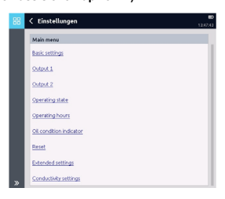

## 5.4.1.2 Erläuterung Der Temperaturbegriffe: 

Hinweis: Wenn Sie den Temperaturbereich während des Referenzzyklus ändern, muss KEIN Reset durchgeführt werden, da sich das HYDACLAB automatisch an den neuen Bereich anpasst. 

## 5.4.1.3 Ausgabeskalierung (Output Scaling)

HYDACLAB Sensor zählt die Betriebsstunden mit. In der Ausgabeskalierung können Sie den oberen Bereich Betriebsstunden (Upper range operating hours) festlegen.

Bei den Betriebsstunden wird das Ausgangssignal auf einen vom Anwender eingestellten oberen Wert skaliert, z. B 4 mA  0 Betriebsstunden und 20 mA 10 000 Betriebsstunden. Diese Zahl kennzeichnet die maximal zu erwartenden Betriebsstunden der Anlage seit dem letzten Zurücksetzen. Oberer Bereich Arrhenius (Upper range Arrhenius): Arrheniuszahl ist die temperaturgewichtete Betriebsstundenzahl. Die Gewichtung basiert auf der Arrhenius-Gleichung. Bei der Arrheniuszahl wird das Ausgangssignal auf einen vom Anwender eingestellten oberen Wert skaliert, z. B. 4 mA  0 temperaturgewichtete Betriebsstunden und 20 mA 20 000 temperaturgewichtete Betriebsstunden, welche die maximal zu erwartende Ölhaltbarkeit der Anlage kennzeichnet / entspricht. 

## 5.4.1.4 Aufnahmeeinstellungen (Log Settings) 

In den Aufnahmeeinstellungen kann das Aufnahmeintervall eingestellt werden, diese legen fest in welchem Intervall die aufgenommenen Werte abgespeichert werden. Das Intervall ist vom Anwender in mehreren Stufen von 10 Sekunden bis 2 Stunden einstellbar. Es werden die absolute Leitfähigkeit, absolute DK, momentane Temperatur, Min/Max-Werte der Temperatur und die Sättigung abgespeichert. Das Log Aufnahmeprotokoll besitzt einen Datenspeicher mit 3 Ebenen. Ist der Speicherplatz auf der ersten Ebene erschöpft, so werden mehrere ältere Datensätze zu einem Datensatz komprimiert, mit einem Zeitstempel versehen und in die nächste Ebene verschoben. Werte können bis zu 10 Jahre gespeichert werden. 

Bestätigen Sie Ihre Änderungen mit "**o.k.**". 

5.4.2 Ausgangsfunktionen HYDACLAB hat 2 Analogausgänge. Im Unterpunkt Ausgang 2 (Output 2) können Sie in der Ausgangsfunktion (Output function) den Analogausgang 
(Analog output settings) konfigurieren. 

Die Änderungen, die Sie hier vornehmen, ändern auch die Analogsequenz. Bei dem **Analogausgang (analog output 2)** kann der Anwender auswählen, welche Größen er ausgeben will sowie das Analogausgangssignal auf 0 bis 10 V-Signal oder 4 bis 20 mA festlegen. Die Messwerte für die Sequenz werden beim Start der Sequenz eingefroren, so dass die Messwerte immer auf den Zustand beim Start der Sequenz bezogen sind. Bei der Arrheniuszahl und bei den Betriebsstunden (Operating hours) wird das Ausgangssignal auf eine vom Anwender eingestellten oberen Wert skaliert, siehe auch 5.4.1.3. Bei den anderen Größen sind die Messbereiche werksseitig voreingestellt. Wird keine Größe ausgewählt, ist der Analogausgang abgeschaltet. Wird nur eine Größe ausgewählt, wird ein reines Analogsignal ausgegeben (keine Sequenz). 

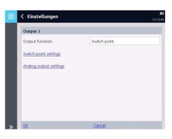

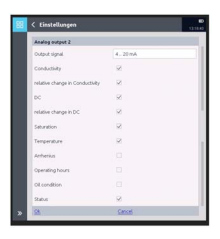

Je Ausgang können mehrere Größen angewählt werden. In diesem Fall werden die Werte in Form einer Sequenz ausgegeben, siehe 5.2. Dabei werden die Größen nacheinander für je 2 Sekunden ausgegeben. Dazwischen liegt eine Pause von 2 Sekunden. Die Sequenz beginnt mit einem 100%- Wert als Startwert. Der Sequenz folgt eine Pause von 32 Sekunden. Dadurch ergibt sich bei 7 Werten plus Startwert eine Sequenzlänge von bis zu 30 Sekunden. Die Sequenz startet dann alle 62 Sekunden. 

Die Ausgabewerte des Ölzustandes bedeuten: 

[table_5][{0: 'Ausgabewert  Ölzustand   0%', 1: 'Es kann keine Aussage getroffen werden'}, {0: '25%', 1: 'In Ordnung'}, {0: '50%', 1: 'Warnung'}, {0: '75%', 1: 'Schnelle Öländerung'}, {0: '100%', 1: 'Alarm'}, {0: '', 1: ''}][/table_5]

## 5.4.3 Schaltausgänge (Switching Output) 

Das HYDACLAB besitzt 2 mögliche Schaltpunkte. Diese werden in den Gerätestatus bitkodiert und können auch über einen physikalischen Schaltausgang ausgegeben werden. In der Analogsequenz, siehe 5.2, werden sie dargestellt. Für jeden Schaltpunkt kann eine Schaltfunktion sowie eine Ein- und Ausschaltverzögerung (Switch-On/Off delay) in Sekunden angegeben werden. Die Schaltfunktion (switching function) wird mit einem logischen Ausdruck festgelegt. Dieser wird als Text eingegeben. Der Text kann Vergleiche und logische Verknüpfungen enthalten. Dabei sind Vergleiche immer nach folgendem Schema <Symbol> <Vergleichsoperator> <Konstante> 
aufgebaut. 

[table_6][{0: 'Folgende Elemente sind möglich:  Symbol Vergleichsoperatoren', 1: 'Logische Operatoren', 2: 'Konstanten'}, {0: 'C für Leitfähigkeit', 1: '= gleich', 2: ''}, {0: 'Phase für die aktuelle Betriebsphase', 1: 'and eine und-Verknüpfung  von 2 logischen Ausdrücken  or eine oder-Verknüpfung von  2 logischen Ausdrücken  (und) um Ausdrücke zu  klammern.  Da die Rangfolge des and und  des or-Operators in der  Mathematik nicht festgelegt ist,  müssen Klammern verwendet  werden, wenn beide  Operatoren auf der gleichen  Stufe verwendet werden.  Zahlenwerte können als  Dezimalzahl mit Komma  oder Punkt eingegeben  werden. Die  eingegebene Zahl muss  sich innerhalb des  Wertebereichs des  Symbols befinden.  Die Groß\x02Kleinschreibung wird  ignoriert.', 2: ''}, {0: '> größer', 1: '', 2: ''}, {0: 'CC für % rel. Änderung der Leitfähigkeit', 1: '>= größer oder gleich', 2: ''}, {0: 'P für DK', 1: '< kleiner', 2: ''}, {0: 'PC für % rel. Änderung der DK', 1: '<= kleiner oder gleich', 2: ''}, {0: 'S für Sättigung', 1: '<> ungleich', 2: ''}, {0: 'T für Temperatur  A für Arrheniuswert  H für Anzahl der Betriebsstunden', 1: 'Beispiel:  " T > 30 and P > 5.3 or C >  2.6" ist nicht erlaubt,  schreiben Sie stattdessen  " T > 30 and (P > 5.3 or C >  2.6)" oder "(T > 30 and P >  5.3) or C > 2.6"', 2: 'Beispiel  "Phase > 3 and T > 30  and T < 50 and (P > 5.3  or C > 2.6 or S > 45)"'}, {0: 'OC für Ölzustand', 1: '', 2: ''}][/table_6]

Hinweis: Ein leerer Text bedeutet, dass der Schaltpunkt immer abgeschaltet ist. 5.4.4 Betriebszustand und Betriebsstunden (Operating state and Operating hours) 

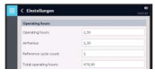

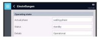

Die Fenster des Betriebszustandes und der Betriebsstunden dienen nur zur Information, hier können keine Einstellungen vorgenommen werden. 

Der HYDACLAB Sensor zählt die Betriebsstunden mit. Die Betriebsstunden kennzeichnen die maximal zu erwartenden Betriebsstunden der Anlage seit dem letzten Zurücksetzen. Die Arrheniuszahl ist die temperaturgewichtete Betriebsstundenzahl. Die Gewichtung basiert auf der Arrhenius-Gleichung. Der HYDACLAB zählt das durchgeführte Zurücksetzen mit. Diese Angabe wird bei der Anzahl der Referenzzyklen angezeigt. Die Gesamtzahl Betriebsstunden beschreibt die tatsächlich gelaufene Betriebsstundenzahl der Anlage einschließlich des erfolgten Zurücksetzens. 

## 5.4.5 Ölzustandsanzeige (Oil Condition Indicator) 

In der Ölzustandsanzeige haben Sie die Möglichkeit die Warn - und Alarmschwellen des Sensors festzulegen, welche mit den LEDs gekoppelt sind. Werden die Alarmschwellen für die Leitfähigkeitsänderung auf +/- 0% gesetzt, wird die Leitfähigkeitsänderung bei der Ölzustandsanzeige nicht berücksichtigt.

## 5.4.6 Erweiterte Einstellungen "Lab Mode" 

 (Extended Setting "Lab Mode")

Lab Mode schaltet die Referenzierungsphase ab. Die Messwerte DK (DC) und Leitfähigkeit (Conductivity) werden nur als Absolutwerte aufgenommen und ausgegeben. Es findet keine Referenzierungsphase statt und die Messwerte "relative change in conductivity" und "relative change in DC" bleiben auf 0%. 

## 5.4.7 Leitfähigkeit Einstellungen 

 (Conductivity Settings)

Die Werkseinstellungen von der Leitfähigkeit sind auf 0100 nS/m eingestellt. Falls die Leitfähigkeit des Öles nie höher als 10 nS/m wird, dann gibt es eine Möglichkeit die Leitfähigkeitsskalierung auf 0-10 nS/m einzustellen. 

## 5.4.8 Zurücksetzen (Reset) 

Beim Zurücksetzen des Sensors gibt es drei Möglichkeiten. Auf Werkseinstellung zurücksetzen (Reset to factory settings) 
bedeutet, dass alle Einstellungen auf den Zustand der Auslieferung zurückgesetzt werden. Referenzzyklus zurücksetzen (Reset reference cycle) (siehe Kap. 7.1) bedeutet, dass die Einstellungen beibehalten werden, aber der Lernzyklus gelöscht wird, der für das Referenzieren benötigt wird. Dieser muss daraufhin nochmal durchgeführt werden, z.B. bei einem Ölwechsel. 

Log Aufnahmeprotokoll zurücksetzen (Log reset) bedeutet, dass die Fittabelle beibehalten, der Datenspeicher aber geleert wird (siehe Kapitel 5.4.1.4). 

5.5 Schnittstellenbeschreibung HSP Das Gerät besitzt eine serielle Schnittstelle, mit welcher der Anwender mit dem Gerät kommunizieren kann. Die Datenübertragung geschieht an PIN 5 über das HSP-Protokoll. Das Gerät unterstützt folgende Funktionen: 

## Hsp

Sensor Id Es wird der Befehl 000 unterstützt. Gerätestatus Es werden die Befehle 010 und 011 unterstützt. 

Sensorinformationen Es werden die Befehle 020 und 021 unterstützt. Messwerte Es werden die Befehle 030, 031 und 032 unterstützt. Log auslesen Es werden die Befehle 060, 061, 070, 071 und 072 unterstützt. Hilfe Es wird der Befehl 999 unterstützt. Weitere Informationen entnehmen Sie bitte der HSP Protokoll Beschreibung "HSP-Spezifikation HYDAC Simple Protocol". 

## 6 Erstinbetriebnahme

Das HYDACLAB beginnt die Datenspeicherung, sobald es mit Spannung versorgt wird und die Temperatur des Mediums erstmals die Aktivierungstemperatur von 40°C (Werksvoreinstellung) 
überschreitet. Die Signale für Temperatur und Sättigung stehen direkt nach Inbetriebnahme zur Verfügung. Das Signal für die relative Änderung der Dielektrizitätskonstante und relativen Änderung der elektrischen Leitfähigkeit wird nach Ablauf der Homogenisierungsphase angezeigt. Die Leitfähigkeits- und Dielektrizitätsänderung gibt die prozentuale Abweichung von einem am Anfang ermittelten Bezugswert an. 

6.1 Fittabelle Das HYDACLAB beschreibt fortlaufend eine Fittabelle, bei der zu jeder Temperatur die zugehörigen Leitfähigkeits- und Dielektrizitätswerte hinterlegt sind. Anhand dieser Tabelle können dann die gemessenen Werte auf eine Referenztemperatur umgerechnet werden. Außerdem wird die Fittabelle zu einem bestimmten Zeitpunkt, nach der Homogenisierungsphase eingefroren. Diese eingefrorene Fittabelle bildet dann den Bezugsrahmen für die Berechnung der Leitfähigkeits- und Dielektrizitätsänderung. Bei der Auslieferung ist die Tabelle leer. Das Beschreiben der Tabelle erfolgt erst, wenn eine eingestellte Aktivierungstemperatur überschritten wurde. 

6.2 Referenzzyklus Während eines Referenzzyklus erfasst das HYDACLAB die Charakteristik des jeweiligen Öles und passt sich den Bedingungen in der gegebenen Applikation an. Es ist deshalb entscheidend, dass während des Referenzzyklus die typischen Betriebsbedingungen, insbesondere alle relevanten Betriebstemperaturbereiche durchlaufen werden. Das Ende des Referenzzyklus ist erreicht, wenn 50% des Arbeitstemperaturbereiches erfasst sind. Das ist sowohl an der LED als auch am Signalpegel des Statussignals (siehe Kap.5.2) erkennbar.

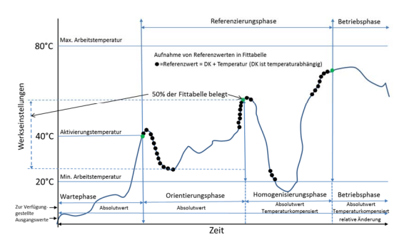

Während des Referenzzyklus ist dafür zu sorgen, dass das HYDACLAB nur dann mit Spannung versorgt wird, wenn sich die Maschine/ Anlage im normalen Betriebszustand befindet. 

(Beispielsweise kann die Spannungsversorgung des Sensors an den Pumpenbetrieb gekoppelt werden.) 
Ein Zurücksetzen sollte erfolgen, wenn nach einer Teil- oder Neubefüllung der Maschine/ Anlage die Analogwerte für die relative Änderung der DK und der elektrischen Leitfähigkeit nicht innerhalb eines Fensters von  5 % liegen. Ursachen dafür können Chargenschwankungen des Öls sein. 

Falls nur geringe Temperaturschwankungen während der Referenzierungsphase vorkommen, könnte es dazu führen, dass die Fittabelle nie zu 50% belegt und somit die Umschaltung der Orientierungsphase in die Homogenisierungsphase verhindert wird. In diesem Fall sollte der min/max Arbeitstemperaturbereich diesbezüglich angepasst werden, damit das Gerät in die Betriebsphase gelangt und eine Änderung der Leitfähigkeit bzw. der DK überwacht und gemeldet kann. 

Bei geringen Temperaturschwankungen werden die Anforderungen der Referenzierungsphase nicht erfüllt. Folglich sollten nur die Absolutwerte überwacht werden (Lab Mode siehe Kap. 5.4.6). Bei sehr geringen Temperaturschwankungen, ist die Beziehung zwischen der DK bzw. Leitfähigkeit sowie so irrelevant. 

7 Zurücksetzen-Funktion Beim Zurücksetzen wird der komplette Speicherinhalt inklusive Referenzzyklus gelöscht. Der Sensor beginnt nach erneutem Anlegen der Spannungsversorgung und erstmaligem Überschreiten der Öl-Temperatur von 40 °C (Werksvoreinstellung) einen neuen Referenzzyklus. Alle Parametereinstellungen im Sensor bleiben unverändert erhalten. Die Durchführung eines Zurücksetzens kann auf unterschiedliche Weise erfolgen: 

## 7.1 Zurücksetzen -Taster Taster Am Gerät.

Dazu die Schraube (siehe Kap. 11), Torx T20, lösen und den Taster mit einem spitzen Hilfsmittel, z.B. mit einem Kugelschreiber drücken (Spannungsversorgung muss vorhanden sein!). Der Taster muss 2 Sekunden gedrückt werden. 

Stand 21.10.2019 **HYDAC ELECTRONIC GMBH** Mat.Nr. 669922 7.2 Zurücksetzen mit HMG 4000 Ein Zurücksetzen des HYDACLAB kann im Sensordialog des HMG 4000 durchgeführt werden. (Anschluss des HYDACLAB an ein HMG 4000 siehe Kap.13.2, HMG 4000). 

## 7.3 Zurücksetzen Mit Pc-Software Cmwin

Ein Zurücksetzen des HYDACLAB kann im Sensordialog der CMWIN durchgeführt werden. 

Die CMWIN ist eine spezielle HYDAC PC-Software und Teil des Lieferumfanges des HMG 510 und HMG 4000. 

## 8 Elektrischer Anschluss

[table_7][{0: 'Pin', 1: '1', 2: '2', 3: '3', 4: '4', 5: '5'}, {0: '1C000', 1: '+UB', 2: 'SP1/AA1*', 3: 'GND', 4: 'SP2/AA2*', 5: 'HSI'}, {0: '00S12', 1: '+UB', 2: 'RS485B', 3: 'GND', 4: 'RS485A', 5: 'HSI'}, {0: '* Werkseinstellungen: Pin 2:SP1 und Pin 4: AA2', 1: '', 2: '', 3: '', 4: '', 5: ''}][/table_7]

[table_8][{0: 'M 12x1, 8-pol.:  Pin 1', 1: '2', 2: '3', 3: '4', 4: '5', 5: '6', 6: '7', 7: '8', 8: ''}, {0: '1CS12', 1: '+UB', 2: 'SP1/AA1', 3: 'GND', 4: 'PE', 5: 'HSI', 6: 'RS485A', 7: 'RS485B', 8: 'SP2/AA2'}][/table_8]

Für den Analogausgang gilt: 
RLmin ≥ 1 k für Spannungsausgang 0..10V
RLmax ≤ 500  m für Stromausgang 4..20mA 

## Anmerkung:

Der Lastwiderstand RL ergibt sich aus dem intern im Auswertegerät befindlichen Messwiderstand und dem Leitungswiderstand der Anschlussleitung. 

[table_9][{0: '9', 1: 'Technische Daten für Standard-Ausführung'}, {0: 'Arbeitsbereich Sättigungsgrad (rel. Feuchte)', 1: '0 .. 100 % Sättigung'}, {0: 'Temperatur', 1: '-25 .. +100 °C'}, {0: 'Dielektrizitätskonstante (DK = εR)', 1: '1 .. 10'}, {0: 'Änderung der Dielektrizitätskonstante', 1: '-30 .. 30%'}, {0: 'Elektr. Leitfähigkeit', 1: '0 .. 100 nS/m'}, {0: 'Änderung der elektr. Leitfähigkeit', 1: '-100 .. 200%'}, {0: 'Betriebsdruck', 1: '< 50 bar'}, {0: 'Druckfestigkeit', 1: '< 600 bar'}, {0: 'Strömungsgeschwindigkeit', 1: '< 5 m/s'}, {0: 'Medienberührende Teile', 1: 'Edelstahl/Keramik mit aufgedampfter Metall Dichtung Glas mit Dünnfilm-Metallbeschichtung / FKM'}, {0: 'Ausgangsgröße Sättigungsgrad (Feuchtemessung) Ausgangssignal (0 .. 100 %)', 1: '4 .. 20 mA / 0 .. 10 V'}, {0: 'Kalibriergenauigkeit', 1: '\uf0a3 ± 2 % FS max.'}, {0: 'Genauigkeit', 1: '\uf0a3 ± 3 % FS typ. *'}, {0: 'Ausgangsgröße Temperatur Ausgangssignal (-25 .. +100 °C)', 1: '4 .. 20 mA / 0 .. 10 V'}, {0: 'Genauigkeit', 1: '\uf0a3 ± 3 % FS max.'}, {0: 'Ausgangsgröße Dielektrizitätskonstante (εR)  Ausgangssignal (1 .. 10)', 1: '4 .. 20 mA / 0 .. 10 V'}, {0: 'Genauigkeit', 1: '\uf0a3 ± 5 % FS max.'}, {0: 'Ausgangsgröße Änderung der Dielektrizitätskonstante  Ausgangssignal (± 30 % v. AW)', 1: '4.. 20 mA / 0 .. 10 V'}, {0: 'Genauigkeit', 1: 's. u. **'}, {0: 'Ausgangsgröße elektrische Leitfähigkeit (nicht für Mod 001) Ausgangssignal (0 .. 100 nS/m)', 1: '4 .. 20 mA / 0 .. 10 V'}, {0: 'Genauigkeit', 1: '\uf0a3 ± 5 % FS max.'}, {0: 'Ausgangsgröße Änderung der elektrischen Leitfähigkeit (nicht für Mod 001) Ausgangssignal (- 100 .. 200%) 4.. 20 mA / 0 .. 10 V  Genauigkeit s. u. ** Schaltausgang (Voreinstellung)  Signal 1 (Öffner) PNP Schaltausgang 0,5 A max.  Schaltpegel \uf0b3 UB - 4 V  Voreinstellung Alarm SP1 Feuchte \uf0b3 85 % Voreinstellung Alarm SP1 Temperatur \uf0b3 80 °C Voreinstellung Alarm SP1 rel. Änderung der Dielektrizitätskonstante \uf0b1 15 %  Voreinstellung Alarm SP1 rel. Änderung der Leitfähigkeit \uf0b1 15 % (nicht für Mod 001)  Umgebungsbedingungen Nenntemperaturbereich +20 .. +80 °C  Lagertemperatur -30 .. +90 °C  Medienverträglichkeit Geeignet für Hydraulik- und Schmieröle  - Zeichen EN 61000-6-1 / 2 / 3 / 4  Viskositätsbereich 1 .. 5000 cSt  Schockfestigkeit nach DIN EN 60068-2-27 50 g / 11 ms / Halbsinus Vibrationsbeständigkeit nach DIN EN 60068-2-6 bei 5 .. 2000 Hz 10 g / Sinus Schutzart nach DIN EN 60529 IP 67 ***  Sonstige Größen  Versorgungsspannung UB 10 .. 36 V DC  Restwelligkeit Versorgungsspannung \uf0a3 5 %  Stromaufnahme ohne Ausgänge max. 100 mA  Mechanischer Anschluss G ¾ A ISO 1179-2  Anzugsdrehmoment 30 Nm Elektrischer Anschluss M12x1, 5 polig / 8-polig Gehäuse Edelstahl Gewicht ca. 215 g  FS (Full Scale); bezogen auf den vollen Messbereich, AW (Anfangs Wert)   * Die maximale Genauigkeit der Feuchtemessung ist stark abhängig von der Ölsorte bzw. der Additivierung. Genauere Angaben hierzu auf Anfrage.   ** Die Genauigkeiten bei der Bestimmung der Änderung der Dielektrizitätszahl und elektr. Leitfähigkeit sind abhängig von der Applikation, der Ölsorte und der Eigenkalibrierung des Sensors. Detaillierte Informationen hierzu auf Anfrage.   *** bei montierter Kupplungsdose entsprechender Schutzart', 1: ''}][/table_9]

## 10 Bestellangaben Typenschlüssel Hydaclab 1400

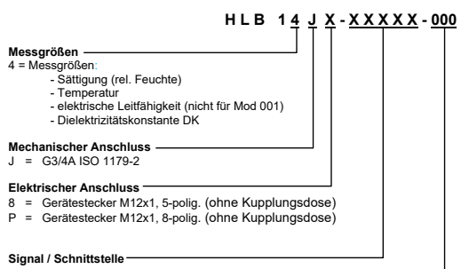

5-polig 1C000 = 1 Schaltausgang / Analogausgang 00F11 = CANopen (auf Anfrage) 
00F31 = IO-Link (auf Anfrage) 
00S12 = RS 485 8-polig:

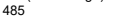 1CS12 = Schaltausgang / Analogausgang / RS 485 Modifikationsnummer

000 = Standard 001 = allg. Info *
* HLB 14J8-1C000-001 dient als reiner Ersatz zum HLB 1300. Dieses Gerät ist auf Analogausgang 2 so voreingestellt, dass keine Leitfähigkeitswerte ausgegeben werden. 

## 11 Geräteabmessungen 12 Zubehör

12.1 Mechanisch ZBM 21 (Flow) 
Adapter zum Einbringen des Ölzustands-Sensors HYDACLAB in eine Leitung G 1/2". 

Anmerkung: Nur geeignet für: max. Betriebsdruck < 50 bar und max. Strömungsgeschwindigkeit < 5m/s. 

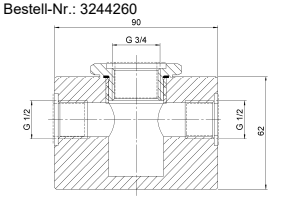

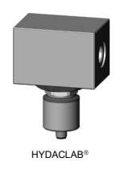

 HYDACLAB

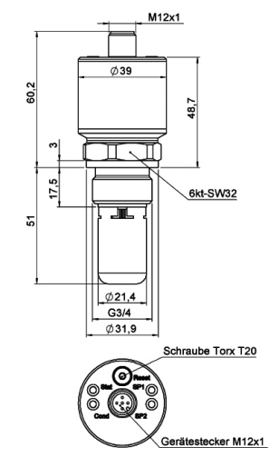

## 12.2 Elektrisch

ZBE 08 (5-pol.) Kupplungsdose M12x1, abgewinkelt Bestell-Nr.: 6006786 ZBE 08-02 (5-pol.) mit 2m Leitung Bestell-Nr.:6006792 ZBE 08S-02 (5-pol.) mit 2m Leitung geschirmt Bestell-Nr.:6019455 ZBE 0P (8-pol.) 
Bestell-Nr.:6055444 ZBE 0P-02 (8-pol.) mit 2m Leitung Bestell-Nr.:6052697 Farbkennung: 

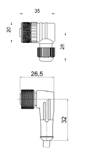

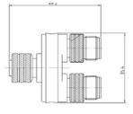

Pin 1: weiß Pin 2: braun Pin 3: grün Pin 4: gelb Pin 5: grau Pin 6: pink Pin 7: blau Pin 8: rot ZBE 26 (nur erforderlich, wenn das HYDACLAB von einer externen Quelle gespeist werden soll, um Batteriestrom zu sparen)
Y-Adapter (blau) für HLB
Bestell-Nr.: 3304374

## Zbe 46 

Adapter, 3-Leiter Sign. + AS1000 Bestell-Nr.: 925725 ZBE 30-02 Sensorkabel M12x1, 2m Bestell-Nr.: 6040851 ZBE 30-05 Sensorkabel M12x1, 5m Bestell-Nr.: 6040852 

## 13.1.1 Anschluss An Ein Hmg 510

Entfernen Sie die Versorgungsleitung vom elektrischen Anschluss des HYDACLAB und schrauben Sie den blauen Y-Adapter für HLB "ZBE 26" auf den Sensor. Schließen Sie die Versorgungsleitung am Anschluss A des Y-Adapters wieder an und verbinden Sie Anschluss B mittels eines Sensorkabels ZBE 30-xx mit Eingang A oder B des HMG 510. 

Farbkennung: Pin 1: braun Pin 2: weiß Pin 3: blau Pin 4: schwarz Pin 5: grau

## 13 Anzeigen

13.1 HMG 510 Das HMG 510 ist ein mobiles 2-Kanal Handmessgerät, welches speziell zur Messwertanzeige von HSI- und SMART-Sensoren vorgesehen ist. 

In Verbindung mit dem HMG 510 ist es möglich, die aktuellen Messwerte auf dem Display des HMG 510 anzuzeigen. 

Bestell-Nr.: 909889 HMG 510-000 
+Ub

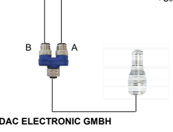

Stand 21.10.2019 **HYDAC ELECTRONIC GMBH** Mat.Nr. 669922

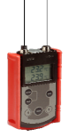

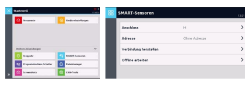

## 13.2 Hmg 4000

Das HMG 4000 ist ein mobiles Handmessgerät mit einem vollgrafikfähigen Farbdisplay zur Messwertanzeige bzw. Messwertaufzeichnung. In Verbindung mit dem HMG 4000 können die aktuellen Messwerte des HYDACLAB sowie die gespeicherten Messkurven auf dem Display des HMG 4000 angezeigt werden. Diese Aufnahmen können mit dem HMG 4000 auch bearbeitet werden. Ferner kann über das HMG 4000 ein Reset des HYDACLAB vorgenommen werden. 

(genaue Beschreibung siehe Bedienungsanleitung HMG 4000). Bestell-Nr.: 925281 HMG 4000-000-D Um SMART-Sensoren mit dem HMG 4000 zu verbinden, wählen Sie im Startmenü die Option "**SMART-Sensoren**". Anschließend geben Sie an, mit welchem **Anschluss** der SMARTSensor verbunden ist. 

Optional können Sie noch eine **Sensor-Busadresse** angeben. Standard und Voreinstellung sind "**Ohne Adresse**". Busadressen müssen vergeben werden, wenn der SMART-Sensor in einem Bussystem betrieben werden soll. Nach Auswahl von "**Verbindung herstellen**" sehen Sie oberhalb der Funktionsleiste einige Informationen zum verbundenen SMART-Sensor. 

## Hauptmenü 

 "Smart-Sensoren"

Sie befinden sich nun im Hauptmenü des SMART-Sensors und haben die Möglichkeit diesen entsprechend Ihren Bedürfnissen anzupassen. Der Umfang dieses Menüs ist je nach Sensortyp unterschiedlich, d.h. es werden nicht immer alle nachfolgend beschriebenen Menüpunkte zur Verfügung stehen. 

## Sensorinformationen

Dieses Menü gibt folgende Informationen über den angeschlossenen SMART-Sensor: 
 Materialnummer Seriennummer Informationen zu den verschiedenen Messkanälen, bezogen auf Art und Messbereich. 

## Sensormesswerte 

Hier werden Ihnen die aktuellen Messwerte sowie die zugehörigen Maßeinheiten des verbundenen SMART-Sensors angezeigt. 

## Sensor-Aufnahmen Verwalten

In diesem Menü können Sie Langzeitaufnahmen, die der SMART-Sensor erstellt hat, zum HMG 4000 übertragen oder diese aus dem Speicher des SMART-Sensors löschen. Mit "**Aktualisieren**" wird geprüft, ob neue Aufnahmen vorhanden sind. Nach Auswahl einer Aufnahme und der Option "**Übertragen**" erhalten Sie eine Ansicht, in der Sie festlegen können, ob die ausgewählte Aufnahme unter der zuvor angezeigten Kombination aus Namen und Nummer im HMG 4000 abgelegt werden soll oder eine neue Verknüpfung vergeben werden soll. 

## Sensoreinstellungen

In Sensoreinstellungen können Sie die Parameter des Gerätes Ihren Anforderungen anpassen, siehe Kap.5.4. 13.2.1 Anschluss an ein HMG 4000 

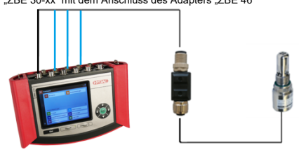

Entfernen Sie die Versorgungsleitung vom elektrischen Anschluss des HYDACLAB und schrauben Sie den Adapter "ZBE 46" auf den Sensor. 

Verbinden Sie einen der Eingänge A bis D des HMG 4000 mittels eines Sensorkabels 
"ZBE 30-xx" mit dem Anschluss des Adapters "ZBE 46" 13.3 CMWIN Speziell entwickelte PC-Software, die mittels Kommunikationsbrücke (HMG 510 oder HMG 4000) mit dem HYDACLAB kommuniziert. Mit der Software können Messkurven zum PC 
übertragen, gespeichert, angezeigt und bearbeitet oder die aktuellen Messwerte dargestellt werden. Die CMWIN ist Teil des Lieferumfanges des HMG 510 und HMG 4000 bzw. steht auf der Homepage als Download bereit. 13.4 CSI B2 Mit Hilfe des Condition Monitoring Schnittstellenmoduls CSI-B-2 und der Software CMWIN ist es möglich, die Daten und Messwerte des Sensors direkt auszulesen oder die Parameter einzustellen. 

## Anmerkung

Auf unserer Homepage stehen Ihnen unsere HYDAC Software-Produkte zum Downloaden zur Verfügung. 

## 14 Lieferumfang

1 HYDACLAB - Sensor 1 Bedienungsanleitung 

## 15 Wichtige Hinweise Auf Einen Blick

 Der montierte Sensor muss vollständig in das Medium eintauchen, damit dieses frei durch den Sensor zirkulieren kann.

 Achten Sie beim Einbau ohne den Montageblock ZBM 21 darauf, dass das Einströmen des Mediums durch den Einbau nicht beeinträchtigt wird. Zwischen der Stirnseite des Sensorkopfes und der gegenüberliegenden Rohr- bzw. Gehäusewand muss ein Mindestabstand von 10 mm eingehalten werden.

 Stellen Sie einen stetigen Durchfluss sicher und vermeiden Sie die Bildung von Luftblasen. Bei stehendem Öl sind erhöhte Messabweichungen möglich.

 Grundsätzlich ist HYDACLAB nur dann mit Spannung zu versorgen, wenn normaler Volumenstrom gewährleistet ist. D.h. trennen Sie das HYDACLAB von der Spannungsversorgung sobald die Anlage abgeschaltet wird, außer Betrieb geht oder eine zeitlich nennenswerte Unterbrechung des Volumenstromes eintritt.

 Beachten Sie, dass während des Referenzzyklus die typischen Betriebsbedingungen herrschen, d.h. alle betriebsrelevanten Zustände durchlaufen werden.

 Der Start des Referenzzyklus beginnt sobald HYDACLAB mit Spannung versorgt ist und anschließend die Temperatur des Mediums erstmalig 40°C (Werkseinstellung) überschreitet.

 Vermeiden Sie während des Referenzzyklus Vermischungen des Fluids oder Auffüllen von Neuöl.

 Bei Ölwechsel oder gravierender Änderung der Umgebungsbedingungen sollte ein Reset durchgeführt werden.

## 16 Haftung

Diese Bedienungsanleitung haben wir nach bestem Wissen und Gewissen erstellt. Es ist dennoch nicht auszuschließen, dass trotz größter Sorgfalt sich Fehler eingeschlichen haben könnten. Haben Sie bitte deshalb Verständnis dafür, dass wir, soweit sich nachstehend nichts anderes ergibt, unsere Gewährleistung und Haftung - gleich aus welchen Rechtsgründen - für die Angaben in dieser Bedienungsanleitung ausschließen. Insbesondere haften wir nicht für entgangenen Gewinn oder sonstige Vermögensschäden. Dieser Haftungsausschluss gilt nicht bei Vorsatz und grober Fahrlässigkeit. Er gilt ferner nicht für Mängel, die arglistig verschwiegen wurden oder deren Abwesenheit garantiert wurde sowie bei schuldhafter Verletzung von Leben, Körper und Gesundheit. Sofern wir fahrlässig eine vertragswesentliche Pflicht verletzen, ist unsere Haftung auf den vorhersehbaren Schaden begrenzt. Ansprüche aus Produkthaftung bleiben unberührt. Im Falle der Übersetzung ist der Text der deutschen Originalbedienungsanleitung der allein gültige.

[table_10][{0: 'Notizen'}][/table_10]

## Hydac Electronic Gmbh

Hauptstr. 27 D-66128 Saarbrücken Germany Web: www.hydac.com E-Mail: electronic@hydac.com Tel.: +49 (0)6897 509-01 Fax.: +49 (0)6897 509-1726

## Hydac Service

Für Fragen zu Reparaturen steht Ihnen der HYDAC Service zur Verfügung. 

## Hydac Service Gmbh

Hauptstr. 27 D-66128 Saarbrücken Germany Tel.: +49 (0)6897 509-1936 Fax.: +49 (0)6897 509-1933 

## Anmerkung

Die Angaben in dieser Bedienungsanleitung beziehen sich auf die beschriebenen Betriebsbedingungen und Einsatzfälle. Bei abweichenden Einsatzfällen und/oder Betriebsbedingungen wenden Sie sich bitte an die entsprechende Fachabteilung. 

Bei technischen Fragen, Hinweisen oder Störungen nehmen Sie bitte Kontakt mit Ihrer HYDACVertretung auf. 

Oil Condition Sensor HYDACLAB 
HLB 1400 User manual 
(translation of original instructions) 

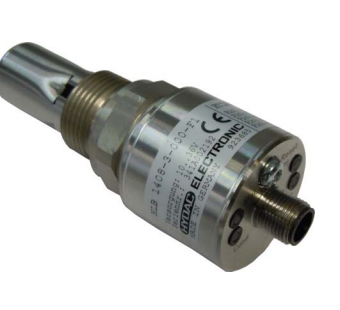

Part. No. 669922 Status: 2019/10/21 

## Contents

[table_11][{0: '1', 1: 'GENERAL', 2: ''}, {0: '2', 1: 'Safety Information .', 2: ''}, {0: '3', 1: 'Installation .', 2: ''}, {0: 'Definition of the Terms', 1: '', 2: ''}, {0: '4', 1: '', 2: ''}, {0: '5', 1: 'Function .', 2: ''}, {0: '5.1', 1: 'Switching output .', 2: ''}, {0: '5.2', 1: 'Analogue output', 2: ''}, {0: '5.3', 1: 'Overview of control LEDs', 2: ''}, {0: 'Parameter Setting via HMG/ CMWIN (For connection see chapter 13.2.1) .......................................... 7', 1: '', 2: ''}, {0: '5.4', 1: '', 2: ''}, {0: '5.4.1', 1: 'Basic Settings .', 2: ''}, {0: '5.4.2', 1: 'OUTPUT Functions ............................................................................................................................................... 9', 2: ''}, {0: '5.4.3', 1: 'Switching outputs', 2: ''}, {0: 'Operating state and operating hours', 1: '', 2: ''}, {0: '5.4.4', 1: '', 2: ''}, {0: '5.4.5', 1: 'OII condition display', 2: ''}, {0: 'Extended settings "Lab mode" .', 1: '', 2: ''}, {0: '5.4.6', 1: '', 2: ''}, {0: '5.4.7', 1: 'Conductivity settings', 2: ''}, {0: '5.4.8', 1: 'Reset', 2: ''}, {0: 'Interface Description HSP (HYDAC Simple Protocol) ....................................................................................... 12', 1: '', 2: ''}, {0: '5.5', 1: '', 2: ''}, {0: 'Start-up', 1: '', 2: ''}, {0: '6', 1: '6.1', 2: 'Fit Table'}, {0: '6.2', 1: 'Reference Cycle', 2: ''}, {0: '7', 1: 'Reset functions', 2: ''}, {0: 'Reset Button', 1: '', 2: ''}, {0: '7.1', 1: '', 2: ''}, {0: '7.2', 1: 'Reset using HMG 4000', 2: ''}, {0: 'Reset using PC software CMWIN', 1: '', 2: ''}, {0: '7.3', 1: '', 2: ''}, {0: 'EElectrical Connection', 1: '', 2: ''}, {0: 'a', 1: 'Standard Technical data', 2: ''}, {0: '9', 1: '', 2: ''}, {0: '10', 1: '', 2: ''}, {0: '11', 1: 'DING IN THE PROPOSITIO', 2: ''}, {0: 'Accessories', 1: '', 2: ''}, {0: '12', 1: '12.1', 2: 'Mechanical .'}, {0: '12.2', 1: 'EElectric', 2: ''}, {0: '13 Displays', 1: '', 2: ''}, {0: 'HMG 510', 1: '', 2: ''}, {0: '13.1', 1: 'Connecting to a HMG 510', 2: ''}, {0: '13.1.1', 1: '', 2: ''}, {0: '13.2', 1: 'HMG 4000 .', 2: ''}, {0: 'Connecting to a HMG 4000', 1: '', 2: ''}, {0: '13.2.1', 1: '', 2: ''}, {0: 'CMWIN', 1: '', 2: ''}, {0: '13.3', 1: 'CSI-B-2', 2: ''}, {0: '13.4', 1: '', 2: ''}, {0: 'ltems supplied .', 1: '', 2: ''}, {0: '14', 1: '', 2: ''}, {0: '15', 1: '', 2: ''}, {0: '16', 1: '', 2: ''}][/table_11]

1 General If you have any queries regarding technical details or the suitability of the instrument for your application, please contact our **Technical Sales department**. HYDACLAB® sensors have been individually calibrated on computer-aided test benches and subjected to a final test. They operate perfectly when used according to the specifications (see Technical Specifications). 

However, if there is a cause for complaint, please contact **HYDAC Service**. Interference by anyone other than HYDAC personnel will invalidate all warranty claims. 

## 2 Safety Information

The Fluid Condition Sensor HYDACLAB® presents no safety concerns when operated in accordance with this user manual. However, in order to avoid any risk to the operator or any damage due to incorrect handling of the unit, please adhere strictly to the following safety instructions: 
 Before commissioning, check that the unit is in perfect condition.

 Before commissioning, please read the operating instructions. Ensure that the unit is suitable for your application.

 During transportation, extra care must be taken to protect the unit from vibration and shock.

 The HYDACLAB must not be put into service if any known technical defects are apparent. The unit must be installed according to the instructions.

 The information on the type code label must be noted.

 After an oil change, RESET must be carried out. The sensor should not be commissioned in old oil, as all relative data changes will be invalid. Troubleshooting and repair work may only be carried out at the HYDAC Service Department. All relevant and generally recognised safety requirements must be adhered to. If the instrument is not handled correctly, or if the operating instructions and specifications are not adhered to, damage to property or personal injury can result.

3 Installation

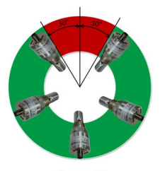

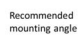

The sensor can be installed directly in the hydraulic system via the threaded G ¾ connection. Please ensure the sensor is not mounted in standing oil. It is recommended to fit the sensor in an inclined position, fitting angle ≥ 30°. Please avoid fitting the sensor vertically with the sensor element pointing downwards. When fitting, ensure that the sensor is completely submerged in the fluid and that the fluid can circulate freely through the sensor. The maximum max oil flow rate should not exceed 5 m/s. 

For installation of the HYDACLAB, HYDAC ELECTRONIC offers the appropriate mounting accessory (see sec. 12.1, Mechanical Accessories). The electrical connection must be carried out by a qualified electrician according to the relevant regulations of the country, (VDE 0100 in Germany). 

HYDACLAB sensors carry the CE mark. A certificate of conformity is available on request. The relevant EMC standards EN 61000-6-1; EN 61000-6-2, EN 61000-6-3, EN 6100-6-4 are met. However, the stipulations of those standards are met only if the sensor's housing has been correctly earthed by a qualified electrician. When installed in a hydraulic block, earthing the block via the hydraulic system is sufficient. 

 HYDACLAB **1400 Page 3** 
Additional installation suggestions which, from experience, reduce the effect of electromagnetic interference: 
 Cable connections to be kept as short as possible. Use shielded cable (e.g. LIYCY 5 x 0.5 mm²).

 The cable shielding must be fitted by qualified personnel, subject to the ambient conditions and with the aim of suppressing interference.

 Keep the unit well away from the electrical supply lines of power equipment, as well as from any electrical or electronic equipment that can cause interference.

## 4 Definition Of The Terms

The term of relative dielectric constant  = /, used in this operating manual is the parameter for the permeability of a substance to electrical fields with regard to the permeability of vacuum (ሻ. 

Other permitted definitions are "relative permitivity", "permitivity value" or "dielectric value". The relative dielectric constant will be referred to hereinafter as DC. A further term used in hereinafter is the relative change in the dielectric constant = relative change in DC. 

The electrical conductivity of the oil is displayed in nS/m, the change in conductivity is displayed in 
%. The saturation level is a parameter for the concentration of water in oil: it is displayed relatively in %. Consequently, 100% corresponds to the point where the oil is fully saturated with water. No further water can be dissolved by the oil and there will be a presence of free water in the oil. 

## 5 Function

HYDACLAB® is a compact, multi-functional sensor for determining the online condition of oil. The user is kept informed of changes in fluid condition as they occur and can take immediate action in the case of deteriorating operating conditions. Changes in fluid condition that might occur due to ageing or mixing with other fluids, for example, are indicated by measuring the temperature, the saturation level, the relative change in electrical conductivity and the relative change in dielectric constant (also referred to as DC). 

A change in conductivity or in the DC results in a deviation from the reference value in percent, 

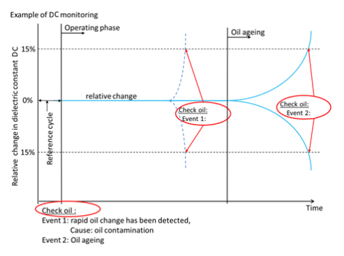 determined during the reference phase. The LEDs displayed by HYDACLAB indicate information about the measured values of the analogue and the switching signals, (i.e. warning, alarm), as well as information about the sensor status and oil condition. 

## Hydaclab **1400 Page 4**

5.1 Switching output The switching output (normally closed function as standard version PIN 2), indicates an alarm function being initiated in the event of a change in the oil condition. The output switches according to the following measured value changes (default settings): 

[table_12][{0: 'Relative change in dielectric constant', 1: '± 15 %', 2: '(temperature compensated)'}, {0: 'Relative change in conductivity', 1: '± 15 %', 2: '(temperature compensated)'}, {0: 'Saturation level', 1: '\uf0b3 85 %', 2: ''}, {0: 'Temperature', 1: '\uf0b3 80 °C', 2: ''}][/table_12]

5.2 Analogue output Analogue output signals representing measured values are output sequentially on PIN 4, for connection to a non-HYDAC device. The setup possibilities for the analogue sequence is described in sec. 5.4 Parameter settings. 

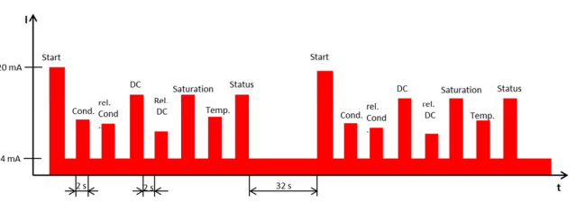 The sequencing of the default pre-set signals is as shown in the diagram below: 
All signals output to the sequential analogue output are default set as 4..20 mA current-loop signals (0 .. 10V is also possible), sequenced and spaced as follows: 

[table_13][{0: '', 1: 'Output signal', 2: 'Duration', 3: ''}, {0: 'Start signal:', 1: '20 mA', 2: '2 s', 3: ''}, {0: '______________________________________________', 1: 'Pause (4 mA)', 2: '2 s', 3: ''}, {0: 'Signal 1:', 1: 'Absolute conductivity value', 2: '0 .. 100 nS/m', 3: '2 s'}, {0: '', 1: 'Pause (4 mA)', 2: '2 s', 3: ''}, {0: 'Signal 2:', 1: 'Change in electrical conductivity', 2: '-100 .. 200%', 3: '2 s'}, {0: '', 1: 'Pause (4 mA)', 2: '2 s', 3: ''}, {0: 'Signal 3:', 1: 'Absolute DC value', 2: '1 .. 10', 3: '2 s'}, {0: '', 1: 'Pause (4 mA)', 2: '2 s', 3: ''}, {0: 'Signal 4:', 1: 'Rel. Change in DC', 2: '-30% ... +30%', 3: '2 s'}, {0: '', 1: 'Pause (4 mA)', 2: '2 s', 3: ''}, {0: 'Signal 5:', 1: 'Saturation level', 2: '0% ... +100%', 3: '2 s'}, {0: '', 1: 'Pause (4 mA)', 2: '2 s', 3: ''}, {0: 'Signal 6:', 1: 'Temperature', 2: '-25°C... +100°C', 3: '2 s'}, {0: '', 1: 'Pause (4 mA)', 2: '2 s', 3: ''}, {0: 'Signal 7:', 1: 'Status signal', 2: 'See table below for levels', 3: '2 s'}, {0: 'Pause before next output cycle:', 1: '4 mA', 2: '32 s', 3: ''}][/table_13]

## Hydaclab **1400 Page 5** Explanation Of Status Signal:

[table_14][{0: 'The information from the status signal is shown in the table.  mA V Status/Phase Exceed operating temperature  range', 1: 'Switching status 1', 2: 'Switching status  2', 3: '', 4: '', 5: ''}, {0: '< 4.0', 1: '- - -', 2: 'Error', 3: 'irrelevant', 4: 'irrelevant', 5: 'irrelevant'}, {0: '4.0-4.5', 1: '0.00-0.31', 2: 'Operating phase', 3: 'No', 4: 'No', 5: 'No'}, {0: '4.5-5.0', 1: '0.31-0.62', 2: 'Operating phase', 3: 'No', 4: 'No', 5: 'Yes'}, {0: '5.0-5.5', 1: '0.62-0.94', 2: 'Operating phase', 3: 'No', 4: 'Yes', 5: 'No'}, {0: '5.5-6.0', 1: '0.94-1.25', 2: 'Operating phase', 3: 'No', 4: 'Yes', 5: 'Yes'}, {0: '6.0-6.5', 1: '1.25-1.56', 2: 'Operating phase', 3: 'Yes', 4: 'No', 5: 'No'}, {0: '6.5-7.0', 1: '1.56-1.87', 2: 'Operating phase', 3: 'Yes', 4: 'No', 5: 'Yes'}, {0: '7.0-7.5', 1: '1.87-2.19', 2: 'Operating phase', 3: 'Yes', 4: 'Yes', 5: 'No'}, {0: '7.5-8.0', 1: '2.19-2.50', 2: 'Operating phase', 3: 'Yes', 4: 'Yes', 5: 'Yes'}, {0: '8.0-8.5', 1: '2.50-2.81', 2: 'Homogenisation phase', 3: 'No', 4: 'No', 5: 'No'}, {0: '8.5-9.0', 1: '2.81-3.12', 2: 'Homogenisation phase', 3: 'No', 4: 'No', 5: 'Yes'}, {0: '9.0-9.5', 1: '3.12-3.44', 2: 'Homogenisation phase', 3: 'No', 4: 'Yes', 5: 'No'}, {0: '9.5-10.0', 1: '3.44-3.75', 2: 'Homogenisation phase', 3: 'No', 4: 'Yes', 5: 'Yes'}, {0: '10.0-10.5', 1: '3.75-4.06', 2: 'Homogenisation phase', 3: 'Yes', 4: 'No', 5: 'No'}, {0: '10.5-11.0', 1: '4.06-4.37', 2: 'Homogenisation phase', 3: 'Yes', 4: 'No', 5: 'Yes'}, {0: '11.0-11.5', 1: '4.37-4.69', 2: 'Homogenisation phase', 3: 'Yes', 4: 'Yes', 5: 'No'}, {0: '11.5-12.0', 1: '4.69-5.00', 2: 'Homogenisation phase', 3: 'Yes', 4: 'Yes', 5: 'Yes'}, {0: '12.0-12.5', 1: '5.00-5.31', 2: 'Orientation phase', 3: 'No', 4: 'No', 5: 'No'}, {0: '12.5-13.0', 1: '5.31-5.62', 2: 'Orientation phase', 3: 'No', 4: 'No', 5: 'Yes'}, {0: '13.0-13.5', 1: '5.62-5.94', 2: 'Orientation phase', 3: 'No', 4: 'Yes', 5: 'No'}, {0: '13.5-14.0', 1: '5.94-6.25', 2: 'Orientation phase', 3: 'No', 4: 'Yes', 5: 'Yes'}, {0: '14.0-14.5', 1: '6.25-6.56', 2: 'Orientation phase', 3: 'Yes', 4: 'No', 5: 'No'}, {0: '14.5-15.0', 1: '6.56-6.87', 2: 'Orientation phase', 3: 'Yes', 4: 'No', 5: 'Yes'}, {0: '15.0-15.5', 1: '6.87-7.19', 2: 'Orientation phase', 3: 'Yes', 4: 'Yes', 5: 'No'}, {0: '15.5-16.0', 1: '7.19-7.50', 2: 'Orientation phase', 3: 'Yes', 4: 'Yes', 5: 'Yes'}, {0: '16.0-16.5', 1: '7.50-7.81', 2: 'Waiting phase', 3: 'No', 4: 'No', 5: 'No'}, {0: '16.5-17.0', 1: '7.81-8.12', 2: 'Waiting phase', 3: 'No', 4: 'No', 5: 'Yes'}, {0: '17.0-17.5', 1: '8.12-8.44', 2: 'Waiting phase', 3: 'No', 4: 'Yes', 5: 'No'}, {0: '17.5-18.0', 1: '8.44-8.75', 2: 'Waiting phase', 3: 'No', 4: 'Yes', 5: 'Yes'}, {0: '18.0-18.5', 1: '8.75-9.06', 2: 'Waiting phase', 3: 'Yes', 4: 'No', 5: 'No'}, {0: '18.5-19.0', 1: '9.06-9.37', 2: 'Waiting phase', 3: 'Yes', 4: 'No', 5: 'Yes'}, {0: '19.0-19.5', 1: '9.37-9.69', 2: 'Waiting phase', 3: 'Yes', 4: 'Yes', 5: 'No'}, {0: '19.5-20.0', 1: '9.69-10.00', 2: 'Waiting phase', 3: 'Yes', 4: 'Yes', 5: 'Yes'}, {0: '- - -', 1: '> 10.00', 2: 'Error', 3: 'irrelevant', 4: 'irrelevant', 5: 'irrelevant'}, {0: 'Note:', 1: 'Due to tolerance variations, we recommend setting the threshold in the evaluation electronics', 2: '', 3: '', 4: '', 5: ''}][/table_14]

Note: Due to tolerance variations, we recommend setting the threshold in the evaluation electronics to approx. 0.25 mA or 0.15mA below the ideal value given in the table. 

5.3 Overview of control LEDs

Parameters adjustable under menu point oil condition indication; warning threshold, chapter 5.4.5 

[table_15][{0: 'Parameters adjustable under menu point oil condition indication; warning threshold, chapter 5.4.5', 1: '', 2: '', 3: '', 4: '', 5: ''}, {0: 'LED 1', 1: 'LED 2', 2: 'LED 3', 3: 'LED 4  SP 2', 4: 'Note / Description', 5: 'Note'}, {0: 'Stat', 1: 'Cond', 2: 'SP 1', 3: 'For commissioning, the  activation temperature of', 4: '', 5: ''}, {0: 'Waiting phase', 1: '40°C (default), must be  exceeded.', 2: '', 3: '', 4: '', 5: ''}, {0: 'Orientation/ Homogenisation within the operation  temperature range, fit table is being filled in  Orientation / Homogenisation  outside the operating temperature range  Operating phase  within the operating temperature range  Operating phase  outside of the operating temperature range  Error', 1: 'Perform a RESET Please check ambient  conditions and installation', 2: '', 3: '', 4: '', 5: ''}, {0: 'Error', 1: '(can occur when measuring  in air, for example)', 2: '', 3: '', 4: '', 5: ''}, {0: 'Device is not in the operating phase or an error has  occurred  Saturation, dialectic or conductivity deviation within  normal range  Warning: Saturation, dielectric or conductivity changes  exceed the warning threshold Alert:  rapid oil change has been detected Check the oil  Alert:  Saturation, dielectric or conductivity changes  Check the oil  exceed the alarm threshold Error status Switch output off Switch output on Critical sensor error Please contact HYDAC Service.  Firmware update  A reset is performed', 1: '', 2: '', 3: '', 4: '', 5: ''}][/table_15]

5.4 Parameter Setting via HMG/ CMWIN (For connection see chapter 13.2.1) 

 It is possible to adjust the sensor parameters to match the application requirements by means of the HMG 4000 ("Establish connection" see chapter 13.2) as well as by means of the PC software CMWIN, via the setting dialogue. After connecting the sensor, chapter 13.2.1, you will be lead to the main menu, and presented with the windows described in detail as follows: Select the sub menu to be changed via the navigation keys "↑" or "↓". 

## 5.4.1 Basic Settings 

In the basic settings menu, **temperature settings, output scaling** and **recording settings** can be changed. For this purpose, please select the value to be modified by means of the navigation keys. 

By pressing the OK button, the value is highlighted and then it is possible to enter a new value. Please press OK again to confirm the selected value. Default settings- see opposite. 

## 5.4.1.1 Temperature Settings

Minimum operation temperature - The sensor is operational when the temperature is above this value. 

Maximum operation temperature - The sensor is operational when the temperature is below this value Reference temperature - The temperature compensated conductivity and DC values will be referenced to this temperature. 

Activating temperature - This value must be exceeded in order for the sensor to start its referencing cycle. 

Homogenisation period - The duration of the homogenisation phase will be defined by this period. 

The Homogenisation phase starts, once 50% of the working temperature range has been recorded. (see also graph chapter 6).

The time should be defined in order to ensure that the system carries out a complete circulation, a mixing of the oil and a complete temperature cycle. 

[table_16][{0: 'Factory settings', 1: 'Description', 2: '', 3: ''}, {0: 'Activation temperature 40°C', 1: 'The value must be exceeded once to start the  referencing phase.', 2: '', 3: ''}, {0: 'Reference', 1: '50°C', 2: 'On completion of the orientation phase the values of', 3: ''}, {0: 'temperature', 1: 'the conductivity / DC will be referenced to this  temperature.', 2: '', 3: ''}, {0: 'Minimum', 1: 'operation', 2: '20°C', 3: 'Should the operating temperature lie below this value,'}, {0: 'temperature', 1: 'the values for conductivity/DC will be frozen.', 2: '', 3: ''}, {0: 'Maximum operation', 1: '80°C', 2: 'Should the operating temperature exceed this value,', 3: ''}, {0: 'temperature', 1: 'the values for conductivity/DC will be frozen.', 2: '', 3: ''}][/table_16]

## Hydaclab **1400 Page 8**

5.4.1.2 Explanation of Terms regarding Temperature: 

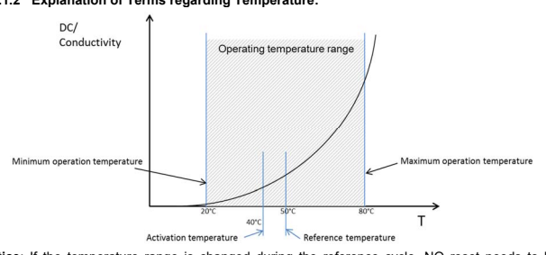 Notice: If the temperature range is changed during the reference cycle, NO reset needs to be performed, as HYDACLAB automatically adapts to the new range. 

## 5.4.1.3 Output Scaling

In the output scaling menu you can set the upper range of operating hours, the HYDACLAB sensor thus counts the operating hours. 

The output signal for the operating hours is scaled to a value set by the user, i.e. 4mA 0 operating hours and 20 mA 10000 operating hours. This figure defines the maximum expected operating hours of the system since its last reset. Upper range Arrhenius: The Arrhenius rate defines the operating hours depending on temperature, the weighting is based on the Arrhenius equation. 

For the Arrhenius value the output signal is scaled to an upper value by the user, i. e. 4 mA  0 temperature dependent operating hours and 20 mA 20000 temperature dependent operating hours, this value defines the maximum expected oil service life in the system. 

## 5.4.1.4 Recording Settings

In the recording settings the recording interval can be adjusted. This setting defines the interval of the recorded values that are to be stored. The interval is adjustable in stages from 10 seconds to 2 hours by the user. Stored values are: the absolute conductivity, the absolute DC, the current temperature, min/max temperature values and the saturation level. The log has a data storage with 3 storage levels. If the storage space is exhausted, a number of data sets will be compressed to one data set, marked with a time stamp and then moved to the next level. The values can be stored for up to 10 years. 

Please confirm your changes by pressing OK. 

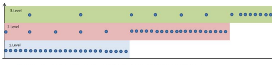

## Hydaclab **1400 Page 9** 5.4.2 Output Functions 

HYDACLAB has 2 possible analogue outputs. In the sub menu **Output 2** you can configure the analogue output in the output function. 

The changes you perform here will also change the analogue sequence. In the **analogue output** the user can select the parameters to be shown and set the analogue output signal to a 0 - 10 V signal or 4 - 20 mA. The measured values for the sequence are frozen at its 

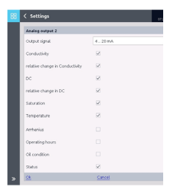 start-up in order to ensure that the measured values always refer to the condition during the start of the sequence. 

For the Arrhenius value and the operating hours, the output signal is scaled to a maximum value which is set by the user, see 5.4.1.3. For all other parameters the measuring ranges are default settings. If no parameter has been selected, the analogue output is switched off. If only one parameter has been selected a pure analogue signal is output (no sequence). 

For each output, several parameters can be selected. In this case the values are shown as sequences, see 5.2 The parameters are shown one after another each 2 seconds. In between each shown parameter there is a pause of 2 seconds. The sequence starts with a 100% value representing the start value. The sequence is followed by a pause of 32 seconds. This means 7 values plus the start value have a sequence length of 30 seconds. The sequence starts every 62 seconds. The output values of the oil condition represent: 

[table_17][{0: 'Output value oil  condition   0%', 1: 'No statement can be made'}, {0: '25%', 1: 'OK'}, {0: '50%', 1: 'Warning'}, {0: '75%', 1: 'Quick oil change'}, {0: '100%', 1: 'Alert'}, {0: '', 1: ''}][/table_17]

## 5.4.3 Switching Outputs 

 Hydaclab Has 2 Possible Switch Points. They

are bit coded to the device status and can also be issued via a physical switching output. They are displayed in the analogue sequence, see 5.2 For each switch point, a switching function as well as a switch-on and switch-off delay can be defined in seconds. The switching function is defined by a logical expression. It is entered in the form of a text. The text 

 can contain comparisons and logical combinations. Comparisons are always structured according to the following scheme <symbol> <comparative operator> <constant>. 

[table_18][{0: 'The following elements are possible:  Symbol Comparative  operators', 1: 'Logical operators', 2: 'Constants', 3: ''}, {0: 'C for conductivity', 1: '= equal', 2: 'and a connection between 2  logical expressions  or or-connection of 2 logical  expressions (and) for  putting expressions into  parentheses.  As the hieararchy of the and and the or-operator is not  defined in mathematics,  parentheses must be used if  both operators are used on the  same level.', 3: 'Numeric values can be  entered as a decimal  number with a comma or  a dot. The entered  number must stay within  the value range of the  symbol.  Uppercase and  lowercase letters are  ignored.'}, {0: 'CC for % rel. change of electronic  conductivity', 1: '> greater than >= greater than or  equal to', 2: '', 3: ''}, {0: 'P for DC  PC for % rel. change of DC', 1: '< smaller than  <= smaller than or  equal to', 2: '', 3: ''}, {0: 'S for saturation  T for temperature', 1: '<> not equal', 2: '', 3: ''}, {0: 'A for Arrhenius value', 1: 'Example:  " T > 30 and P > 5.3 or C >  2.6" is not allowed. Instead,  please write:  " T > 30 and (P > 5.3 or C >  2.6)" or "(T > 30 and P > 5.3)  or C > 2.6"', 2: 'Example:  "Phase > 3 and T > 30  and T < 50 and (P > 5.3  or C > 2.6 or S > 45)"', 3: ''}, {0: 'H for the number of operating hours  OC for oil condition  Phase for the current operating  phase  Note: An empty text means that the switch point is always switched off.', 1: '', 2: '', 3: ''}][/table_18]

5.4.4 Operating state and operating hours 

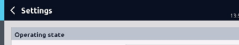

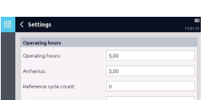

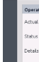

The windows of the operating state and the operating hours serve as information only. No settings can be carried out from here. The HYDACLAB sensor counts the operating hours. The operating hours indicate the maximum expected operating hours of the system since its last reset. The Arrhenius rate defines the operating hours depending on temperature. The weighting is based on an Arrhenius calculation. HYDACLAB counts the amount of resets performed and is displayed as the number of reference cycles. The total number of operating hours describes the system's actual performed number of operating hours including the performed resets. 

## 5.4.5 Oil Condition Display 

With the oil condition screen you have the opportunity to define the warning and alarm thresholds of the sensor, each of which are linked to a LED. If the alarm threshold for conductivity change or DC change is set to +/- 0%, then they are not considered when displaying the oil condition.

## 5.4.6 Extended Settings "Lab Mode" 

"Lab Mode" switches off the referencing phase. The measured values DC and conductivity are recorded and output only as absolute values. There is no referencing phase and the "relative change in conductivity" and "relative change in DC" readings remain at 0%. 

5.4.7 Conductivity settings The default setting for conductivity is 0-100 nS / m. If the conductivity of the oil will never be more than 10 nS / m, then there is a possibility to set the conductivity scaling to 0-10 nS / m. 

## 5.4.8 Reset 

There are three different ways to perform a reset of the sensor. Reset to default settings means that all settings in the device are set back to its delivered status.

Reset reference cycle (see 7.1) means that all settings will be kept, except for the reference cycle data. Therefore, the reference cycle must be performed again, i.e. after an oil change. Reset log means that the fit table is kept but the data storage is cleared.

## Hydaclab **1400 Page 12**

5.5 Interface Description HSP (HYDAC Simple Protocol) The device has a serial interface. The user can communicate with the device via this interface. Data transmission at a baud rate of 9600 is possible via PIN 5 using the HSP protocol. The device supports the following functions: 
HSP Sensor Id Command 000 is supported. 

Device status Commands 010 and 011 are supported. Sensor Information Commands 020 and 021 are supported. 

Measured values Commands 030, 031 and 032 are supported. 

Read out Log Commands 060, 061 , 070, 071 and 072 are supported. 

Help Command 999 is supported. 

Detailed information can be found in the HSP protocol manual "HSP Specification". 

6 Start-up HYDACLAB starts its data storage as soon as it is connected to a voltage supply and the fluid temperature exceeds its activating temperature of 40°C (factory settings) for the first time. The output signals for temperature and saturation are available immediately after sensor start-up. The signal for relative change in the DC and relative change in the conductivity is displayed after the homogenisation phase is completed. The conductivity and the dielectric change is indicated as a percentage deviation from the reference value determined during the referencing phase. 

6.1 Fit Table HYDACLAB continuously writes to a fit table in which the respectively defined conductivity and dielectric values for each temperature are stored. By means of this table, the measured values can be linked to a reference temperature. The fit table will be frozen on completion of the homogenisation phase. The frozen fit table provides a reference framework for the calculation of the conductivity and dielectric change. On delivery of the HYDACLAB the table is empty. The table is not written to until the activation temperature has been exceeded. 

6.2 Reference Cycle During the referencing cycle HYDACLAB records the characteristics of the respective oil and adapts to the conditions of the relevant application. It is therefore essential that typical operating conditions, particularly all relevant operating temperature ranges, are run through during the reference phase. The end of the reference cycle is achieved when 50% of the working temperature is recorded and can be recognised from the LED as well as from the signal level of the status signal (see chapter 5.2). 

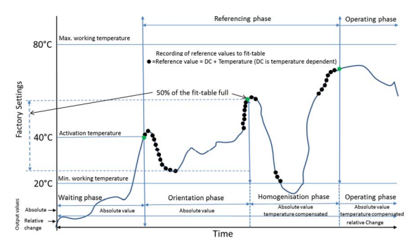

During the referencing phase, the user must ensure that HYDACLAB is only supplied with voltage if the operating conditions of the machine/system are normal. 

(For example, the supply voltage of the sensor can be linked to the pump operation.) 
The sensor should be reset if, after the machine/system is part-filled or re-filled the analogue values for the relative change in dielectric constant and the electric conductivity do not fall within a window of ± 5 %. This can be caused by variations in oil characteristics in different oil batches. 

If only small temperature changes occur during the referencing phase, then it is possible that the "Fit Table" would never become 50% full, preventing the "Orientation Phase" from switching to the "Homogenisation Phase". Therefore the working temperature range should be set to accommodate this, otherwise HYDACLAB will never reach the Operating Phase, preventing the monitoring and alarming of changes in DC and Conductivity. 

Alternatively, if due to limited temperature changes, the requirements of the "Referencing Phase" cannot be guaranteed, then only the absolute values need to be monitored (Lab Mode). Please note that if the temperature changes are only small, then the recording of the relationship between temperature and DC or the temperature and Conductivity becomes irrelevant anyway. 

## 7 Reset Functions

With reset, the entire contents of the memory including the reference phase is deleted. The sensor begins a new referencing phase once the voltage supply is re-connected and once the fluid temperature of 40°C (default setting) is exceeded for the first time. All parameter settings remain unchanged in the sensor. 

A reset can be carried out in different ways: 
7.1 Reset Button Button on the device. 

For this purpose, please loosen the screw (Torx T20) and press the button using a pointed object (pen or similar). Ensure the power supply is switched on. The button must be pressed for 2 seconds. 

## 7.2 Reset Using Hmg 4000

A **reset** of the HYDACLAB can be performed in the sensor dialogue of the HMG 4000. 

(Connection of the HYDACLAB to a HMG 4000 see chapter13.2, HMG 4000). 

## 7.3 Reset Using Pc Software Cmwin

A **reset** of the HYDACLAB can be performed in the sensor dialogue of the CMWIN software. 

CMWIN is special HYDAC PC software and is supplied with the HMG 510 and HMG 4000. 

## 8 Electrical Connection

[table_19][{0: 'Pin', 1: '1', 2: '2', 3: '3', 4: '4', 5: '5'}, {0: '1C000', 1: '+UB', 2: 'SP1/AA1*', 3: 'GND', 4: 'SP2/AA2*', 5: 'HSI'}, {0: '00S12', 1: '+UB', 2: 'RS485B', 3: 'GND', 4: 'RS485A', 5: 'HSI'}, {0: '* Default settings: Pin 2:SP1 und Pin 4: AA2', 1: '', 2: '', 3: '', 4: '', 5: ''}][/table_19]

[table_20][{0: 'M 12x1, 8 pole:  Pin 1', 1: '2', 2: '3', 3: '4', 4: '5', 5: '6', 6: '7', 7: '8', 8: ''}, {0: '1CS12', 1: '+UB', 2: 'SP1/AA1', 3: 'GND', 4: 'PE', 5: 'HSI', 6: 'RS485A', 7: 'RS485B', 8: 'SP2/AA2'}][/table_20]

The following is applicable for the analogue output:
RLmin ≥ 1 k for output 0..10V
RLmax ≤ 500  for output 4..20mA 

## Note:

The load resistance RL is the sum of the internal input resistance of the evaluation unit and the resistance of the connection line. 

[table_21][{0: '9', 1: 'Standard Technical data'}, {0: 'Input data Saturation level (relative humidity)', 1: '0 .. 100 % saturation'}, {0: 'Temperature', 1: '-25 .. +100 °C'}, {0: 'Dielectric constant (DC = εR)', 1: '1 .. 10'}, {0: 'Change in the dielectric constant', 1: '-30 .. 30%'}, {0: 'Electrical conductivity', 1: '0 .. 100 nS/m'}, {0: 'Cange of electronic conductivity', 1: '-100 .. 200%'}, {0: 'Operating pressure', 1: '< 50 bar'}, {0: 'Pressure resistance', 1: '< 600 bar'}, {0: 'Flow velocity', 1: '< 5 m/s'}, {0: 'Parts in contact with fluid', 1: 'Stainless steel / ceramic with vacuum-metallised seal  Glass with thin-film metallic coating / FKM'}, {0: 'Output variable saturation level  Output signal (0 .. 100 %)', 1: '4 .. 20 mA / 0 .. 10 V'}, {0: 'Calibration accuracy', 1: '\uf0a3 ± 2 % FS max.'}, {0: 'Accuracy', 1: '± 3 % FS typ. *'}, {0: 'Output variable temperature  Output signal (-25 .. +100°C)', 1: '4 .. 20 mA / 0 .. 10 V'}, {0: 'Accuracy', 1: '\uf0a3 ± 3 % FS max.'}, {0: 'Output variable dielectric constant (εR)  Output signal (1 .. 10)', 1: '4 .. 20 mA / 0 .. 10 V'}, {0: 'Accuracy', 1: '\uf0a3 ± 5 % FS max.'}, {0: 'Output variable change of dielectric constant  Output signal (±30 % of IV)  Accuracy', 1: 'see below **'}, {0: 'Output variable electric conductivity (not for Mod 001) Output signal (0 .. 100 nS/m)', 1: '4 .. 20 mA / 0 .. 10 V'}, {0: 'Accuracy', 1: '\uf0a3 ± 5 % FS max.'}, {0: 'Output variable change of electric conductivity (not for Mod 001) Output signal (-100 .. 200 %)  Accuracy', 1: 'see below **'}, {0: 'Switching output (default settings)  Signal 1 (N/C)', 1: 'PNP Switching output 0.5 A max.  Switching level \uf0b3 UB - 4 V'}, {0: 'Default alert SP1 relative humidity', 1: '\uf0b3 85 %'}, {0: 'Default alert level SP1 temperature', 1: '\uf0b3 80 °C'}, {0: 'Default alert level SP1 rel. change in dielectric constant', 1: '± 15 %'}, {0: 'Default alert SP1 rel. change in conductivity', 1: '± 15 % (not for Mod 001)'}, {0: 'Environmental conditions  Nominal temperature range', 1: '+20 .. +80 °C'}, {0: 'Storage temperature', 1: '-30 .. +90 °C'}, {0: 'Fluid compatibility', 1: 'Suited for hydraulic and lubrication oils'}, {0: '- mark', 1: 'EN 61000-6-1 / 2 / 3 / 4'}, {0: 'Viscosity range', 1: '1 .. 5000 cSt'}, {0: 'Shock resistance acc. to DIN EN 60068-2-27', 1: '50 g / 11 ms / half sine'}, {0: 'Vibration resistance acc. to DIN EN 60068-2-6 at 5 .. 2000 Hz', 1: '10 g / sine'}, {0: 'Protection class acc. To DIN EN 60529', 1: 'IP 67 ***'}, {0: 'Other data Supply voltage UB', 1: '10 .. 36 V DC'}, {0: 'Residual ripple of supply voltage', 1: '\uf0a3 5 %'}, {0: 'Current consumption without outputs', 1: 'max. 100 mA'}, {0: 'Mechanical connection', 1: 'G ¾ A ISO 1179-2'}, {0: 'Tightening torque, recommended', 1: '30 Nm'}, {0: 'Electrical connection', 1: 'M12x1, 5 pole / 8 pole'}, {0: 'Housing', 1: 'Stainless steel'}, {0: 'Weight', 1: 'approx. 215 g'}, {0: 'Note: reverse polarity protection, short circuit protection provided. FS (Full Scale) = relative to complete measuring range IV (Initial Value)   * The max. accuracy achievable when measuring relative humidity is heavily dependent on the type of fluid or fluid additive. More precise information   on this is available on request.   ** The accuracies when measuring the change of dielectric constant and the electric conductivity depend on the application, the oil type and the auto-  4 .. 20 mA / 0 .. 10 V 4 .. 20 mA / 0 .. 10 V', 1: ''}][/table_21]

## 10 Order Details Model Code Hydaclab 1400

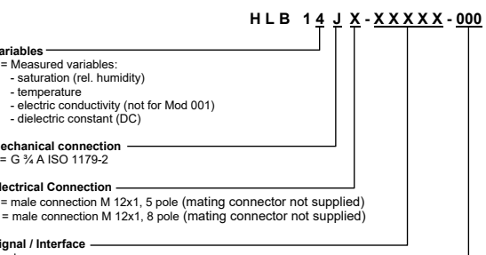

*
5 pole 1C000 = 1 switching output / analogue output 00S12 = RS 485 00F11 = CANopen (on request) 00F31 = IO-Link (on request) 
8 pole 1CS12 = 1 switching output / analogue output / RS 485 Modification number

 000 = standard 001 = Info *
HLB 14J8-1C000-001 is a pure replacement for the HLB 1300. This device is preset on analog output 2 so that no conductivity values are output

## 1 Dimensions

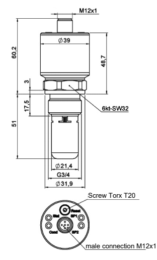

## 12 Accessories 12.1  Mechanical

ZBM 21 (Flow)
Adapter to connect the HYDACLAB® fluid condition sensor in a G 1/2" line.

Note: suitable only for max. operating pressure < 50 bar and max oil flow rate < 5 m/s.

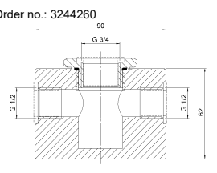

HYDACLAB®

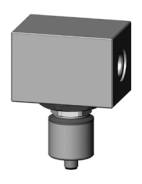

## 12.2 Electric Zbe 08 (5 Pole)

Connector M12x1, right-angled Order no.:6006786 ZBE 08-02 (5 pole) with 2m cable Order no.:6006792 ZBE 08S-02 (5 pole) with 2m screened cable Order no.:6019455 ZBE 0P (8 pole) 
Order no.:6055444 ZBE 0P-02 (8 pole) with 2m cable Order no.:6052697 

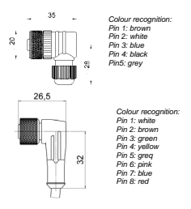

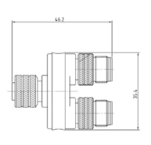

ZBE 26 (only required if HLB is to be supplied from an external supply to save HMG battery power) Y-adapter (blue) for HLB Order no.:3304374 

## Zbe 46 

Adapter, HLB 1400 + AS1000 Order no.: 925725 ZBE 30-02 Sensor cable M12x1, 2m Order no.:6040851 ZBE 30-05 Sensor cable M12x1, 5m Order no.:6040852 

## 13 Displays

13.1 HMG 510 Portable 2-channel digital display, specially designed for use with HSI and SMART sensors. 

It is possible to display the actual measured values on the HMG 510 display. 

Order No.: 909889 HMG 510-000 

## 13.1.1 Connecting To A Hmg 510 

Remove the supply cable from the electrical connection of the HYDACLAB and screw the blue Y-adapter HLB "ZBE 26" onto the sensor. Reconnect the supply cable to connection A of the Yadapter and connect connection B using a sensor cable ZBE 30-xx to input A or B of the HMG 
510. 

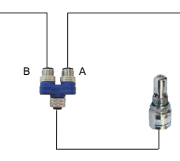

+Ub

## 13.2 Hmg 4000

Portable data recorder with a colour display with full graphics capability to display or record measured values from the HYDACLAB. With the HMG 4000 the actual measured values and the stored measurement curves can be shown on the HMG 4000 display. The recordings can also be stored and processed on the HMG 4000. In addition, the HYDACLAB can be reset using the HMG 
4000. 

(for a detailed description, see the operating manual for the HMG 4000). Order no.: 925279 HMG 4000-000-E

To connect SMART sensors with the 

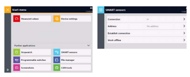 HMG 4000, select the **SMART Sensors** option in the **start menu**. Then enter the **channel** to which the SMART sensor is connected. You also have the option of entering a sensor bus address. The default setting is **No address.** Bus addresses must be assigned when the SMART sensor is operated in a bus system. After selecting **Establish connecting** information about the connected SMART sensor will be displayed above the function bar. 

## Main Menu 

 Smart Sensors

You are now in the SMART Sensor's menu and can enter settings to adapt the sensor to your requirements. 

The items contained in the menu vary in accordance with the sensor type connected, i.e. not all of the menu items described below may be available. 

## Sensor Information

This menu provides the following information about the connected SMART sensor: 
 Part number Serial number Information about the various measurement channels with regard to their type and measurement range. 

Sensor Measured Values 

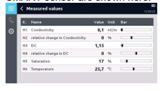 The actual measured values along with the associated units of measurement of the connected SMART sensor are shown here. 

## Sensor Manage Recordings

In this menu you can transfer long-term recordings created by the SMART sensor to the HMG 4000, or delete them from the SMART sensor's memory. **Refresh** enables you to check whether new recordings are present. After having selected a recording and the option **transmission** you can determine whether you'd like to store it in the HMG 4000 under the earlier displayed combination of name and number, or whether you would like to assign a new designation. 

## Sensor Settings

In the sensor settings you can adjust the device parameters to suit your requirements, see chapter 5.4. 

## 13.2.1 Connecting To A Hmg 4000 

Remove the supply cable from the electrical connection of the HYDACLAB and screw the adapter 
"ZBE 46" onto the sensor. 

Connect one of the inputs A to D of the HMG 4000 to the adapter "ZBE 46" using a sensor cable "ZBE 30-0z". 13.3 CMWIN This is specially developed PC software, which communicates with the HYDACLAB via a communication bridge (HMG 510 or HMG 4000). Using this software, measurement curves can be transferred to the PC, stored, displayed and processed or the actual measured values can be displayed. CMWIN is supplied with the HMG 510 and HMG 4000. It is also available for download from our internet site. 

## 13.4 Csi-B-2

By means of the condition monitoring interface module CSI-B-2 and the CMWIN software, it is also possible to read out the measured values directly from the sensor or to set the parameters. 

## Note

All HYDAC software products are available for download from our internet site. 

## 14 Items Supplied 1 Hydaclab - Sensor 1 Operating Manual 15 Important Tips At A Glance

 The sensor once fitted must be completely immersed in the fluid and the fluid must be able to circulate freely through the sensor. 

 When installing without the mounting block ZBM 21, make particularly sure that the flow of fluid is not impeded by the installation. There must be a minimum distance of 10 mm between the front end of the sensor head and the opposite wall of the pipe/housing. 

 Ensure there is constant flow and prevent the formation of air bubbles. With standing oil, variations in measurement may increase. 

 In principle the HYDACLAB must only be supplied with voltage if normal flow is guaranteed. In other words, disconnect the HYDACLAB from the supply voltage as soon as the system is switched off, stops operating or if the flow is interrupted for a significant period. 

 Ensure that the operating conditions are typical during the reference cycle i.e. the whole range of conditions relevant to operation are included. 

 The reference cycle starts as soon as HYDACLAB is supplied with voltage and the fluid temperature exceeds the activation temperature of 40°C for the first time (default settings). 

 During the reference cycle, please avoid mixing fluids and filling up with new oil. 

 In the event of oil change or serious alteration in the ambient conditions, the unit should be reset. 

## 16 Liability

This operating manual was made to the best of our knowledge. Nevertheless and despite the greatest care, it cannot be excluded that mistakes could have crept in. Therefore, please understand that in the absence of any provisions to the contrary hereinafter our warranty and liability - for any legal reasons whatsoever - are excluded in respect of the information in this operating manual. In particular, we shall not be liable for lost profit or other financial loss. This exclusion of liability does not apply in cases of intent and gross negligence. Moreover, it does not apply to defects which have been deceitfully concealed or in cases of culpable harm to life, physical injury and damage to health. In the event that we should negligently breach any material contractual obligation, our liability shall be limited to the foreseeable loss. Claims due to the Product Liability shall remain unaffected. 

In cases where the translation is used, the text of the original German Assembly and Repair Instructions shall prevail. 

[table_22][{0: 'Notes'}][/table_22]

## Hydac Electronic Gmbh

Hauptstr. 27 D-66128 Saarbrücken Germany Web: www.hydac.com E-Mail: electronic@hydac.com Tel.: +49 (0)6897 509-01 Fax: +49 (0)6897 509-1726 

## Hydac Service

For enquiries regarding repairs, please contact HYDAC Service. 

## Hydac Service Gmbh

Hauptstr. 27 D-66128 Saarbrücken Germany Tel.: +49 (0)6897 509-1936 Fax: +49 (0)6897 509-1933 

## Note

The information in this manual relates to the operating conditions and applications described. For applications and operating conditions not described, please contact the relevant technical department. If you have any questions, suggestions, or encounter any problems of a technical nature, please contact your HYDAC representative. 