# Hy-Ttc 500


Quick Start Guide - C Programming Programmable ECU for Sensor-Actuator Management Product Version 01.08

[table_0][{0: 'Document Number:', 1: 'D-TTC5F-G-20-004'}, {0: 'Document Version:', 1: '1.4.6'}, {0: 'Date:', 1: '07-May-2020'}, {0: 'Status:', 1: 'Released'}][/table_0]

TTControl GmbH Schoenbrunner Str. 7, A-1040 Vienna, Austria,Tel. +43 1 585 34 34–0, Fax +43 1 585 34 34–90, office@ttcontrol.com No part of the document may be reproduced or transmitted in any form or by any means, electronic or mechanical, for any purpose, without the written permission of TTControl GmbH. Company or product names mentioned in this document may be trademarks or registered trademarks of their respective holders. TTControl GmbH undertakes no further obligation or relation to this document.

Copyright  2020 TTControl GmbH. All rights reserved. Subject to changes and corrections TTControl GmbH Confidential and Proprietary Information

## Legal Notice Document Number: D-Ttc5F-G-20-004

The data in this document may not be altered or amended without special notification from TTControl GmbH. TTControl GmbH undertakes no further obligation in relation to this document. The software described in it can only be used if the customer is in possession of a general license agreement or single license. The information contained in this document does not affect or change any General Terms and Conditions of TTControl GmbH and/or any agreements existing between TTControl GmbH and the recipient regarding the product or Sample concerned. The reader acknowledges that this document may not be reproduced, stored in a retrieval system, transmitted, changed, or translated, in whole or in part, without the express prior written consent of TTControl GmbH. The reader acknowledges that any and all of the copyrights, trademarks, trade names, patents (whether registrable or not) and other intellectual property rights embodied in or in connection with this document are and will remain the sole property of TTControl GmbH or the respective right holder. Nothing contained in this legal notice, the document or in any web site of TTControl GmbH shall be construed as conferring to the recipient any license under any intellectual property rights, whether explicit, by estoppel, implication, or otherwise. The product or Sample is only allowed to be used in the scope as described in this document.

TTControl GmbH provides this document "as is" and disclaims all warranties of any kind. The entire risk, as to quality, use or performance of the document remains with the recipient.

All trademarks mentioned in this document belong to their respective owners.

Copyright  2020 TTControl GmbH. All rights reserved.

## Contents

[table_1][{0: 'Table of Contents', 1: 'ii', 2: '', 3: ''}, {0: 'List of Figures', 1: '1', 2: '', 3: ''}, {0: 'I', 1: 'Quick Start Guide', 2: '2', 3: ''}, {0: '1', 1: 'Overview', 2: '', 3: '3'}, {0: '2', 1: 'Information and latest version of software', 2: '', 3: '4'}, {0: '3', 1: 'Getting Started', 2: '5', 3: ''}, {0: '4', 1: 'Using the Interface Board', 2: '', 3: '7'}, {0: '4.1', 1: 'HY-TTC 500 Cable Harness', 2: '', 3: '7'}, {0: '4.2', 1: 'HY-TTC 500 CAN Termination', 2: '8', 3: ''}, {0: '4.3', 1: 'HY-TTC 500 Power Supply', 2: '9', 3: ''}, {0: '4.4', 1: 'HY-TTC 500 Terminal 15 (KL15) Modes', 2: '', 3: '11'}, {0: '4.5', 1: 'Status LEDs', 2: '', 3: '12'}, {0: '4.6', 1: 'Selecting BroadR-Reach®or Ethernet mode', 2: '', 3: '13'}, {0: '4.7', 1: 'HY-TTC 500 Download and Debugging', 2: '', 3: '14'}, {0: '5', 1: 'C Programming Howto for HY-TTC 500', 2: '', 3: '15'}, {0: '5.1', 1: 'Overview', 2: '', 3: '15'}, {0: '5.2', 1: 'Endianess', 2: '', 3: '15'}, {0: '5.3', 1: 'Tool Chain', 2: '', 3: '15'}, {0: '5.4', 1: 'File Structure', 2: '20', 3: ''}, {0: '5.5', 1: 'Development Environment', 2: '22', 3: ''}, {0: '5.6', 1: 'Settings.mk', 2: '22', 3: ''}, {0: '5.7', 1: 'Application Examples', 2: '24', 3: ''}, {0: '5.7.1', 1: 'Build Application', 2: '', 3: '24'}, {0: '5.7.2', 1: 'General', 2: '', 3: '27'}, {0: '5.7.3', 1: 'Help for C Driver Functions', 2: '', 3: '30'}, {0: '5.7.4', 1: 'Linking Constant Data', 2: '', 3: '30'}, {0: '5.7.5', 1: 'Safety Configuration', 2: '', 3: '32'}, {0: '5.7.6', 1: 'Debugging of a safety-critical Application', 2: '', 3: '32'}, {0: '5.8', 1: 'Flashing the HY-TTC 500', 2: '32', 3: ''}, {0: '5.8.1', 1: 'The Lauterbach Debugging Device and Trace32', 2: '', 3: '32'}, {0: '5.8.2', 1: 'The TTC-Downloader Tool', 2: '', 3: '45'}, {0: '6', 1: 'Memory Mapping', 2: '', 3: '48'}, {0: '6.1', 1: 'Memory Map for Internal Flash and RAM', 2: '', 3: '48'}, {0: '6.2', 1: 'Memory Map for External Flash and RAM', 2: '49', 3: ''}, {0: 'References', 1: '50', 2: '', 3: ''}, {0: 'Legal Disclaimer', 1: '', 2: '51', 3: ''}][/table_1]

ii Contents

## List Of Figures

[table_2][{0: '3.1', 1: 'HY-TTC 500 Starter Kit', 2: '', 3: '5'}, {0: '3.2', 1: 'HY-TTC 500 Starter Kit for C programming', 2: '', 3: '6'}, {0: '4.1', 1: 'HY-TTC 500 Interface Board', 2: '', 3: '7'}, {0: '4.2', 1: 'HY-TTC 500 Interface Board CAN Termination', 2: '', 3: '8'}, {0: '4.3', 1: 'HY-TTC 500 Interface Board CAN Termination', 2: '', 3: '9'}, {0: '4.4', 1: 'HY-TTC 500 Interface Board Power Supply', 2: '10', 3: ''}, {0: '4.5', 1: 'HY-TTC 500 Interface Board Power Supply', 2: '10', 3: ''}, {0: '4.6', 1: 'HY-TTC 500 Interface Board Terminal 15 (KL15)', 2: '11', 3: ''}, {0: '4.7', 1: 'HY-TTC 500 Interface Board Terminal 15 (KL15)', 2: '11', 3: ''}, {0: '4.8', 1: 'Status LEDs', 2: '', 3: '12'}, {0: '4.9', 1: 'Status LEDs', 2: '', 3: '13'}, {0: '4.10', 1: 'Jumpers for Ethernet or BroadR-Reach®mode', 2: '13', 3: ''}, {0: '5.1', 1: 'CCS Edit - Code Composer Studio', 2: '', 3: '16'}, {0: '5.2', 1: 'Show only. . . check box', 2: '', 3: '16'}, {0: '5.3', 1: 'Work with field', 2: '17', 3: ''}, {0: '5.4', 1: 'Add button', 2: '17', 3: ''}, {0: '5.5', 1: 'Add Repository dialog', 2: '18', 3: ''}, {0: '5.6', 1: 'TI Compiler Updates branch', 2: '', 3: '19'}, {0: '5.7', 1: 'ARM Compiler Tools 5.1.6', 2: '', 3: '19'}, {0: '5.8', 1: 'Contents of the Get_Started directory', 2: '', 3: '20'}, {0: '5.9', 1: 'The examples and template directories', 2: '', 3: '21'}, {0: '5.10', 1: 'Settings.mk', 2: '23', 3: ''}, {0: '5.11', 1: 'Select new wizard page', 2: '', 3: '25'}, {0: '5.12', 1: 'Import Existing Code page', 2: '', 3: '25'}, {0: '5.13', 1: 'Browse For Folder dialog', 2: '', 3: '26'}, {0: '5.14', 1: 'Console pane with successful build', 2: '26', 3: ''}, {0: '5.15', 1: 'Includes', 2: '27', 3: ''}, {0: '5.16', 1: 'Application Descriptor Block (APDB)', 2: '', 3: '28'}, {0: '5.17', 1: 'Application initialization', 2: '', 3: '29'}, {0: '5.18', 1: 'Application loop', 2: '', 3: '30'}, {0: '5.19', 1: 'Linking constant data to the external flash and/or application configuration data', 2: '.', 3: '31'}, {0: '5.20', 1: 'Lauterbach Base Station', 2: '', 3: '33'}, {0: '5.21', 1: 'Trace32 Software', 2: '', 3: '33'}, {0: '5.22', 1: 'Chosse Destination Location page', 2: '', 3: '33'}, {0: '5.23', 1: 'Installation Type page', 2: '', 3: '34'}, {0: '5.24', 1: 'Setup Type page', 2: '', 3: '34'}, {0: '5.25', 1: 'TRACE32 Product Type page', 2: '35', 3: ''}, {0: '5.26', 1: 'Maintenance Notice page', 2: '', 3: '35'}, {0: '5.27', 1: 'Debugger Interface Type page', 2: '', 3: '36'}, {0: '5.28', 1: 'OS Selection page', 2: '', 3: '36'}, {0: '5.29', 1: 'CPU selection page', 2: '', 3: '37'}, {0: '5.30', 1: 'TRACE32 executable type dialog', 2: '37', 3: ''}][/table_2]

[table_3][{0: '5.31', 1: 'Environment variable T32ID page', 2: '', 3: '37'}, {0: '5.32', 1: 'Device software installation', 2: '38', 3: ''}, {0: '5.33', 1: 'Environment variable T32TMP page', 2: '38', 3: ''}, {0: '5.34', 1: 'Prepare TRACE32 for Integration. . . page', 2: '39', 3: ''}, {0: '5.35', 1: 'Select way to submit registration page', 2: '39', 3: ''}, {0: '5.36', 1: 'TRACE32 software is successfully finished page', 2: '40', 3: ''}, {0: '5.37', 1: 'JTAG Adapter Board', 2: '40', 3: ''}, {0: '5.38', 1: 'JTAG Cable', 2: '40', 3: ''}, {0: '5.39', 1: 'HY-TTC 500 with JTAG connector and LEDs', 2: '', 3: '41'}, {0: '5.40', 1: 'Lauterbach connection to HY-TTC 580 (1)', 2: '', 3: '42'}, {0: '5.41', 1: 'Lauterbach connection to HY-TTC 580 (2)', 2: '', 3: '42'}, {0: '5.42', 1: 'HY-TTC 500 with LEDs', 2: '', 3: '43'}, {0: '5.43', 1: 'HY-TTC 500 with JTAG connector and signal pins', 2: '', 3: '44'}, {0: '5.44', 1: 'Trace32 and .cmm batch file', 2: '', 3: '44'}, {0: '5.45', 1: 'Flash application dialog', 2: '45', 3: ''}, {0: '5.46', 1: 'Reset Trace32 windows dialog', 2: '45', 3: ''}, {0: '5.47', 1: 'Trace32 Window after flashing', 2: '', 3: '46'}, {0: '5.48', 1: 'TTC-Downloader', 2: '47', 3: ''}, {0: '6.1', 1: 'Memory map for HY-TTC 500 internal Flash', 2: '', 3: '48'}, {0: '6.2', 1: 'Memory map for HY-TTC 500 external RAM and Flash', 2: '', 3: '49'}][/table_3]

HY-TTC 500 Quick Start Guide - C Programming V 1.4.6 2 Part I

# Quick Start Guide

## 1 Overview

The purpose of this document is to give a short overview of how to setup the HY-TTC 500 Starter Kit for C programming.

In case of errors or bugs in documents or workshop examples, please send a feedback to our support team (support@ttcontrol.com).

## 2 Information And Latest Version Of Software

Get the latest version of the Quick Start Guide and information about new product features, improvements and bug fixes from our Service Area at **http://www.ttcontrol.com/service-area/**.

Download the latest files as follows:
1. Enter the **Service Area** page.

2. Then click Controller > HY-TTC 500 Family > IO Driver Release > **IO Driver Release <latest version>**.

3. From the page with the latest IO Driver Release, download Installer - C Programming Environment for HY-TTC 500 <version and build>.

## 3 Getting Started

TTControl GmbH recommends using the HY-TTC 500 Starter Kit, because it includes all components required for smooth development. There are two variants of the HY-TTC 500 Starter Kit available: one for C programming (with JTAG-Adapter and open housing) and one for CODESYS programming. This Quick Start Guide is for the C programming variant (see Figure 3.2 on the following page). For the CODESYS programming variant, see [5]. Note that the Ethernet USB adapter is only part of the starter kit if the corresponding HY-TTC 500 ECU is equipped with an Ethernet interface.

[table_4][{0: 'Nr.', 1: 'Starter Kit Components'}, {0: '1', 1: 'HY-TTC 500 ECU open housing'}, {0: '2', 1: 'JTAG adapter'}, {0: '3', 1: 'JTAG adapter cable'}, {0: '4', 1: 'Interface board'}, {0: '5', 1: 'Cable harness 1.5 m'}, {0: '6', 1: 'Installation CD C-Programming'}, {0: '7', 1: 'Ethernet USB adapter with driver and software'}, {0: '8', 1: 'PCAN USB adapter with driver and software'}, {0: '9', 1: 'Datacable 2m'}, {0: '10', 1: 'Quick Start Guide'}][/table_4]

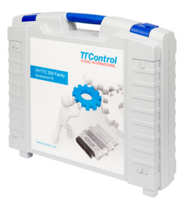

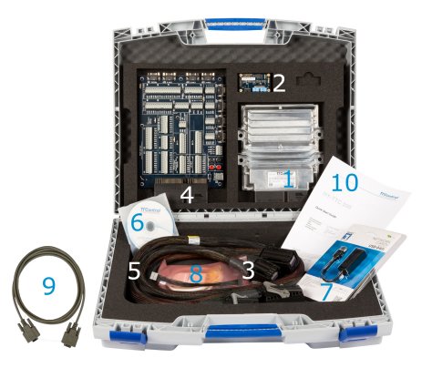

| 6

## 4 Using The Interface Board

 4.1 Hy-Ttc 500 Cable Harness

Connect the HY-TTC 500 to the connector interface board with the provided cable harness. Note: Do not use a cable harness from a different HY-TTC 500 variant! The HY-TTC 500 variants use different cable harnesses and the usage of the wrong cable harness may damage the HY-TTC 500 device.

## 4.2 Hy-Ttc 500 Can Termination

If termination of a CAN interface (2 x 60 Ωsplit termination) is required, then connect the jumper pins for the CAN interface as follows:

[table_5][{0: 'CAN Interface', 1: 'Connect Jumper Pins'}, {0: 'CAN0', 1: '235 with 209 and 222 with 248'}, {0: 'CAN1', 1: '236 with 210 and 223 with 249'}, {0: 'CAN2', 1: '237 with 211 and 224 with 250'}, {0: 'CAN3', 1: '216 with 212 and 225 with 229'}][/table_5]

Figure 4.3 on the next page shows the jumper setting for CAN0 as example.

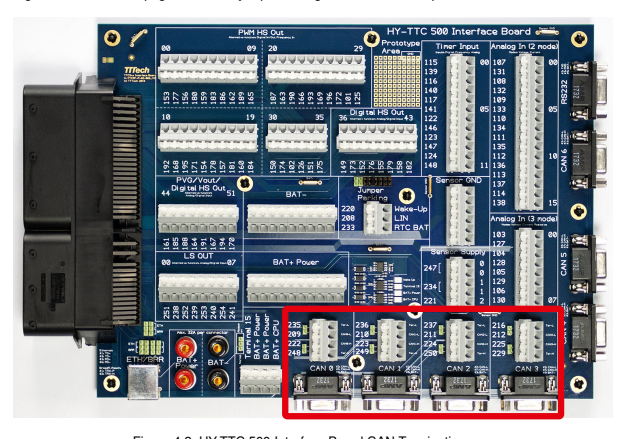

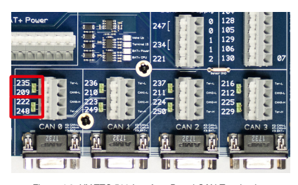

## 4.3 Hy-Ttc 500 Power Supply

- Connect the power supply GND to the black socket named **BAT-**.

- Connect the positive power supply to the red socket named **BAT+ Power** and to **BAT+ CPU**
on the connector terminal block, e.g. by short-circuit of BAT+ CPU to **BAT+ Power**.

See also Figure 4.4 on the following page and Figure 4.5 on the next page.

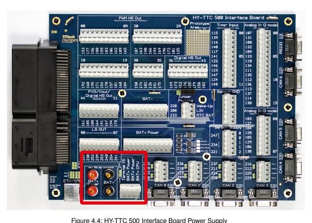

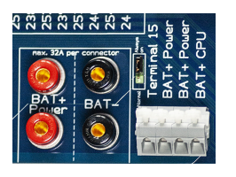

## 4.4 Hy-Ttc 500 Terminal 15 (Kl15) Modes

- **Always on Mode**:

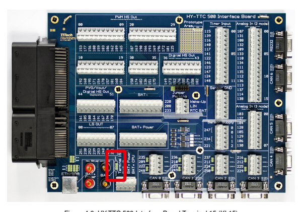

Put the jumper to **Always on** mode if the HY-TTC 500 shall be in active state independent of Terminal 15.

- **Normal Mode**:
Put the jumper to **Normal** mode if the HY-TTC 500 power-up shall depend on **Terminal 15**.

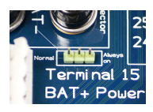

## 4.5 Status Leds

There are status LEDs for
- BAT+ Power

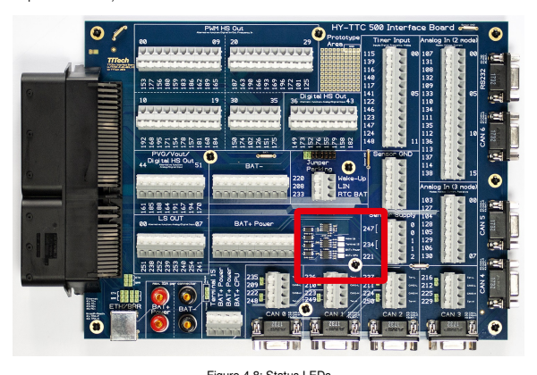

- BAT+ CPU
- Terminal 15
- Wake-Up See Figure 4.8 on this page and Figure 4.9 on the next page. A status LED is on, when the corresponding input voltage is above the lower voltage limit (8V) for safe operation of the ECU. The switching threshold of the LEDs is min. 8 V and max. 8.9 V (to guarantee a voltage >8 V over all parts tolerances).

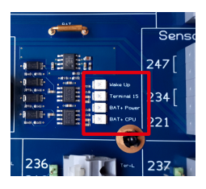

## 4.6 Selecting Broadr-Reach® **Or Ethernet Mode**

For Ethernet mode, set all six jumpers as shown in Figure 4.10(a) on this page. Note: The Ethernet mode is only available for HY-TTC 580.

For BroadR-Reach® mode (also known as 100BASE-T1 Ethernet), set all six jumpers as shown in Figure 4.10(b) on the current page.

Note: The BroadR-Reach® mode is available on HY-TTC 590E, HY-TTC 590, and HY-TTC 508.

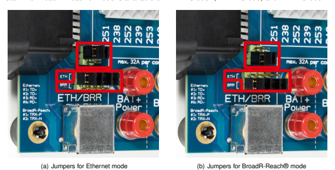

Figure 4.10: Jumpers for Ethernet or BroadR-Reach® mode

## 4.7 Hy-Ttc 500 Download And Debugging

For application download to and debugging of HY-TTC 500 there are the following options:
- For download and debugging via **JTAG** it is possible to use the **Lauterbach Power Debug**
Module with the **TTControl JTAG Adapter Board** and Lauterbach Batch files (***.cmm**).

- For download via CAN it is possible to use the **TTControl Downloader (TTC-Downloader)**
and the **Peak PCAN-USB Adapter**.

- For download via **Ethernet** it is possible to use the **TTControl Downloader** and an Ethernet Interface.

Note: For unexperienced users of the HY-TTC 500 it is recommended to use the CAN or JTAG
option. If you use Ethernet and an application is already flashed to the target, then you have to make sure that the application listens to download requests on the Ethernet. The example application of the Quick Start Guide does not listen to download requests.

## 5 C Programming Howto For Hy-Ttc 500 5.1 Overview

The following C programming Howto gives customers who purchase a product of the HY-TTC 500 family a quick overview of how to program these devices in C. This Howto also lists basic C code to demonstrate how to implement main functions and safety-relevant functions of the device. Finally, this Howto provides a step-by-step guide on how to flash the software with a Lauterbach Debugging Device.

## 5.2 Endianess

The endianess of the ARM®Cortex™-R4F core of the TI TMS570 CPU is configured to BE32.

Big-endian systems store the most-significant byte of a multi-byte data field in the lowest memory address. Also, the address of the multi-byte data field is the lowest address. The endianess of the HY-TTC 500 controllers can not be changed.

## 5.3 Tool Chain

The required tool chain is **TI ARM Code Generation Tools**, version 5.1.6. It conforms to the ISO/IEC 9899:1990 C standard [1], which was previously ratified as ANSI X3.159-1989 (ANSI C89).

An integrated development environment (IDE) named **TI Code Composer Studio (TI CCS)**, is available online from **http://processors.wiki.ti.com/index.php/Download_CCS\#** or from your local distributor.

Upgrade or downgrade the tool chain of your TI CCS installation to a specific version as described in the following instruction list:
Note: It might be necessary to turn off the antivirus protection in Windows Security for Windows 10 before starting with upgrade or downgrade.

1. Click Help > **Install New Software** (see Figure 5.1 on the following page) to open the **Install**
dialog.

2. Clear the check box **Show only the latest versions of available software** in the **Install**
dialog (see Figure 5.2 on the next page).

3. From the **Work with** list, select **Code Generation Tools Updates** (see Figure 5.3 on page 17).

If this option is not available, then you need to perform the following sub-steps, otherwise continue with step 4 on page 18.

a) Click Add (see Figure 5.4 on page 17) to open the **Add Repository** dialog. b) In the dialog (see Figure 5.5 on page 18):
- for **Name**, enter **Code Generation Tools Updates**
- for **Location**, enter **http://software-dl.ti.com/dsps/dsps_public_sw/**
sdo_ccstudio/codegen/Updates/p2win32/

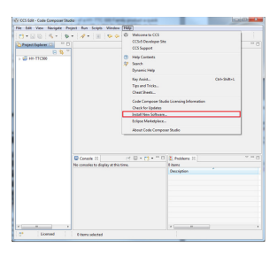

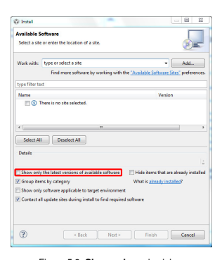

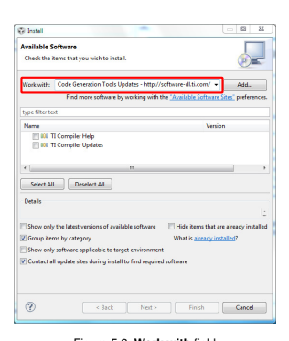

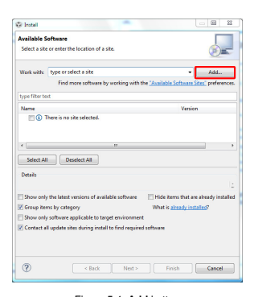

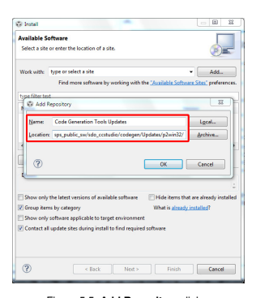

c) From the **Work with** field, select **Code Generation Tools Updates**.

d) Continue with step 4 below.

4. From the list of tools, expand the **TI Compiler Updates** branch (see Figure 5.6 on the next page) and then select **ARM Compiler Tools 5.1.6** (see Figure 5.7 on the facing page)
5. Click **Next** and follow the instructions of the installation wizard.

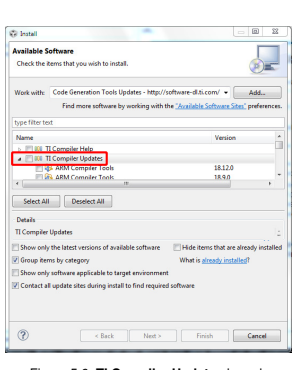 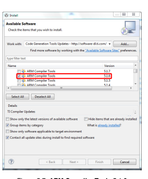

## 5.4 File Structure

The developer package is extracted into five directories:
- **Bootloader**

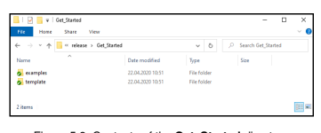

- **Documentation**
- **FPGA_Bitstream**
- **Get_Started**
- **Release_Notes**
Figure 5.8 on the current page shows the contents of the **Get_Started** directory.


Figure 5.9(a) on the facing page shows the contents of the **examples** directory. The **examples** directory has some prebuilt projects to explain the usage of certain functions. Figure 5.9(b) on the next page shows the contents of the **template** directory, which contains a template for starting a new project.

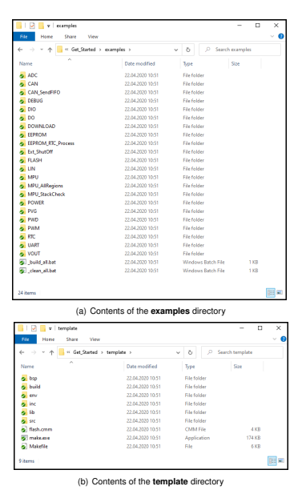

The template should help you getting started. Every new project should start with a copy of this folder as base. The **template** directory contains several subdirectories that are necessary for a project:
- bsp: Subdirectory bsp (Board Support Package) contains files for the linker and board specific objects.

- **build**: Subdirectory **build** is an empty folder in which the generated files are put during the compile process.

- env: Subdirectory env (Environment) contains auxiliary tools like these two:
- File **AddAPDB.exe** patches the **.hex** files with the CRC checksum, application size and build date.

- File **nowECC.exe** generates a second file which contains the corresponding ECC data if the Lauterbach Device is used for flashing the device.

- inc: Subdirectory inc (Include) contains all the header files that are necessary to create a project with the C programming language.

- lib: Subdirectory lib (Libraries) contains the libraries **ttc500.lib** (for the hardware driver)
and **bsp.lib** (for the startup code).

- src: Subdirectory src (Source) contains the source code files to create a project with the C
programming language.

## 5.5 Development Environment

TTControl GmbH recommends the **TI Code Composer Studio (TI CCS)** as your primary development environment.

## 5.6 Settings.Mk

The **Settings.mk** is needed to tell the **Makefile** what settings to use. Some basic settings can be modified in this file.

\# TTC-Downloader hardware type DOWNLOADER_HW_TYPE = 0x00400807 \# Bootloader version BOOTLOADER_VERSION = 3.0 \# path with C compiler ifndef C COMP PATH
C_COMP_PATH = C:\TI\ccsv6\tools\compiler\arm_5.1.6\bin endif \#--
\#
\#=
\# compile code for profiling or debugging 0 ... profiling
\#
1 ... debugging
\#
\#  2 ... release OPT_TYPE  =  1 ifeq ($(OPT_TYPE), 0)
\# optimize for profiling OPT_STR := PROFILING
endif ifeq ($(OPT_TYPE), 1)
\# optimize for debugging OPT_STR := DEBUGGING
endif ifeq ($(OPT_TYPE), 2)
\# optimize for release OPT_STR := RELEASE
endif

## Figure 5.10: Settings.Mk

- DOWNLOADER_HW_TYPE tells AddAPDB.exe for which HW type to compile.

- 0x00400807 compiles for a 1st generation¹ HY-TTC 580.

- 0x00600807 compiles for a 1st generation¹ HY-TTC 540.

- 0x00A00807 compiles for a 1st generation¹ HY-TTC 520 ³
- 0x00C00807 compiles for a 1st generation¹ HY-TTC 510. - 0x00201007 compiles for a 2 nd generation² HY-TTC 580.

- 0x00402007 compiles for a 2 nd generation² HY-TTC 540.

- 0x00602007 compiles for a 2 nd generation² HY-TTC 520 3 . - 0x00802007 compiles for a 2 nd generation² HY-TTC 510.

- 0x00201C07 compiles for a HY-TTC 590.

- 0x00401C07 compiles for a HY-TTC 590E 3.

- 0x00201807 compiles for a HY-TTC 508.

- **C_COMP_PATH** tells the **Makefile** what compiler to use. **TI ARM Code Generation** tools are the only ones recommended by TTControl GmbH. Note: Make sure the path is the one you selected as installation folder for the installation of TI CCS.

- **OPT_TYPE** configures the compiler options to predefined values, for code optimizations and debugging symbols. Select 1 for **debugging** and 2 for a **release build**. If any other compiler or linker options are needed, please refer to the **TI ARM Code Generation Tools manuals** [2] and [3].
Additionally all the paths for the different folders are specified in **Settings.mk**. They must be adjusted if any of the folders are moved.

## 5.7 Application Examples

This section shows a basic example. Section 5.7.1 on this page shows how to build the application with CCS. Section 5.7.2 on page 27 shows the code with some overview comments about the code structure. For more information, see Section 5.7.3 on page 30, Section 5.7.4 on page 30, and Section 5.7.5 on page 32.

## 5.7.1 Build Application

1. Open the Code Composer Studio. 2. Click File > New > **Project...** to open the **New Project** dialog (see Figure 5.11 on the next page).

3. On the **Select a wizard** page, select **Makefile Project with Existing Code** (see Figure 5.11 on the facing page) and then click **Next**.

4. On the **Import Existing Code** page, fill the fields as follows (see Figure 5.12 on the next page):
- for **Project Name**, enter any name (**HY-TTC_500_Demo** in our example) - for **Existing Code Location**, select the **template** folder as shown in Figure 5.13 on page 26
- for **Languages**, select C and C++
- for **Toolchain for Indexer Settings**, select **<none>**
Then click **Finish**.

5. From the menue, select Project > **Build All**. The **Console** pane opens and shows the build process (see Figure 5.14 on page 26).

6. After successful building, the **Console** pane shows **No errors** (see Figure 5.14 on page 26).

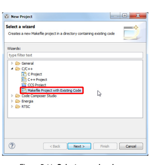

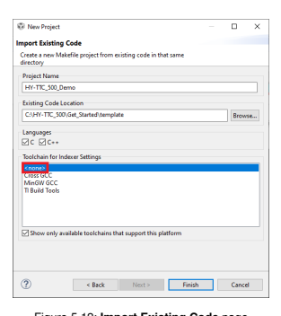

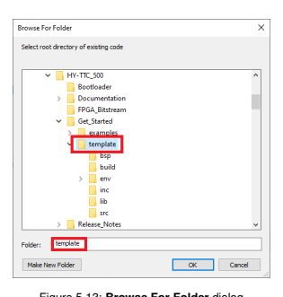


## 5.7.2 General

Every program must include at least the header files **IO_Driver.h** and **APDB.h** (see Figure 5.15 on the current page). The Application Descriptor Block (APDB) is a 128-byte structure that is used by download tools and the bootloader to update the application and do CRC checks. The structure Apdb_t must be defined (see Figure 5.16 on the following page).

[table_6][{0: '/******************************************************************************  * Includes  ******************************************************************************/ #include "APDB.h" #include "IO_Driver.h" #include "IO_DIO.h" #include "IO_POWER.h" #include "IO_RTC.h" Main include files for I/O driver and APDB Other includes Figure 5.15: Includes'}][/table_6]

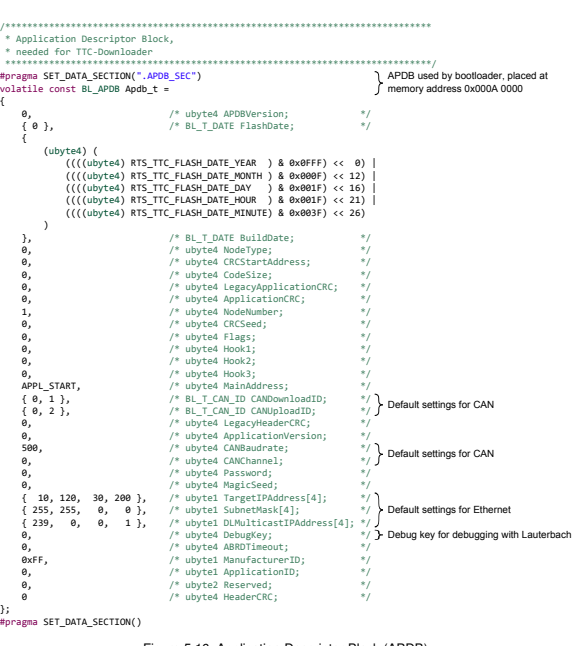

The first step is to initialize the **IO_Driver** in the **main()** function. After that, every channel, function or interface can be initialized with individual parameters (Figure 5.17 on the current page).

/******************************************************************************
 * **Main Task**
 ******************************************************************************/
\#pragma TASK( main ); void main(void)
{ volatile IO_ErrorType io_error = IO_E_OK;
 ubyte4 timestamp = 0; ubyte2 pwm0_current = 0; bool pwm0_fresh = FALSE;
 /* safety configuration */
 IO_DRIVER_SAFETY_CONF safety_conf;
 /* 10ms cycle period with 25% window size,
 * no resets,
 * 30ms glitch filter, * no callbacks */
 safety_conf.command_period = 10000; safety_conf.windows_size = SAFETY_CONF_WINDOW_SIZE_25_PERCENT;
 safety_conf.reset_behavior = SAFETY_CONF_RESETS_DISABLED;
 safety_conf.glitch_filter_time = 30; safety_conf.error_callback = NULL;
 safety_conf.notify_callback = NULL;
 
 /* initialize I/O driver with safety configuration */
 io_error = IO_Driver_Init(&safety_conf);
1) Initialize I/O driver
 /* setup a PWM output with current measurement */
 io_error = IO_PWM_Init( IO_PWM_00 /* PWM channel 0 */
 , 100 /* frequency is 100Hz */
 , TRUE /* positive polarity */ , FALSE /* no diagnostic margin */
 , NULL /* not safety critical */ );
2) Initialize I/Os
 /* turn on power stage */
 io_error = IO_POWER_Set( IO_INT_POWERSTAGE_ENABLE , IO_POWER_ON
 );
 /* turn on safety switch 0 */ io_error = IO_POWER_Set( IO_INT_SAFETY_SW_0
 , IO_POWER_ON
 );
 /* start the RTC */
 IO_RTC_StartTime(&timestamp); 

[table_7][{0: '3) Enable outputs 4) Start timestamp'}][/table_7]

Figure 5.17: Application initialization After initializiation, typically a while loop (**while (1)**) is executed. This is the main loop of the application, and it will be executed each cycle time ms. See Figure 5.18 on this page.

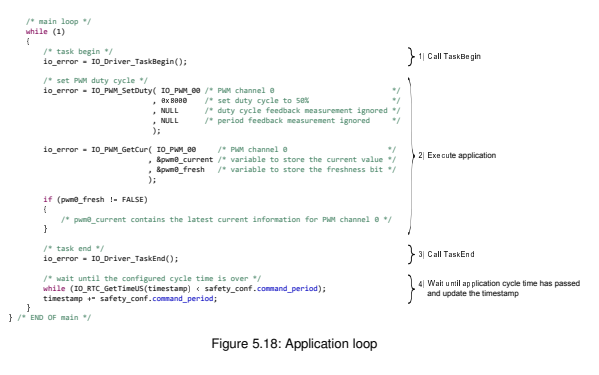

Be aware that the duration of each cycle is 10000 µs in this case. See also Figure 5.17 on the previous page, parameter **safety_conf.command_period**.

## 5.7.3 Help For C Driver Functions

The I/O driver API documentation (**HY-TTC_500_IO_Driver_Manual_V3.1.0.chm** [4]) is available in the compiled HTML format and can be found in **Documentation > Manuals**. It provides a short overview of the available I/O driver functions as well as detailed descriptions of those functions, including parameters, return values and examples.

## 5.7.4 Linking Constant Data

Constant data is linked to the application region by default. However, it can also be linked to the external flash memory (if available) or to the application configuration data region. The major difference is the integrity protection of their respective contents. While constant data linked to the external flash memory is protected by the application CRC, the application configuration data region's integrity must be ensured by the application itself. Figure 5.19 on the facing page depicts an example of how to link constant data to the external flash memory as well as to the application configuration data region.

/******************************************************************************
 * **Global data**
 ******************************************************************************/

```
#pragma SET_DATA_SECTION("#$% &
                             'FLA(
                                   )
                                             
                                    ")
/*
 * After setting the active data section to " #$%&_FLASH"* the linker places
 * ALL of the subsequently defined variables to the +
                                                    ,-
                                                      ernal flash memory.
 * 
 * Attention: Be aware that the constant data linked to the e,-
                                                               +
                                                                         
                                                                .
                                                                          
                                                                nal flash
 * memory is protected by the application CR/0 Thus, any modification
 * will lead to an invalid application CRC.
 */
const ubyte1 foo = 1
                   2
                             
                     1; /* foo is linked to e,-
                                                  +
                                                            
                                                   .
                                                             
                                                   nal flash */
const uby-
          +
                    
          3
                    
            bar = 124
                     3567 /* bar is also linked to +
                                                    ,
                                                              
                                                     ternal flash */

```

#pragma SET_DATA_SECTION("#/**FG_FLA**(
)

## ")

/*
 * After setting the active data section to " \#CFG_FLASH"* **the linker places**
 * ALL of the subsequently defined variables to the configuration flash memory.

 * 
 * Attention: Be aware that the content of the configuration flash memory is
 * NOT protected by the application CR/0 **This means that the data**
 * integrity of the configuration flash memory must be ensured by
 * the application itself.

 */
const ubyte2 wayne = 8 5 6**; /* wayne is linked to configuration flash */**

#pragma SET_DATA_SECTION()
/*
 * After placing the respective global variables to the +
,

ternal and
 * configuration flash memory, the active data section needs to be reset
 * to its default value.

 */

## Figure 5.19: Linking Constant Data To The External Flash And/Or Application Configuration Data 5.7.5 Safety Configuration

For safety-critical applications, every safety-critical IO pin can be initialized with a safety configuration. Please refer to **HY-TTC_500_Series_C_API_Manual.chm** [4] for further details.

To enable any outputs, the I/O Driver has to be configured with a valid safety configuration. The I/O Driver safety configuration consists of several elements:
- **command_period [**µs]: Sets the period at which the application cycle is executed.

Important: The **command_period** is checked by the watchdog and has to meet the window configuration.

- **window_size [%]**: Configures the size of the window for the watchdog which checks the command_period. The application cycle has to fulfill those timing requirements.

- **reset_behavior**: Configures how often the watchdog can restart the CPU in case of an error. If a safety-critical error occurs, the watchdog will reset the CPU and start again. After the maximum number of resets, a permanent safe state will be entered.

- **glitch_filter_time [ms]**: Sets the time a temporary error condition must persist to cause an error reaction by the safety function.

- **error_callback**: Configures the error callback for the application. It can be set to **NULL** to disable the error callback.

- **notify_callback**: Configures the notification callback for the application. It can be set to NULL to disable the notification callback.

## 5.7.6 Debugging Of A Safety-Critical Application

The **DebugKey** field of the APDB can be set to **0xC0FFEE** to enable debugging of a safety-critical I/O Driver. This can be done directly in the definition of the APDB (Figure 5.16 on page 28).

## 5.8 Flashing The Hy-Ttc 500

There are two ways how to flash a HY-TTC 500 device: Using the Lauterbach Debugging Device or the TTC-Downloader Tool via CAN or Ethernet. Both ways will be described step by step. For further information on each product, please refer to the respective manual.

## 5.8.1 The Lauterbach Debugging Device And Trace32 5.8.1.1 Overview

The Lauterbach product TRACE32-ICD supports a wide range of on-chip debug interfaces. The hardware for the debugger is universal and allows interfacing different target processors by simply changing the debug cable and the software.

## 5.8.1.2 Installation

The installation is started automatically or by executing **setup.bat** on the installation DVD.


The installation wizard guides you trough the installation process:

1. After the Welcome page, confirm the licensing agreements on the **License Software Agreement** page.

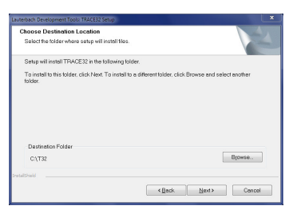

2. On the **Choose Destination Location** page, set the installation path (see Figure 5.22 on this page).

3. On the **Installation Type** page, select **Custom Installation** (see Figure 5.23 on the next page).

4. On the **Setup Type** page, select **New Installation** (see Figure 5.24 on the following page).

5. On the **TRACE32 Product Type** page, select **Debugger** (see Figure 5.25 on page 35). 6. On the **Maintenance Notice** page and click **Next** (see Figure 5.26 on page 35). 7. On the **Debugger Interface Type** page, select **USB Interface** (see Figure 5.27 on page 36).


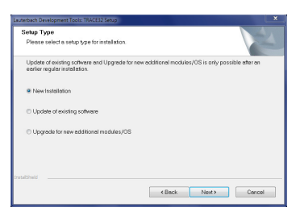

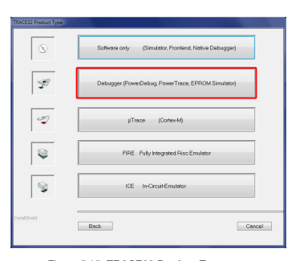

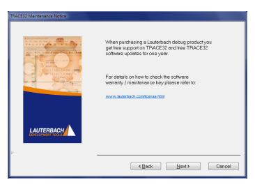

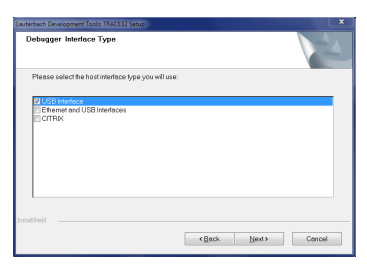

8. On the **OS Selection** page, select **PC Windows XP/VISTA/7/8/10** (see Figure 5.28 on this

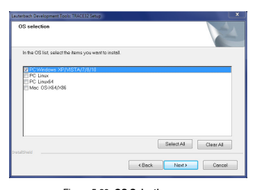

page).

9. On the **CPU selection** page, select **ICD ARM 32-bit** (see Figure 5.29 on the next page).

10. In the **TRACE32 executable type** dialog, click Yes for a 64-bit OS (see Figure 5.30 on the facing page).

11. On the **Environment variable T32ID** page, choose the default value T32 (see Figure 5.31 on the next page).

12. If you are asked to install the Lauterbach device software, click **Install** (see Figure 5.32 on page 38). Use the suggested default settings for the device software installation process.

13. On the **Environment variable T32TMP** page, set the destination folder (see Figure 5.33 on page 38).

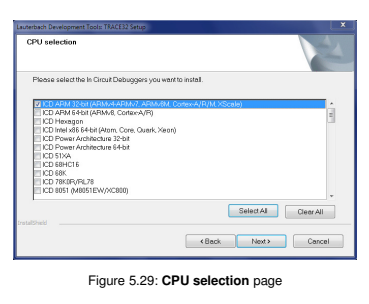

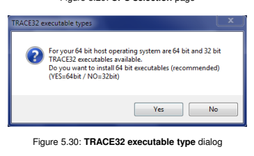


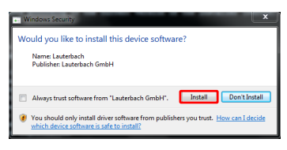

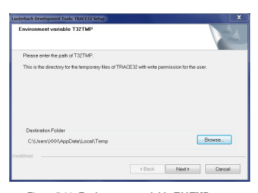

14. On the next pages related to screen configuration, use the default settings.

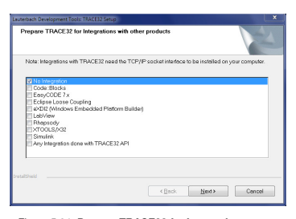 15. On the **Prepare TRACE32 for Integration with other products** page, select **No Integration**
(see Figure 5.34 on this page).

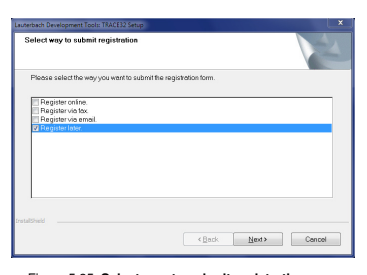

16. For the pages **Folder Selection** and **Folder program group type**, use the default settings.

17. On the **Select way to submit registration** page, select **Register later** (see Figure 5.35 on the current page).

18. The last page **TRACE32 software is successfully finished** shows the installation path and how to start the software (see Figure 5.36 on the following page). Click **Finish** to complete the installation.


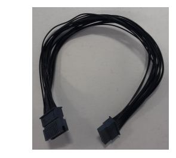

## 5.8.1.3 Usage 5.8.1.3.1 Hardware

The HY-TTC 580 Starter Kit comes with the following components:
- JTAG Adapter Board (Figure 5.37 on the current page) and JTAG Cable (Figure 5.38 on this

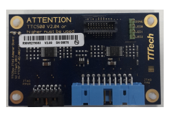

page)

- open housing of the HY-TTC 500 ECU to enable a connection with the JTAG interface (Figure 5.39 on the next page)

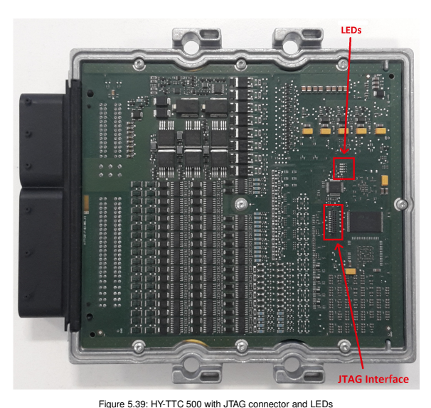

The following components from Lauterbach are required:
- Lauterbach Base Station. For example, **Power Debug Interface USB 3 LA-3500** - Lauterbach Debug Cable **JTAG-CORTEX-A/R LA-7843** - Lauterbach AC/DC power supply adapter
- USB connector to connect Lauterbach and PC
Please refer to Figure 5.40 and Figure 5.41 on the following page for how to connect, for example, a HY-TTC 580 with Lauterbach debugger.

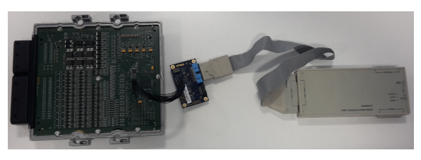

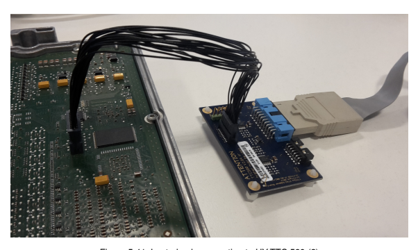

## 5.8.1.3.2 Led Description Done Led

The DONE LED (see Figure 5.42 on the current page) indicates the configuration status: If the DONE LED is ON, the FPGA is not configured. If the DONE LED is OFF, the FPGA is configured.

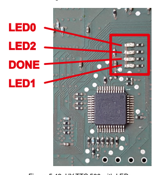 

Debug LEDs The LEDs LED0. . . LED2 shown in Figure 5.42 on this page are for debugging. They are controlled by the **IO_DEBUG_SetOutputPin()** function. See [4] for details. They are completely controllable by the application.

Signal pins The signal pins on the JTAG adapter board (see Figure 5.43 on the next page) indicate the inverted status of the DONE LED and the Debug LEDs. That is, if a LED is ON, the corresponding signal pin has low voltage (0).

Note: The signal pins shown in Figure 5.43 on the following page are unprotected CMOS outputs.

Any external voltage applied on these pins can damage the ECU.

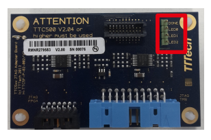

## 5.8.1.3.3 Software

1. Connect the Lauterbach Base Station and Debug Cable to the PC and power supply and

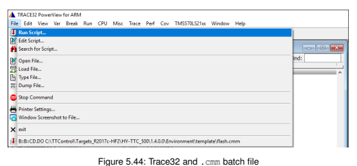

install the necessary drivers.

2. Make the connections as described in Section 4.3 on page 9 and in Section 5.8.1.3.1 on page 40.

3. Perform a power cycle.

4. Click **Start > Trace32 ICD ARM32 USB** on the Windows start menu to start the Lauterbach debugger software.

5. The HY-TTC 500 template comes with a predefined ***.cmm** script. Start the script by clicking File > Run Script (Figure 5.44 on the current page).

6. A dialog asks whether you want to flash the application or not (Figure 5.45 on the facing page).

If you click Yes, the flashing process starts.

7. When the flashing process has finished, the next dialog asks whether you want to keep the current Trace32 window configuration or reset to a default configuration (Figure 5.46 on the next page).

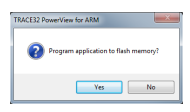


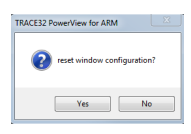

8. After the flashing procedure, you return to the Trace32 window (Figure 5.47 on the following page). Its appearance depends on the chosen windows configuration.

## 5.8.2 The Ttc-Downloader Tool 5.8.2.1 Tool Download

You can download the TTC-Downloader tool from our Service Area:
1. Enter the **HY-TTC Downloader** page. 2. From there, enter the page with the latest release.

3. Download **Installer - TTC-Downloader <version>.zip**. 4. Extract the **.zip** file on your computer.

The tool comes with a documentation file **help.chm**.

## 5.8.2.2 Device Connection

A connection with the HY-TTC 500 can be established either via CAN or via Ethernet as described in Section 5.8.2.2.1 on the current page and Section 5.8.2.2.2 on the following page.

## 5.8.2.2.1 Connecting Via Can

To connect to the device via CAN, use a CAN connector (e.g., **Peak PCAN-USB**) and connect it to CAN0 of the HY-TTC 500. Then power off the device and open the TTC-Downloader.

If the correct CAN settings are not known, then force the default connection settings by connecting the pin sensor supply 0 and sensor supply 1 of the HY-TTC 500 to ground. For variants without

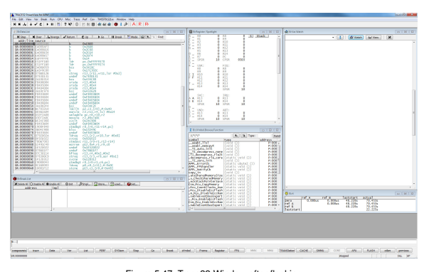

pin sensor supply 1, the default connection can be set by connecting the pin sensor supply 0 to ground. See the TTC-Downloader documentation **help.chm**, Section **Advanced Features > The** CAN Fallback Mode for the HY-TTC 500 variant specific default CAN channel. Note: If you have changed the TTC-Downloader settings in previous applications of the HY-TTC 500, then make sure that you reset them to the default values.

To start connecting press F2 and quickly power on the device, while the Downloader progress bar appears (see Figure 5.48(a) on the next page).

After successful connection, the downloader will identify the device and prepare the flashing process (see Figure 5.48(b) on the facing page).

## 5.8.2.2.2 Connecting Via Ethernet

Note: For unexperienced users of the HY-TTC 500 it is recommended to use the CAN option. If you use Ethernet and an application is already flashed to the target, then you have to make sure that the application listens to download requests on the Ethernet. The example application of the Quick Start Guide does not listen to download requests.

To connect to the device via Ethernet, use the Ethernet port of your computer and connect it to the Ethernet port of the HY-TTC 500. Note that a point-to-point Ethernet connection is mandatory. Open the TTC-Downloader.

The next step depends on the content of the flash memory:

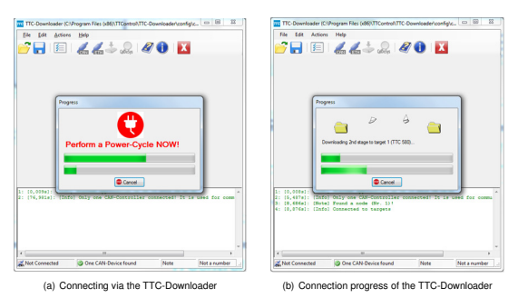

- If the target has no application and no CODESYS runtime system flashed, then use the default connection settings. To set the default settings, open the **Preferences** dialog box (e.g. with Ctrl + P) and click **Default**.

- If the target has an application or CODESYS runtime system flashed, then enter the correct Ethernet settings. If you do not know the correct Ethernet settings, please use CAN to connect with the target as described in Section 5.8.2.2.1 on page 45. To set the correct Ethernet settings, open the **Preferences** dialog box (e.g. with **Ctrl + P**), enter the values, and click **Apply**.

In the **Preferences** dialog box, open the **Ethernet** tab, select the used Ethernet adapter in the Network Adapter dropdown menu, and click **Apply**.

Close the **Preferences** dialog box. Now power on the target. Start the connection procedure by pressing F5. After successful connection, the downloader will identify the device and prepare the flashing process (see Figure 5.48(b) on this page).

## 5.8.2.3 Flashing To Hy-Ttc 500

After successful connection via CAN or Ethernet, you can open your **.hex**-file and flash the device with the Download icon in the **Application Download** group in the Node area. For further information about how to update the bootloader/FPGA IP, read/write from/to EEPROM, and other features of the TTC-Downloader, please refer to the documentation **help.chm** for the tool.

## 6 Memory Mapping 6.1 Memory Map For Internal Flash And Ram

The following table specifies the start address and size of the bootloader, FPGA IP, APDB, **application** and **application configuration data** for the HY-TTC 500 controllers. See also the file mem_ttc500_bl.lsf, which is delivered with the package.

Note: A compatible FPGA is delivered with the package. Note: The application configuration data region is not protected by the application CRC and thus, its integrity must be ensured by the application itself. For detailed information about modifying the flash memory, refer to the documentation **help.chm** for the TTC-Downloader, page **Modifying Flash/EEPROM Memory**.

HY-TTC 500 Start Address **Size**

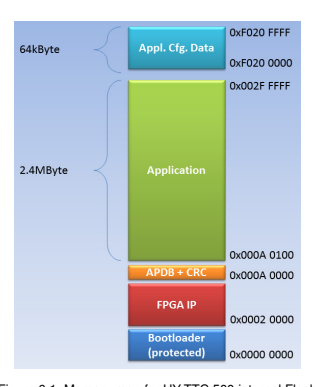 Application Cfg. Data 0xF0200000 65536 Bytes Application 0x000A0100 2490112 Bytes

APDB + CRC 0x000A0000 256 Bytes

FPGA IP 0x00020000 524288 Bytes

Bootloader 0x00000000 131072 Bytes

The following table specifies the start address and size of the **internal RAM** for the HY-TTC 500 controllers.

[table_8][{0: 'HY-TTC 500', 1: 'Start Address', 2: 'Size'}, {0: 'Int. RAM', 1: '0x08003000', 2: '217088 Bytes'}][/table_8]

## 6.2 Memory Map For External Flash And Ram

The following tables specify the start address of the **external RAM** and **Flash** for the HY-TTC 500 controllers.


[table_9][{0: 'HY-TTC 580', 1: 'Start Address', 2: 'Size'}, {0: 'Ext. RAM', 1: '0x60000000', 2: '2097152 Bytes'}, {0: 'Ext. Flash', 1: '0x64000000', 2: '8388608 Bytes'}, {0: 'HY-TTC 540', 1: 'Start Address', 2: 'Size'}, {0: 'Ext. RAM', 1: '0x60000000', 2: '2097152 Bytes'}, {0: 'HY-TTC 520', 1: 'Start Address', 2: 'Size'}, {0: 'Ext. RAM', 1: '0x60000000', 2: '2097152 Bytes'}][/table_9]

## Bibliography

[1] ISO/IEC. ISO/IEC 9899. International Standard, International Organization for Standardization (ISO),
International Electrotechnical Commission (IEC), 12 1990.

[2] Texas Instruments. ARM Assembly Language Tools, 06 2013. SPNU118L, v5.1. [3] Texas Instruments. ARM Optimizing C/C++ Compiler, 06 2013. SPNU151I, v5.1. [4] TTControl GmbH. HY-TTC 500 I/O Driver Manual. S-TTC5F-G-20-001. [5] TTControl GmbH. HY-TTC 500 Quick Start Guide - CODESYS. User Documentation D-TTC5F-G-20-014, TTTech, BU Off-Highway, Services & Operations.

## Legal Disclaimer

THE INFORMATION GIVEN IN THIS DOCUMENT IS GIVEN AS A SUPPORT FOR THE USAGE OF THE PRODUCT AND SHALL NOT BE REGARDED AS ANY DESCRIPTION OR WARRANTY
OF A CERTAIN FUNCTIONALITY, CONDITION OR QUALITY OF THE PRODUCT. THE RECIPIENT OF THIS DOCUMENT MUST VERIFY ANY FUNCTION DESCRIBED HEREIN IN THE REAL
APPLICATION. THIS DOCUMENT WAS MADE TO THE BEST OF KNOWLEDGE OF TTCONTROL GMBH. NEVERTHELESS AND DESPITE GREATEST CARE, IT CANNOT BE EXCLUDED
THAT MISTAKES COULD HAVE CREPT IN. TTCONTROL GMBH PROVIDES THE DOCUMENT
FOR THE PRODUCT "AS IS" AND WITH ALL FAULTS AND HEREBY DISCLAIMS ALL WARRANTIES OF ANY KIND, EITHER EXPRESSED OR IMPLIED, INCLUDING BUT NOT LIMITED
TO THE IMPLIED WARRANTIES OF MERCHANTABILITY AND FITNESS FOR A PARTICULAR PURPOSE, ACCURACY OR COMPLETENESS, OR OF RESULTS TO THE EXTENT PERMITTED
BY APPLICABLE LAW. THE ENTIRE RISK, AS TO THE QUALITY, USE OR PERFORMANCE OF THE DOCUMENT, REMAINS WITH THE RECIPIENT. TO THE MAXIMUM EXTENT PERMITTED
BY APPLICABLE LAW TTCONTROL GMBH SHALL IN NO EVENT BE LIABLE FOR ANY SPECIAL, INCIDENTAL, INDIRECT OR CONSEQUENTIAL DAMAGES WHATSOEVER (INCLUDING
BUT NOT LIMITED TO LOSS OF DATA, DATA BEING RENDERED INACCURATE, BUSINESS INTERRUPTION OR ANY OTHER PECUNIARY OR OTHER LOSS WHATSOEVER) ARISING OUT
OF THE USE OR INABILITY TO USE THE DOCUMENT EVEN IF TTCONTROL GMBH HAS BEEN ADVISED OF THE POSSIBILITY OF SUCH DAMAGES.

IF THE PRODUCT IS MARKED AS "PROTOTYPE", THE DELIVERED PRODUCT IS A DEVELOPMENT SAMPLE ("SAMPLE"). THE RECIPIENT ACKNOWLEDGES THAT THEY ARE ALLOWED
TO USE THE SAMPLE ONLY IN A LABORATORY FOR THE PURPOSE OF DEVELOPMENT. IN
NO EVENT IS THE RECIPIENT ALLOWED TO USE THE SAMPLE FOR THE PURPOSE OF SERIES MANUFACTURING.

TTCONTROL GMBH PROVIDES NO WARRANTY FOR ITS PRODUCTS OR ITS SAMPLES, INCLUDING BUT NOT LIMITED TO THE IMPLIED WARRANTIES OF MERCHANTABILITY AND FITNESS FOR A PARTICULAR PURPOSE AND TO THE MAXIMUM EXTENT PERMITTED BY APPLICABLE LAW DISCLAIMS ALL LIABILITIES FOR DAMAGES RESULTING FROM OR ARISING
OUT OF THE APPLICATION OR USE OF THESE PRODUCTS OR SAMPLES. THE EXCLUSION
OF LIABILITY DOES NOT APPLY IN CASES OF INTENT AND GROSS NEGLIGENCE. MOREOVER, IT DOES NOT APPLY TO DEFECTS WHICH HAVE BEEN DECEITFULLY CONCEALED
OR WHOSE ABSENCE HAS BEEN GUARANTEED, NOR IN CASES OF CULPABLE HARM TO
LIFE, PHYSICAL INJURY AND DAMAGE TO HEALTH. CLAIMS DUE TO STATUTORY PROVISIONS OF PRODUCT LIABILTY SHALL REMAIN UNAFFECTED.

ANY DISPUTES ARISING OUT OF OR IN CONNECTION WITH THIS DOCUMENT SHALL BE GOVERNED SOLELY BY AUSTRIAN LAW, EXCLUDING ITS CONFLICT OF LAW RULES AND THE UNITED NATIONS CONVENTION ON CONTRACTS FOR THE INTERNATIONAL SALE OF GOODS. SUCH DISPUTES SHALL BE DECIDED EXCLUSIVELY BY THE COURTS OF VIENNA,
AUSTRIA.