# Appareil De Mesure Portable Hmg 4000

Notice d'utilisation 
(Traduction de l'original) 

 

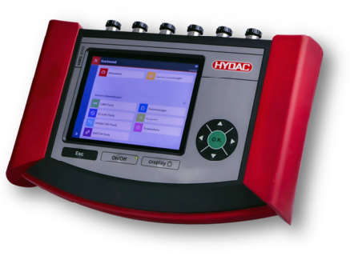

[table_0][{0: 'Avant-propos .'}, {0: '1 Généralités'}, {0: '1.1 Fonctions standard ................................................................................................................................8'}, {0: '1.2 Fonctions CAN'}, {0: '1.3 Fonction IO-Link'}, {0: '1.4 Contenu de la livraison'}, {0: '1.5 Sécurité technique .'}, {0: '1.6 Consignes de sécurité'}, {0: "1.7 Droits d'auteur"}, {0: '1.8 Conseil à propos de la garantie .'}, {0: "2 L'HMG 4000 en un coup d'oeil ..................................................................................................14"}, {0: '2.1 Ecran tactile et touches de fonction .'}, {0: '2.2 Connecteurs'}, {0: "3 Premiers pas avec I'HMG 4000 .............................................................................................16"}, {0: '3.1 Déballage'}, {0: '3.2 Chargement de la batterie'}, {0: "3.3 Mise en marche et arrêt de l'appareil"}, {0: '3.4 Mise à jour du firmware'}, {0: "4 Manipulation de l'HMG 4000 ..................................................................................................18"}, {0: "4.1 Utilisation de l'écran tactile ."}, {0: "4.2 Structure de l'affichage graphique"}, {0: "4.3 Navigation dans la barre de menus/commandes (barre d'outils) ................................................... 19"}, {0: '5 Démarrage rapide............................................................................................................................20'}, {0: '5.1 Menu de base .'}, {0: '5.2 Valeurs de mesure'}, {0: "5.3 Démarrage d'un enregistrement simple ."}, {0: '6 Menu Démarrer.'}, {0: '7 Application « Valeurs de mesure » ........................................................................................25'}, {0: '7.1 Affichage des informations du canal de mesure'}, {0: "7.2 Réglages de l'affichage  des valeurs de mesure"}, {0: '7.3 Entrées analogiques (A-H)'}, {0: '7.4 Entrées numériques (I, J)'}][/table_0]

[table_1][{0: '7.5 CAN-Bus/HCSI (K)'}, {0: '7.6 Calculs (L)'}, {0: '7.7 Autres réglages de mesure'}, {0: '8 Enregistrements .............................................................................................................................57'}, {0: "8.1 Démarrage de l'enregistrement"}, {0: "8.2 Procédure d'enregistrement"}, {0: "8.3 Utilisation pendant I'enregistrement"}, {0: '8.4 Enregistrements'}, {0: "9 Application « Réglages de l'appareil » ................................................................................82"}, {0: '9.1 Réglages de la région et de la langue'}, {0: "9.2 Réglages de la date et de l'heure"}, {0: "9.3 Réglages d'affichage ..............................................................................................................................................83"}, {0: '9.4 Réglages de graphiques ..............................................................................................................................83'}, {0: "9.5 Informations sur l'appareil ........................................................................................................................84"}, {0: '9.6 Gérer les réglages .'}, {0: '10 Application  « Chronomètre »'}, {0: '1 Application "Outils IO-Link"…………………………………………………………………………………………………88'}, {0: '1.1 Connecter le capteur IO-Link .................................................................................................................................8'}, {0: '1.2 Capteur IO standard'}, {0: '1.3 Capteur IO-Link intelligent .............................................................................................................................92'}, {0: '1.4 Contacteurs programmables (anciennes séries*) .............................................................................95'}, {0: '12 Application « Outils HYDAC HSI » ...................................................................................97'}, {0: '12.1 Connexion des capteurs CM ...............................................................................................................98'}, {0: '12.2 Menu Capteur CM'}, {0: '13 Application « Fonctionnalité CAN » ....................................................................................102'}, {0: '13.1 Réglages de base'}, {0: '13.2 Etablir la connexion'}, {0: '14 Application des "Outils MATCH"…'}, {0: '12'}, {0: '14.2 Menu principal'}, {0: '15'}, {0: '14.4 Menu de commande'}][/table_1]

[table_2][{0: "15 Application « Captures d'écran »"}, {0: '16 Application « Gestionnaire de fichiers » ...............................................................................124'}, {0: '124'}, {0: '16.2 Limitations liées au Gestionnaire de fichiers .'}, {0: '128'}, {0: '17 Nettoyage/Maintenance/Mise à jour ....................................................................................129'}, {0: '129'}, {0: '17.2 Maintenance/calibrage'}, {0: '17.3 Réparation'}, {0: '17.4 Mise à jour du logiciel .'}, {0: '17.5 Remplacement de la batterie .'}, {0: '17.6 Compensation de potentiel CC-CC'}, {0: '18 Accessoires ......................................................................................................................................134'}, {0: '134'}, {0: '18.2 Câbles de capteur .'}, {0: '18.3 Accessoires divers'}, {0: '18.4 Pièces de rechange'}, {0: '19 Caractéristiques techniques'}, {0: "19.1 Canaux d'entrée"}, {0: '19.2 CAN .'}, {0: '137'}, {0: "19.4 Tension d'alimentation"}, {0: '19.5 Affichage'}, {0: '138'}, {0: '19.7 Mémoire .'}, {0: '19.8 Normes techniques'}, {0: '19.9 Conditions ambiantes'}, {0: '19.10 Affectation des canaux .'}, {0: '19.11 Dimensions et masse'}, {0: 'A1 Schéma fonctionnel'}, {0: 'A2 Déclaration Conformité CE ....................................................................................................143'}, {0: 'A3 Certificat de test ONU (pour le transport des batteries) .............................................144'}][/table_2]

 

## Avant-Propos

A l'intention des utilisateurs de notre produit, nous avons regroupé dans cette notice, les principales informations pour l'utilisation et la maintenance de l'appareil. 

Cette notice a pour objectif de simplifier la prise de connaissance du produit et l'exploitation optimale de ses possibilités d'utilisation, conformément à l'usage prévu. 

Ce document doit toujours être disponible sur le lieu d'utilisation. 

Veuillez noter que les informations fournies dans cette documentation correspondent à la technique de l'appareil au moment de l'élaboration de ce document. Pour cette raison, les différentes données techniques, illustrations et mesures sont susceptibles de diverger. 

Si, lors de la lecture de cette documentation, vous deviez détecter des erreurs ou encore si vous aviez des suggestions ou des remarques, veuillez-vous adresser à : 

## Hydac Electronic Gmbh

Documentation technique Hauptstrasse 27 66128 Saarbrücken Allemagne Tél. : +49 (0)6897 / 509-01 Fax: +49 (0)6897 / 509-1726 E-mail : electronic@hydac.com La rédaction vous remercie pour votre participation. "De la pratique vers la pratique". 

## 1 Généralités

Ce manuel est fourni avec l'appareil. Il comporte des textes et des graphiques permettant de manipuler correctement le produit et doit être lu avant l'installation, le montage et l'utilisation de l'appareil. 

La notice d'utilisation propose des informations pour une utilisation en toute sécurité de l'appareil de mesure portable HMG 4000. Si vous utilisez ce manuel de la manière recommandée, vous pourrez rapidement faire un usage efficace et sûr de l'HMG 4000. 

## 1.1 Fonctions Standard

L'appareil de mesure portable HMG 4000 est un appareil servant à effectuer des mesures et à collecter des données sur les machines et installations hydrauliques et pneumatiques, aussi bien dans l'industrie que dans le domaine mobile. 

Il est utilisé prioritairement dans les domaines du service après-vente, de la maintenance, du diagnostic d'erreur ou sur des bancs d'essai. 

L'HMG 4000 peut enregistrer simultanément des signaux de 38 capteurs max. 

A cet effet, HYDAC ELECTRONIC propose des capteurs spéciaux, détectés automatiquement par l'HMG 4000 et réglables en termes de grandeur de mesure, de plage de mesure et d'unité. 

Il s'agit d'une part des capteurs HSI (HYDAC Sensor Interface) pour la pression, la température et le débit qui peuvent être raccordés à 8 canaux d'entrée analogiques. 

Par ailleurs, il est possible de raccorder des capteurs de Condition Monitoring HYDAC 
(capteurs CM) à ces entrées. Il s'agit de capteurs HSI HYDAC qui fournissent simultanément plusieurs grandeurs de mesure (valeur mesurées). 

Via la connexion du bus CAN, il est en outre possible de raccorder jusqu'à 28 capteurs HCSI (HYDAC CAN Sensor Interface) spéciaux, même avec une détection automatisée des capteurs. Les capteurs intelligents HYDAC peuvent aussi être lus, programmés et paramétrés. 

Une autre possibilité consiste à connecter l'HMG 4000 à un réseau CAN existant. Cette approche permet de collecter les données de mesure transmises sur le bus CAN (par ex. 

régime de moteur, pression de moteur) en association avec les données de mesure du système hydraulique. 

Les capteurs HYDAC IO-Link (aussi capteurs intelligents) ainsi que les anciens commutateurs électroniques programmables peuvent être lus, programmés et paramétrés avec IO-Link via la connexion dédiée. De plus, les jeux de paramètres enregistrés peuvent être transférés à d'autres appareils. 

Description de l'appareil Il est également possible de raccorder des capteurs HYDAC de conception plus ancienne ou des capteurs usuels d'autres fabricants. Comme ceux-ci sont toutefois dépourvus d'une détection automatique des capteurs, un paramétrage manuel est nécessaire. 

Veuillez vérifier l'affectation des broches des capteurs non-HSI ou des capteurs d'autres fabricants par rapport aux affectations des broches *19.10.1 Canaux de* mesure :Fehler! Verweisquelle konnte nicht gefunden werden. **décrites dans le** 
chapitre. Si nécessaire, des adaptateurs de raccordement sont disponibles que vous trouverez au chap. *18.3 Accessoires divers.*
Outre cela, l'appareil dispose d'entrées de mesure pour des capteurs usuels avec signaux d'intensité et de tension. Pour compléter son domaine d'application, l'HMG 4000 dispose en outre de deux entrées numériques (par ex., pour les mesures de fréquence et de vitesse de rotation). 

Au total, l'HMG 4000 peut représenter jusqu'à 100 canaux de mesure. 

Selon son type, le capteur possède une mémoire interne. Des valeurs de mesure enregistrées sur une période prolongée sont sauvegardées dans cette mémoire. En outre, il est possible de modifier, en fonction du type de capteur, les paramètres préréglés et de les enregistrer dans la mémoire interne en tant que configuration du capteur. 

Par ses menus de sélection clairs, l'appareil offre à l'utilisateur un accès intuitif aux fonctions et réglages. Pour la saisie de valeurs numériques et de texte, l'HMG 4000 dispose d'un écran tactile, au fonctionnement similaire à celui d'un téléphone mobile ou d'une tablette. 

Dans le cas de machines au procès dynamique il est possible de saisir et d'enregistrer simultanément 8 signaux d'entrée analogiques avec une période d'échantillonnage de 0,1 ms. La condition requise pour cette fonction est naturellement l'utilisation de capteurs rapides correspondants adaptés. 

La fonction la plus attractive de l'appareil HMG 4000 est de pouvoir enregistrer sous forme de courbe de mesure les processus dynamiques d'une machine et de les représenter graphiquement - et cela même en ligne en temps réel (fonction oscilloscope). 

## Description De L'Appareil

L'HMG 4000 est équipé d'un logiciel spécialement développé garantissant la saisie et le traitement rapides des données. Une courbe de mesure peut comporter jusqu'à 8 millions de valeurs de mesure. La mémoire de valeurs de mesure servant à l'archivage de ces données peut enregistrer plus de 500 courbes de mesure de ce type. Outre les courbes de mesure simples d'enregistrements individuels et en continu, l'appareil HMG 4000 dispose d'autres fonctions pour l'enregistrement de mesures événementielles et de protocoles de mesure. Diverses possibilités de déclencheur sont disponibles pour le déclenchement de l'événement. 

Outre l'enregistrement de courbes de mesure, il est possible de créer et d'enregistrer des réglages spécifiques à l'utilisateur, appelés profils utilisateur. Ceci offre surtout des avantages pour les utilisateurs qui sont amenés à répéter les mêmes mesures sur différentes machines à des fins de maintenance préventive. Le profil utilisateur respectif peut alors être chargé à partir de la mémoire de l'HMG 4000. 

Aux fins de visualisation, l'HMG 4000 dispose d'un écran tactile 5,7" graphique, pour la représentation claire des valeurs de mesure affichées sous forme de texte ou de courbe de mesure. Il est également possible d'opter pour une représentation en grand format des mesures pour permettre une lecture de loin. De plus, l'appareil HMG 4000 est équipé de nombreuses fonctions conviviales pour l'affichage, l'analyse et le traitement des mesures : 
- Tableau 
- Graphique - Echelle 
- Suiveur 
- Zoom - entre autres La communication de l'HMG 4000 avec un PC se déroule au moyen de l'interface USB 
Device intégrée. Le logiciel HYDAC « *HMGWIN »* **correspondant, fourni avec l'HMG 4000** 
permet d'assurer ultérieurement un traitement, une représentation et une analyse conviviales des mesures sur le PC. Ainsi, une utilisation (à distance) de l'HMG 4000 directement à partir de l'ordinateur est également possible. Configuration requise : 
HMGWIN et HEWIN fonctionnent sur tous les systèmes d'exploitation Windows à partir de Windows 2000 et sous le framework Microsoft.NET à partir de V2. 

Ce Framework est installé en standard à partir de Windows 7. 

## 1.2 Fonctions Can

- Possibilité de raccordement à un bus CAN (Généralités, CANopen, J1939) - Lecture et analyse de jusqu'à 28 valeurs de mesure d'au maximum 28 messages CAN 
- Configuration de mesure des capteurs CAN 
- Raccordement jusqu'à 28 capteurs HCSI HYDAC - Lire, programmer et paramétrer les capteurs intelligents HYDAC 
- Fonctions supplémentaires dans le menu « *Fonctionnalité CAN »*

## 1.3 Fonction Io-Link

- Lire, programmer et paramétrer les capteurs IO-Link et les capteurs intelligents HYDAC 
- Programmer et paramétrer d'anciens manocontacteurs, thermocontacteurs et contacteurs de niveau électroniques, capteurs de l'état de l'huile et capteurs d'humidité électroniques avec IO-Link (EDS 8xx, ExS 3xxx, HxS 3xxx, HLB 1400, AS 3xxx) 
et HPG P1-000 
- Autres fonctions, voir menu "Outils IO-Link" 

## 1.4 Contenu De La Livraison

- HMG 4000 
- Bloc d'alimentation pour raccordement 90 á 230 V 
- Manuel 
- CD avec pilotes USB et logiciel « HMGWIN » 
(logiciels d'analyse des données de mesure) 
ainsi que d'autres informations de produits 
- Câble de raccordement USB 
- Sangle 

## 1.5 Sécurité Technique

Les composants de l'appareil de mesure portable HMG 4000 ainsi que l'appareil fini subissent des contrôles de qualité stricts. Chaque HMG 4000 est soumis à un test final. 

Cela nous permet de garantir que l'appareil ne présente aucun défaut à la livraison et qu'il respecte les spécifications indiquées. 

Les appareils de mesure portables de la série HMG 4000 ne nécessitent aucun entretien et fonctionnent parfaitement dans les conditions d'utilisation spécifiées. S'il devait toutefois apparaître un motif de réclamation, veuillez-vous adresser à votre représentant HYDAC. 

Tout montage non-conforme ou toute intervention extérieure dans l'appareil entraînent l'annulation de la garantie. 

Description de l'appareil 

## Respect Des Normes Européennes

Les appareils de mesure portables de la série HMG 4000 portent le label CE et satisfont ainsi aux conditions d'homologation actuellement en vigueur en Allemagne ainsi qu'aux normes européennes relatives au fonctionnement de ces appareils. Le respect des directives valables sur la compatibilité électromagnétique et des directives de sécurité conformes à la directive basse tension est ainsi garanti. 

L'afficheur est conforme aux normes européennes suivantes : 
IEC 61000-4-2 / -3 / -4 / -5 / -6 / -8 EN 61010 Nous nous réservons le droit de procéder à des modifications techniques. 

## 1.6 Consignes De Sécurité

Les appareils de mesure portables de la série HMG 4000 ne présentent aucun risque lorsqu'ils sont utilisés en toute conformité. Toutefois, pour éviter des dangers pour les utilisateurs et des dégâts matériels suite à une fausse manipulation de l'appareil, veuillez respecter impérativement les consignes de sécurité suivantes : - L'HMG 4000 ne doit être utilisé que dans un parfait état technique. - Les consignes d'utilisation doivent être scrupuleusement respectées. La fonction 
« Tarage zéro » peut notamment conduire à des situations dangereuses. Lisez à ce propos les instructions du chap.*7.1.5 Redéfinition du point zéro du canal de mesure*. 

- En cas de raccordement simultané de capteurs et d'interfaces (mesure en ligne), il faut veiller à un équilibre de potentiel suffisant. 

- En cas de raccordement simultané des bus CAN et USB, une connexion directe des deux potentiels de masse ou l'utilisation d'un isolateur USB au niveau de l'esclave USB 
est obligatoire. 

- Respectez les indications de la plaque signalétique. 

- La recherche de pannes et les réparations ne peuvent être effectuées que par notre SAV HYDAC. 

- Toutes les directives de sécurité reconnues de manière générale et pertinentes doivent être également respectées. 

- Les règles de sécurité locales applicables doivent être respectées pour la manutention et le maniement de la batterie au lithium. 

- Les prescriptions et dispositions suivantes concernant les batteries lithium-ion doivent être respectées de manière responsable pendant le transport et l'expédition : - Route / rail : ADR / RID (Accord européen relatif au transport international des marchandises dangereuses par route / rail) 
- Fret maritime: Code IMDG (Code maritime international des marchandises dangereuses) 
- Fret aérien: IATA (International Air Transport Association) 

## 1.7 Droits D'Auteur

La transmission ou la reproduction de ce document, l'utilisation et la diffusion du contenu ne sont pas autorisées, sauf mention expresse. 

Le manquement à cette condition donnera lieu à des dommages et intérêts. 

Tous droits réservés. 

## 1.8 Conseil À Propos De La Garantie

Ce manuel a été établi avec le plus grand soin possible. Cependant, il n'est pas à exclure que des erreurs ou différences se soient glissées dans le texte et par conséquent, nous ne garantissons pas l'exactitude complète de son contenu. 

Si en dépit de nos efforts des erreurs apparaissent toujours, toutes les remarques et propositions d'amélioration seront les bienvenues. 

# 2 L'Hmg 4000 En Un Coup D'Oeil

2.1 Ecran tactile et touches de fonction 

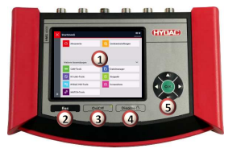

## Ecran Tactile

Effleurez l'écran tactile uniquement avec les doigts ! 

Faites attention à ce que l'écran tactile n'entre pas en contact avec d'autres appareils électriques, car des décharges électrostatiques peuvent provoquer des dysfonctionnements de l'écran. 

Faites attention à ce que l'écran tactile n'entre pas en contact avec des liquides. L'humidité ou le contact avec des liquides peut provoquer des dysfonctionnements de l'écran tactile. 

Pour éviter d'endommager l'écran tactile, ne tapotez pas avec des objets à arêtes vives ou pointus et n'exercez aucune pression forte. Quelques gestes simples (effleurement, mouvements de balayage ou de glissement et rapprochement ou écartement des doigts) sont tout ce qu'il y a à connaître pour l'utilisation de l'écran tactile. Vous trouverez des instructions à ce propos dans le chap. 4.1 Utilisation de l'écran tactile. 

## Touche Esc

Abandon d'une saisie ou « Retour **» pas à pas** 
Touche On/Off Mettre l'HMG en route/à l'arrêt Touche d'affichage Pression brève : Activation/désactivation de l'affichage ; Pression longue : Réglage de la luminosité Croix de navigation/directionnelle Pour une navigation pas à pas à l'intérieur de l'affichage : touche « O.K. » **pour** 
l'entrée, la fin, la reprise ou l'enregistrement d'une saisie En guise d'alternative à l'écran tactile, l'HMG 4000 peut aussi être utilisé avec la touche ESC ainsi que la croix de navigation/directionnelle. 

## 2.2 Connecteurs 

Entrées analogiques (noir) 
8 connecteurs d'entrée (*canal A à H***) pour le raccordement de capteurs analogiques** 
normaux (0 à 10 V, 4 à 20 mA, etc.), ainsi que de capteurs CM ou HSI HYDAC, par exemple pour mesurer la pression, la température, le débit ou l'état de l'huile. 

Entrées numériques **(bleu)** 
1 Connecteur d'entrée pour 2 signaux numériques (*canal I, J***), par ex. pour les** 
mesures de fréquence ou de vitesse de rotation Bus CAN/HCSI **(rouge)** 
1 connecteur pour bus CAN et pour capteurs HCSI HYDAC (*canal K*) 
IO-Link **(jaune)** 
1 connecteur pour des capteurs IO-Link et d'anciens contacteurs électroniques programmables de pression, de température et de niveau HYDAC 
USB Host **pour le raccordement d'esclaves (par ex. clé USB)** 
USB Device **pour le raccordement à un PC**
Douille de raccordement pour le bloc d'alimentation DEL d'indication de l'état de charge

# 3 Premiers Pas Avec L'Hmg 4000

## 3.1 Déballage

L'HMG 4000 est livré emballé dans un carton. Lors de la réception et du déballage, vérifiez que la livraison est complète et qu'elle ne présente pas d'éventuels dommages liés au transport. Si tel était le cas, veuillez le signaler au transporteur. 

## 3.2 Chargement De La Batterie

Chargez complètement la batterie au moyen du bloc d'alimentation fourni avant d'utiliser l'HMG 4000 pour la première fois. 

La batterie située à l'intérieur de l'HMG 4000 est chargée dès que l'appareil est alimenté via le bloc d'alimentation fourni.

Utilisez exclusivement les batteries, blocs d'alimentation et câbles fournis ou homologués par HYDAC. 

Des batteries, chargeurs et câbles non homologués peuvent aboutir à une surchauffe ou une explosion de la batterie ou encore endommager l'HMG 4000. 

Lorsque le niveau de charge de la batterie est faible, un message d'avertissement correspondant s'affiche sur l'écran. 

Lorsque la batterie est complètement déchargée, l'HMG 4000 ne peut pas être mis en marche immédiatement après le raccordement du bloc d'alimentation. Chargez d'abord la batterie vide pendant quelques minutes avant de remettre en marche l'HMG. Un branchement erroné du bloc d'alimentation peut entraîner des dommages graves au niveau de l'appareil. Les dommages imputables à une utilisation non conforme ne sont pas couverts par la garantie. 

Pendant le chargement, l'appareil peut chauffer. Ce phénomène est normal et n'a aucune incidence sur le fonctionnement, les performances ou la durée de vie de l'HMG 
4000. Si l'échauffement de la batterie est supérieur à la normale, débranchez le bloc d'alimentation. 

L'état de charge de la batterie est indiqué en permanence par la DEL intégrée située à côté du connecteur : 
Vert = Batterie entièrement chargée Orange = Chargement de la batterie en cours Rouge = Défaut Lorsque l'appareil est en marche, l'état de charge actuel est aussi indiqué dans la barre d'affichage en haut, à droite de l'écran. 

## 3.3 Mise En Marche Et Arrêt De L'Appareil

Après la première mise en marche de l'HMG 4000, suivez les instructions qui s'affichent et effectuez les réglages de base nécessaires sur l'écran de « bienvenue ». 

## 3.4 Mise À Jour Du Firmware

Pour bénéficier de la dernière version de l'HMG 4000, il est possible de mettre à jour le firmware de l'appareil, à condition d'avoir un fichier de mise à jour correspondant. 

Les réglages enregistrés sur l'HMG 4000 peuvent, dans certaines circonstances, 

ne plus être lisibles après l'installation d'une mise à jour. 

Les instructions correspondantes s'affichent avant l'exécution de la mise à jour. 

Le cas échéant, effectuez une sauvegarde préalable des données sur un PC, 
avant de démarrer la mise à jour. 

Raccordez le bloc d'alimentation à l'HMG 4000, pour garantir une alimentation électrique fiable et continue pendant le processus de mise à jour. Vous trouverez des informations détaillées sur la mise à jour du firmware dans le chap. 17.4 Mise à jour du logiciel.

# 4 Manipulation De L'Hmg 4000

## 4.1 Utilisation De L'Écran Tactile

L'utilisation de l'écran tactile s'effectue simplement au moyen de quelques gestes 
(effleurement, mouvements de balayage ou de glissement et rapprochement ou écartement des doigts) : Effleurement/glissement Ecartement des doigts 

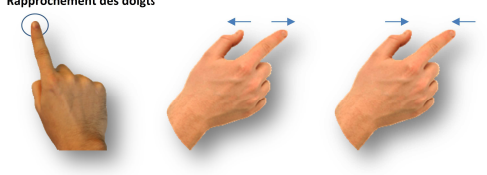

Rapprochement des doigts 4.2 Structure de l'affichage graphique 

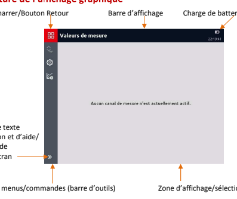 
Affichage de texte d'information et d'aide/ 
Génération de capture d'écran 

## 4.3 Navigation Dans La Barre De Menus/Commandes (Barre D'Outils)

Toutes les possibilités de réglage et de saisie dans les différentes applications et menus de fonctions de l'HMG 4000 sont, pour l'essentiel, parfaitement claires et intuitives. 

Le bouton permet d'accéder directement au « *menu Démarrer »* **à partir de** 
n'importe quel affichage et option de menu. 

Le bouton permet, à partir du menu Démarrer, de revenir directement à l'application/la page de menu/l'affichage exécuté en dernier. 

Au moyen du bouton en haut dans la barre d'affichage, vous revenez une étape en arrière à la page affichée précédemment dans tous les menus et affichages. Le bouton en bas dans la barre de menus/commandes permet d'afficher, puis de masquer des textes d'informations concernant les différents boutons de commande (icônes) et/ou l'application courante. 

D'autre part, le bouton apparaît et permet de générer directement une capture d'écran du contenu d'écran actuel. 

## 5 Démarrage Rapide 5.1 Menu De Base 

Lors de la mise en marche initiale, l'appareil affiche un écran de 
« Bienvenue ». Pour le fonctionnement de l'appareil, vous devez désormais effectuer les 
« réglages de base ». 

Sélectionnez le format de date souhaité, 

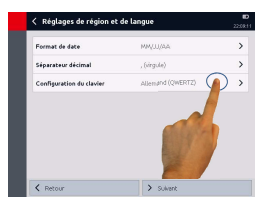

le séparateur décimal et la configuration de clavier. 

Terminez le processus avec *« Suivant »*
ou revenez à l'écran précédent avec 
« Retour ». 

Entrez la date et l'heure. 

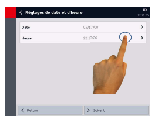

Terminez le processus avec *« Suivant »*
ou revenez à l'écran précédent avec 
« Retour ». 

La saisie des réglages de base est 

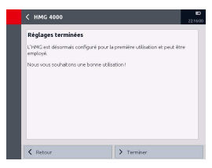 désormais terminée et vous pouvez utiliser l'HMG 4000. 

Terminez le processus avec 
« Terminer » **ou revenez à l'écran** 
précédent avec *« Retour »*. 

 
L'affichage passe ensuite à l'affichage 

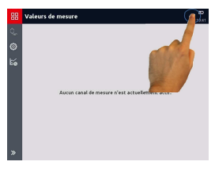 des valeurs de mesure. 

Si aucun capteur n'est raccordé, le message « Aucun canal de mesure n'est actuellement actif » **apparaît.** 
En effleurant la zone de 

batterie/d'heure dans la barre d'affichage, la fenêtre « Statut » cicontre s'ouvre. 

Elle fournit des informations sur l'état de charge actuel ainsi que sur la date et l'heure réglées. 

Il est possible de modifier la date et l'heure à cet emplacement. 

## 5.2 Valeurs De Mesure 

Si aucun capteur n'est raccordé, le message 
« Aucun canal de mesure n'est actuellement actif » **apparaît.** 
A la livraison, les huit entrées 

analogiques sont préréglées sur le mode **« Détection automatique de** capteur ». 

Si, maintenant, un capteur CM ou HSI 
HYDAC est raccordé à un des canaux A à H, il est détecté automatiquement et affiché en conséquence. 

La représentation des valeurs de mesure (voir à droite) affiche les éléments suivants : Canal d'entrée - Désignation - Unité - Valeur de mesure Pour apporter des modifications aux 

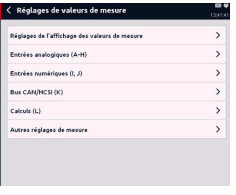

réglages de valeurs de mesure ou aux canaux de mesure, le bouton permet d'accéder au menu **« Réglages** 
de valeurs de mesure ». 

(Pour des informations détaillées, voir le chap. 7 Application « Valeurs de mesure ».) 

## 5.3 Démarrage D'Un 

 Enregistrement Simple

Pour enregistrer des courbes de valeurs de mesure, vous y accédez, à partir de l'affichage de valeurs de mesure, via le bouton dans le menu *« Enregistrements »*. 

Le bouton permet d'accéder 

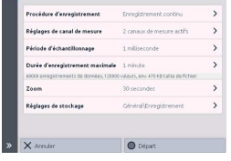

au menu *« Démarrer* l'enregistrement ». 

Dans cette section, vous pouvez effectuer les réglages correspondants pour l'enregistrement. 

(Pour des informations détaillées, voir le chap. 8 « Enregistrements ».) 

## 6 Menu Démarrer 

Après la mise en marche de l'HMG 
4000, l'écran passe automatiquement à l'affichage des valeurs de mesure. Le bouton permet d'accéder au 
« menu Démarrer ». 

Dans le réglage de base, seules les deux applications suivantes sont affichées : 
- **Valeurs mesurées** - **Réglages de l'appareil** 
Le bouton permet de revenir directement à la dernière application exécutée. 

Le bouton dans la section *« Autres* applications » **permet d'afficher des** 
fonctions et applications supplémentaires sélectionnables pour l'appareil :
- **Fonctionnalité CAN** 

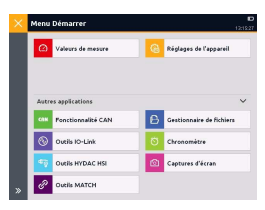 - **Outils IO-Link** - **Outils HYDAC HSI** - **Outils MATCH** - **Gestionnaire de fichiers** - **Chronomètre** - **Captures d'écran** 
Si l'affichage de *« Autres applications »* **est sélectionné, ce réglage est conservé.** 
Autrement dit, lors de l'utilisation du menu Démarrer, toutes les applications et fonctions sont systématiquement affichées. Le bouton permet d'annuler ce réglage.

## 7 Application « Valeurs De 

 Mesure »

Si des capteurs sont raccordés et si les canaux sont réglés en conséquence, leurs valeurs de mesure actuelles s'affichent immédiatement. 

Par défaut, la représentation des valeurs de mesure contient les indications suivantes : 
- Canal d'entrée (le cas échéant, sous-canal) - Désignation (type de capteur) 
- Unité 
- Valeur de mesure 
- Courbe 

## 7.1 Affichage Des Informations Du 

 Canal De Mesure

Si vous effleurez une zone de valeur de mesure, une nouvelle fenêtre avec des informations détaillées sur le canal de mesure concerné apparaît. 

Cette fenêtre fournit les informations suivantes concernant le canal de mesure et le capteur raccordé : 
- Plage de mesure - Valeurs min./max. réinitialisées 
- Dernière valeur de mesure 
- Dernière valeur minimale 
- Dernière valeur maximale - Réglages : 
 Mode Nom Détection de capteur 
- Courbe En utilisant le bouton , vous revenez à l'affichage des valeurs de mesure. 

Via la zone *« Courbe »,* **vous accédez à** 

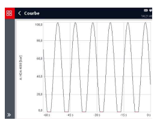

une nouvelle fenêtre. 

Ici, la courbe actuelle des valeurs de mesure est représentée sous forme de graphique continu. 

(Voir aussi le chap. 7.2.5 « Affichage de la courbe ») 

## 7.1.5 Redéfinition Du Point Zéro Du Canal De Mesure

Via le bouton , il est possible de 

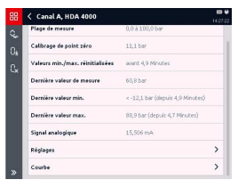

redéfinir le point zéro du canal de mesure. Cette fonction est, par exemple, utile pour masquer des pressions dynamiques présentes dans un système. Si un transmetteur de pression, malgré l'installation à l'arrêt, présente une pression de 3 bar, cette valeur peut être acceptée comme nouveau point zéro pour l'affichage. 

Le bouton permet de supprimer de nouveau le décalage de point zéro. 

Le zéro peut être redéfini sur la totalité de la plage de mesure d'un canal. 

Pour des raisons de sécurité, tous les 

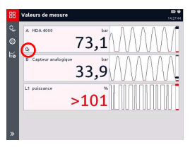 canaux de mesure pour lesquels le point zéro a été redéfini sont signalés par un symbole correspondant sur l'affichage des valeurs de mesure. 

## Attention ! 

Un canal de mesure identifié par une flèche peut être soumis à une 

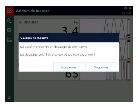 pression élevée malgré l'affichage « 0 bar ».

Avant de démonter le capteur correspondant ou d'autres pièces, assurezvous que l'installation est effectivement hors pression. 

Le non-respect de cette précaution peut entraîner des **situations mortelles**.

Un arrêt/démarrage de l'HMG 4000 ou d'un ou de plusieurs canaux de mesure n'entraîne pas la suppression automatique du nouveau point zéro défini. Lorsque vous arrêtez et redémarrez l'HMG, un message correspondant s'affiche. 

Il existe une exception dans laquelle la dérive du point zéro est automatiquement effacée. C'est toujours le cas lorsque le capteur raccordé au canal correspondant présente une plage de mesure différente de celle pour laquelle la dérive du point zéro a été réglée. Autrement dit, la dérive du point zéro n'est sauvegardée que si le nouveau capteur raccordé présente les mêmes valeurs de début et de fin de plage, de chiffres après la virgule ainsi que la même unité. 

Pour effectuer des modifications des réglages de valeurs de mesure ou des canaux de mesure, vous pouvez utiliser le bouton sur l'affichage des valeurs de mesure pour accéder au menu *« Réglages de valeurs de mesure »*. 

Dans cette fenêtre, vous pouvez effectuer des réglages et modifications dans les options suivantes : 
- **Réglages de l'affichage des** 

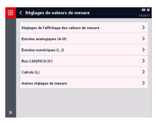

valeurs de mesure 
- **Entrées analogiques (A-H)** - **Entrées numériques (I, J)** - **Bus CAN/HCSI (K)** - **Calculs (L)** - **Autres réglages de mesure** 

## 7.2 Réglages De L'Affichage 

 Des Valeurs De Mesure

Cette option offre les possibilités de réglage suivantes : 
- **Rafraîchissement** - **Durée de courbe** - **Représentation des valeurs de** 
mesure 
- **Afficher les valeurs min./max.** - **Afficher l'histogramme** 
- **Afficher la courbe** 

## 7.2.1 Rafraîchissement 

L'utilisation de *« Rafraîchissement »*
affiche une liste de sélection pour un affichage dynamique : 
- Rapide - Moyen - Lent - Très lent - Désactivé Les réglages du rafraîchissement dans l'affichage des valeurs de mesure n'a aucune influence sur la mesure proprement dite ! Ils servent uniquement à mieux lisser l'affichage, par exemple en cas de pulsations. 

## 7.2.2 Représentation Des Valeurs De Mesure

La sélection de **« Représentation des** 
valeurs de mesure » ouvre une liste de sélection de représentation des différentes valeurs de mesure : 
- **Tableau** - **Volets de taille M** - **Volets de taille L** 
- **Volets de taille XL** - **Volets de taille XXL** 
Cette option permet de 

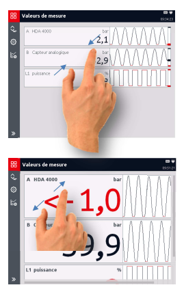

sélectionner entre un tableau des valeurs de mesure et différentes zones d'affichage numérique pour la taille de représentation des différentes valeurs de mesure. Sinon, il est aussi possible dans l'affichage des valeurs de mesure, d'agrandir ou de réduire la taille des zones d'affichage directement en écartant les doigts ou en rapprochant les doigts sur l'écran tactile. 

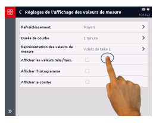

## 7.2.3 Afficher Les Valeurs Min./Max.

Après la sélection de « Afficher les valeurs min./max.», les valeurs minimales et maximales sont représentées avec la valeur de mesure. 

Les valeurs minimales et maximales 

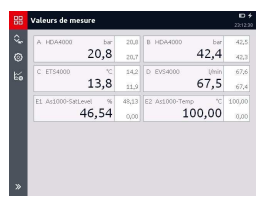

sont affichées en continu jusqu'à ce que l'affichage soit de nouveau désactivé ou que ces valeurs soient entre temps réinitialisées via le bouton 
. 

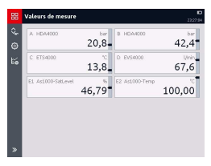

## 7.2.4 Afficher L'Histogramme

La sélection de « Afficher l'histogramme » permet d'activer l'affichage supplémentaire d'un histogramme pour les valeurs de mesure. 

La présentation des mesures diffère selon le réglage de l'affichage des mesures. 

## 7.2.5 Afficher La Courbe

La sélection de « Afficher la courbe » permet en outre d'activer et de désactiver l'affichage d'une courbe pour les valeurs de mesure.

Vous pouvez choisir la période sur laquelle porte l'affichage de la courbe.

Différentes plages de temps entre 10 secondes et 60 minutes sont s selectionnables. Selon le réglage de la représentation de la courbe (durée de courbe),
l'affichage pour les valeurs de mesure differe.

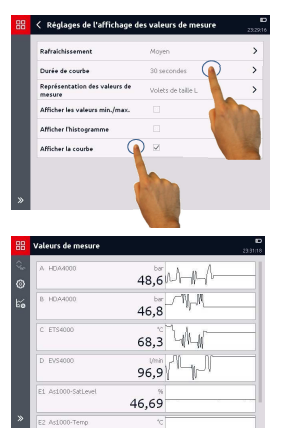

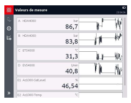

## 7.3 Entrées Analogiques (A-H)

Cette option permet d'accéder à une 

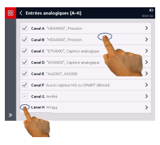 liste de tous les canaux de mesure analogiques disponibles sur l'HMG. A la gauche de chaque canal se trouve une case permettant d'activer ou d'inhiber l'entrée. Les canaux actifs sont identifiés par une coche. 

A droite de la case est indiqué, selon les réglages, le type de capteur (par ex. « HDA 4000 »), le mode de fonctionnement du capteur (par ex. 

« Capteur analogique ») et, le cas échéant, une désignation (par ex. « Pression système »). 

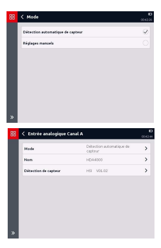

## 7.3.1 Mode

La zone Mode permet de déterminer si un capteur CM ou HSI HYDAC avec détection automatique de capteur ou un capteur analogique standard est raccordé. En cas de détection automatique de capteur, l'HMG 4000 reprend toutes les indications et valeurs directement à partir du capteur CM ou HSI HYDAC. En cas de réglage manuel, les indications et valeurs correspondantes du capteur raccordé, comme décrit ciaprès, doivent être entrées manuellement. 

## 7.3.2 Nom

Dans la zone *« Nom »***, vous pouvez** 

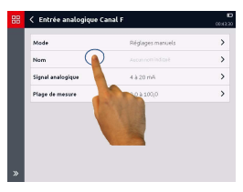

entrer une désignation facultative pour chaque canal de mesure. 

 
Pour cela, une nouvelle fenêtre avec une configuration de clavier s'ouvre. Entrez le nom souhaité et enregistrez la saisie avec *« Appliquer »*. 

Les trémas, ainsi que les 

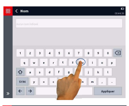

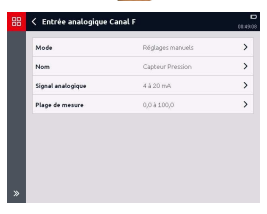

caractères spéciaux associés à la lettre apparaissent après une pression prolongée sur les lettres correspondantes. 

La désignation entrée apparaît désormais dans la zone *« Nom »* **et** 
aussi en conséquence dans l'affichage des valeurs de mesure. 

## 7.3.3 Signal Analogique

La zone *« Signal analogique »* **propose** 

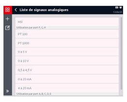

une liste de sélection de divers signaux analogiques. Elle permet de sélectionner un signal analogique à partir des entrées existantes. 

Lors de la livraison, la liste propose 

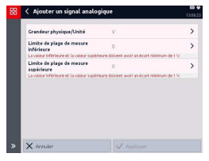

uniquement HSI, *0 à 10 V* **et** 
4 à 20 mA, ainsi que PT 100 **et** PT 
1000 **pour le canal « H »** 
Le bouton permet d'ajouter un signal analogique supplémentaire. Via le bouton , il est possible de supprimer un signal analogique de la liste. 

## 7.3.4 Plage De Mesure 

Pour définir la plage de mesure, vous entrez des valeurs pour **« Format** 
décimal », **« Limite de plage de mesure** 
inférieure/supérieure » et *« Unité »*. 

Dans la zone *« Unité »,* **vous pouvez** 
ajouter une autre unité à la liste avec le bouton . Via le bouton , il est possible de supprimer des unités de la liste. 

## 7.4 Entrées Numériques (I, J) 

Cette option permet d'accéder à une liste de tous les canaux de mesure numériques disponibles sur l'HMG. 

A la gauche de chaque canal se trouve une case permettant d'activer ou d'inhiber l'entrée. Les canaux actifs sont identifiés par une coche. 

A droite de la case est indiqué, selon les réglages, le mode ou, le cas échéant, la désignation (par ex. « Vitesse de rotation »). 

## 7.4.1 Mode 

Ici, vous spécifiez, séparément pour chaque entrée, le mode de traitement du signal d'entrée numérique. Les modes suivants sont sélectionnables : 
- **Etat numérique** - **Fréquence, vitesse de rotation,** 
débit 
- **Comptage d'impulsions** - **Durées** 

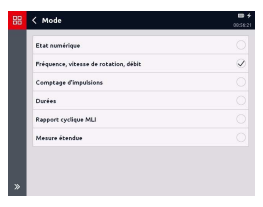 - **Rapport cyclique MLI** - **Mesure étendue** 
Selon la sélection, des sous-menus correspondants s'ouvrent et permettent d'effectuer les réglages nécessaires pour la fonction concernée. 

## 7.4.2 Etat Numérique 

La valeur de mesure correspond à l'état numérique en entrée. Elle est actualisée toutes les 0,1 ms. La plage de mesure est comprise entre 0 et 1, et elle ne comporte pas d'unité ni de décimale après la virgule. 

## 7.4.3 Fréquence, Vitesse De 

 Rotation, Débit

La fréquence est mesurée en *« Hz »* **et,** 
selon le réglage, elle est convertie en vitesse de rotation ou débit (1 Hz à 30 kHz). 

Pour *« l/min » et « g/min »,* **il convient** 
d'indiquer le *« facteur K »* **en plus.** 
Celui-ci indique le rapport entre les impulsions et le volume 
(« Impulsions/l » ou *« Impulsions/g »*) 
Les fréquences inférieures à 1 Hz 

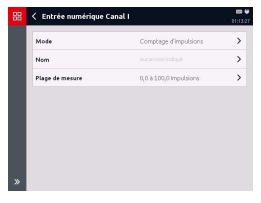

peuvent être mesurées avec **« Mesure** 
étendue ». 

## 7.4.4 Comptage D'Impulsions

Cette option permet de compter les impulsions. La valeur de mesure correspond à l'état du compteur. La valeur est actualisée toutes les ms. Il est possible de compter jusqu'à 2 milliards d'impulsions. 

## 7.4.5 Durées 

Cette section permet de mesurer les durées. Les mesures suivantes sont possibles : 
- **Durée de cycle (durée de période)** - **Temps d'activation cyclique** 
- **Temps de désactivation cyclique** - **Total des temps d'activation** - **Total des temps de désactivation** 
Les temps cumulés permettent, par exemple, de mesurer les temps d'activation des unités. 

Ces durées sont mesurées avec une résolution de 1 ms. Il est possible de totaliser des durées jusqu'à 500 h. Il est possible de réinitialiser le total à tout moment. 

## 7.4.6 Rapport Cyclique Mli 

Cette section permet de mesurer le rapport entre le temps d'activation et le temps de désactivation. L'HMG enregistre le rapport cyclique pour des fréquences de 1 Hz à 1 kHz. 

La valeur est actualisée avec la durée de période actuelle. 

Le rapport cyclique pour les fréquences inférieures à 1 Hz peut être mesuré avec 
« Mesure étendue ». 

La limite de plage de mesure inférieure est toujours *« 0 % »***, la limite de plage de** 
mesure supérieure est toujours *« 100 % »*. 

## 7.4.7 Mesure Étendue

Cette section permet de configurer librement une mesure. 

- **Mesure fondamentale** 

(fréquence/impulsion/temps/MLI) 
- **Expiration de délai** 
(uniquement pour fréquence/MLI) 
- **Durées à mesurer** 
(uniquement pour les durées) 
- **Facteur d'échelle** 

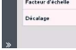

- **Valeur de décalage** 
La valeur de mesure est calculée en multipliant une valeur fondamentale par un facteur d'échelle, puis en ajoutant une valeur de décalage. Valeur de mesure = (valeur de mesure fondamentale x facteur d'échelle) + décalage En cas de mesure fondamentale d'une fréquence, la résolution est toujours réglée sur l'unité de mesure sélectionnée par Hz. Elle l'est par impulsion pour les impulsions, en pour cent pour le rapport cyclique et par seconde pour les durées. 

La valeur de décalage est toujours réglée dans l'unité de mesure sélectionnée. Les deux valeurs peuvent être indiquées avec jusqu'à 9 chiffres avant la virgule et 6 décimales après la virgule. 

Le taux d'actualisation, les limites de mesure et les précisions dépendent de la méthode de mesure fondamentale utilisée. 

Il existe une spécificité pour les méthodes de mesure de la fréquence et du rapport cyclique MLI. Dans ces deux cas, il est possible de régler un délai d'expiration. Alors que pendant la mesure simple de fréquence, de vitesse de rotation, de débit ou de rapport cyclique pour des valeurs inférieures à 1 Hz, autrement dit après 1 seconde, la valeur de mesure passe à 0, cette limite peut être réglée avec la mesure étendue. Ce faisant, il est possible de mesurer des fréquences jusqu'à 0,01 Hz. Cela correspond à une durée de période de 100 secondes. 

## Exemple Pour Le Calcul Du Facteur D'Échelle Pour Une Mesure De Vitesse De Rotation :

[table_3][{0: '1 impulsion', 1: 'à 1 rév /s', 2: '≙', 3: '1 Hz [1/s]', 4: '→', 5: '60[s] : 1[1/s] = 60'}, {0: '2 impulsions à 1 rév /s', 1: '≙', 2: '2 Hz [1/s]', 3: '→', 4: '60[s] : 2[1/s] = 30', 5: ''}, {0: '4 impulsions à 1 rév /s', 1: '≙', 2: '4 Hz [1/s]', 3: '→', 4: '60[s] : 4[1/s] = 15', 5: ''}][/table_3]

## 7.5 Can-Bus/Hcsi (K)

Lors de la connexion de l'HMG 4000 à un système de bus CAN externe existant ou lors de la mise en place d'un système de bus CAN interne avec capteurs HCSI, il convient en principe de respecter les consignes de sécurité suivantes : 
Le bus CAN peut uniquement être connecté à l'HMG 4000 

 via le connecteur « CAN » (K) ! L'HMG 4000 doit toujours être connecté à un système de bus CAN 

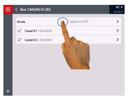

conformément au mode sélectionné. 

Le connecteur *« K »* **(bus CAN/HCSI) sur l'HMG 4000 est utilisable dans deux modes** 
distincts : 

## - **Capteurs Hcsi**

Dans ce mode, il est possible de raccorder un maximum de 28 capteurs HCSI avec un total de 28 canaux de mesure à l'appareil, pour constituer un système de bus CAN interne. 

## - **Analyser Les Messages**

Ce mode décrit l'activation sur un système de bus CAN existant (par ex. sur une machine agricole, un engin de chantier, etc.). Il est possible de définir un maximum de 28 canaux de mesure, lesquels lisent les données définies des messages reçus et calculent les valeurs de mesure correspondantes. 

## 7.5.1 Capteurs Hcsi

Conformément aux capteurs HSI (HYDAC Sensor Interface) analogiques pour les entrées analogiques, ces capteurs sont appelés *« capteurs HCSI »* **(HYDAC CAN Sensor** 
Interface). 

Si le connecteur *« K »* **est utilisé dans ce mode, les capteurs HCSI qui y sont raccordés** 
sont détectés automatiquement par l'HMG 4000, y compris, leurs caractéristiques, et le bus de capteurs CAN « interne » fonctionne à 500 kbit/s. 

Un capteur HCSI peut posséder un ou plusieurs canaux. Un numéro est stocké pour chaque canal au niveau du capteur. Un maximum de 28 canaux peut être affecté sur l'HMG 4000. Chaque numéro de canal doit apparaître une fois seulement dans la configuration de bus, et il peut être modifié et réaffecté de manière simple sur l'HMG 4000. 

A la livraison, tous les capteurs ont le numéro de canal *« 1 » et aussi le numéro « 2 »*, 
etc. pour les capteurs avec plusieurs canaux. Autrement dit, au début de la configuration du bus, vous devez régler un ou plusieurs numéros de canaux pour chaque capteur, afin d'établir une affectation directe entre le capteur physique et l'affichage correspondant sur l'HMG. Le numéro de canal attribué est enregistré de manière permanente sur le capteur. La connexion des différents capteurs s'effectue via des câbles de connexion M12x1 à 5 pôles (ZBE 30) et un *« répartiteur en Y HCSI »*. 

Comme pour tout système de bus CAN, la ligne de bus doit, aussi en mode HCSI, présenter une terminaison à chaque extrémité. 

Pour cela, la résistance de terminaison interne de l'HMG est activée automatiquement en mode HCSI et, à l'autre extrémité, il convient de visser une *« terminaison de bus HCSI »* **au niveau du dernier capteur sur le répartiteur** 
en Y. 

Temps de rafraîchissement du signal : 
Le temps de rafraîchissement du signal des capteurs HCSI raccordés peut être calculé sur la base de la règle empirique suivante : 
 ≈ 1  

 [ms] 
n = Nombre de capteurs raccordés T = Temps de rafraîchissement, arrondi à des valeurs de ms entières L'HMG 4000 peut, avec le bloc d'alimentation branché, alimenter en tension jusqu'à 28 capteurs HCSI. 

Aucune alimentation en tension séparée n'est nécessaire pour la configuration du bus. 

Schéma de connexion de la configuration de bus HCSI : 

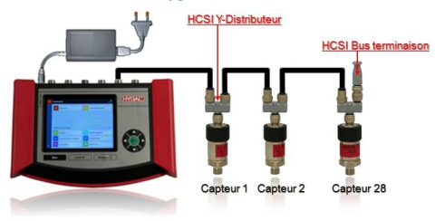

La configuration de bus doit, en partant de l'HMG 4000, toujours aller dans 

 un seul sens. L'HMG 4000 doit toujours être le premier participant sur le bus. 

Un branchement à partir de l'HMG 4000 dans les deux sens n'est pas 

autorisé ! 

## Capteurs Hcsi

Cette option fournit une liste de tous les canaux de mesure HCSI actifs sur l'HMG, 
autrement dit une liste de tous les capteurs HCSI raccordés. 

A la gauche de chaque canal se trouve une case permettant d'activer ou d'inhiber l'entrée. Les canaux actifs sont identifiés par une coche. 

Pour modifier les réglages du canal correspondant, effleurez la zone concernée. 

Dans la fenêtre qui s'ouvre, vous 

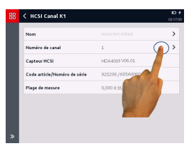 pouvez attribuer un nom au canal et aussi modifier le numéro de canal du capteur et en affecter un nouveau (1 à 28). 

D'autre part, la désignation, le code article et le numéro de série, ainsi que la plage de mesure et l'unité du capteur raccordé sont affichés. 

## Gestion Des Conflits 

Si deux ou plusieurs capteurs raccordés ont le même numéro de canal, seul le premier capteur est activé et un message correspondant s'affiche. Vous devez résoudre le conflit en modifiant le numéro de canal en double et en affectant un nouveau numéro. 

## Gestion Des Valeurs De Mesure

L'HMG 4000 envoie une demande de valeur de mesure sur le bus. Ensuite, tous les capteurs HCSI raccordés envoient leur valeur de mesure. Si l'HMG a reçu toutes les valeurs de mesure, il envoie la requête suivante. Le temps de rafraîchissement des valeurs de mesure est déterminé ainsi automatiquement selon le nombre des capteurs raccordés. 

La vitesse de transmission pour le système de bus HCSI est de 500 kbit/s et n'est pas modifiable. Il en résulte la longueur maximale possible de câble ≤ 100 m. 

## 7.5.2 Analyse Des Messages De Bus Can 

Ce chapitre s'adresse aux ingénieurs, aux programmeurs, aux personnes chargées de la mise en service, ainsi qu'au personnel de maintenance et de réparation ayant les connaissances correspondantes dans le domaine de l'automatisation industrielle, notamment dans les systèmes de bus CAN. 

Avant de connecter l'HMG 4000 sur un système de bus CAN opérationnel, il faut, selon le type et la topologie du système de bus CAN, ainsi que le mode de connexion, effectuer les préréglages et spécifications de paramètres correspondants sur l'HMG 4000. 

Une connexion de l'HMG 4000 avec des préréglages erronés sur un système 

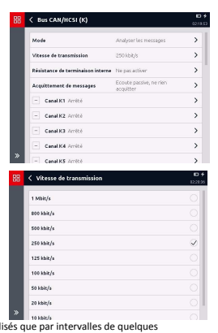

de bus CAN actif peut provoquer des perturbations ou une défaillance du bus, ainsi que des dysfonctionnements, et aboutir à des dommages matériels 
(machine et installation) et corporels. 

En mode *« Analyser les messages »,* 
vous accédez au menu principal de cette fonctionnalité CAN et vous avez la possibilité d'adapter les réglages en fonction de vos besoins. Au niveau supérieur, il convient d'abord d'effectuer les réglages suivants : 

## Vitesse De Transmission

Pour l'analyse des messages, l'HMG 
doit être réglé sur la vitesse de transmission du système de bus externe. 

Les vitesses de transmission possibles vont de 10 kbit/s à 1 Mbit/s.

Temps de rafraîchissement du signal : 
Les messages CAN reçus peuvent ne peuvent être actualisés que par intervalles de quelques millisecondes. 
- **Résistance de terminaison interne** 

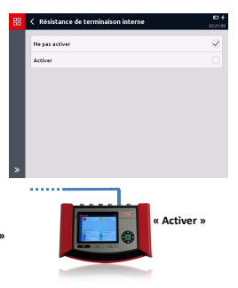

La résistance de terminaison interne doit ensuite être activée, lorsque l'HMG 4000 n'est pas connecté avec un câble de dérivation mais constitue le « dernier participant » à l'extrémité du système de bus CAN. Si l'HMG 4000 est connecté avec un câble de dérivation, la résistance de terminaison interne ne doit pas être activée. 

- **Acquittement des messages** 

L'acquittement des messages doit, selon l'application, être désactivé ou activé. 

 « Ne pas « Activer » 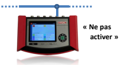

Ecoute passive, ne rien acquitter Ce réglage doit toujours être sélectionné lorsque l'HMG 4000 est connecté à un système de bus CAN, afin d'analyser passivement des messages prédéfinis. Ecoute active, acquitter les messages Aux fins de test ou pour la mise en service de participants individuels sur le bus, il est par exemple souvent nécessaire d'acquitter de manière ciblée la réception de messages. Dans ce type de situation, il est nécessaire de sélectionner ce réglage.

Version 29/03/2021 - V01 R20 [45] **Code article: 669951**
Configuration des messages CAN 

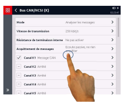 Ci-après, il est possible d'activer individuellement, puis de configurer un maximum de 28 messages CAN (souscanaux). Ces messages sont alors analysés par l'HMG comme des canaux de mesure « normaux » (valeurs de mesure). Si vous avez sélectionné 

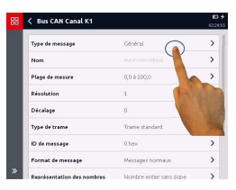

et activé un message (canal de bus CAN Kn), la fenêtre de configuration ci-contre apparaît. 

Effectuez l'un après l'autre tous les réglages nécessaires conformément aux messages de bus à analyser et à représenter sous forme de valeur de mesure. Type de message 

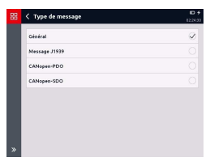 L'HMG 4000 peut analyser les types de messages suivants : 
- **Généralités** 
- **Message J1939** 
- **CANopen-PDO** - **CANopen-SDO** 
Selon le type de message sélectionné, il convient de distinguer les réglages/ 
configurations nécessaires comme décrit ci-après. 

Valeurs de mesure HMG 4000 Type de message « Généralités » 

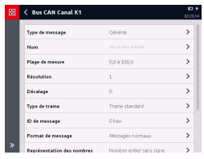 Dans ce mode, vous pouvez analyser les messages CAN 
généraux. Pour le type de message 
« Généralités » **les réglages de** 
paramètres répertoriés ci-après sont nécessaires. 

## - **Nom**

Le nom entré est utilisé comme nom du canal de mesure. Si aucun nom n'est entré ici, *« Canal CAN x »* **est visible comme nom de canal.**
- **Plage de mesure** 
Entrez les limites de plage de mesure inférieure et supérieure, l'unité et le format décimal.

- **Résolution** 
Entrez une valeur pour l'unité/bit. 

(par ex. 2 décimales ≙ 0,01 résolution)
- **Décalage** 
Entrez un éventuel décalage présent.

- **Type de trame** 
Sélectionnez le type de trame employé (Standard/Etendue).

- **ID de message** 
Entrez l'ID de message (hex.) (0 à 1FFFFFFF).

## - **Format De Message**

Sélectionnez le format de message employé (Normal/Multiplexé). 

Avec Multiplexé, entrez par ailleurs la position de bit et la *longueur de bit du* sélecteur, ainsi que la valeur du *sélecteur*.

- **Représentation des nombres** 
Sélectionnez la représentation des nombres utilisée (nombre entier/nombre à virgule flottante).

- **Séquence d'octets** 
Sélectionnez la séquence d'octets employée (Little-Endian/Big-Endian).

- **Position de bit** 
Entrez la position de bit correspondante des données (0 à 63).

- **Longueur de bit** 
Entrez la longueur de bit correspondante des données (1 à 64).

Version 29/03/2021 - V01 R20 [47] **Code article: 669951**
Valeurs de mesure HMG 4000 Message J1939 

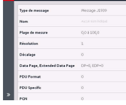

 Dans ce mode, les données sont récupérées sur un bus J1939 à partir d'un groupe de paramètres transférés. Les groupes de paramètres doivent, pour cela être transférés directement. 

(BAM et CMT ne peuvent pas être analysés !) 
En mode J1939-PGN, les réglages suivants sont nécessaires : 

## - **Nom**

Le nom entré est utilisé comme nom du canal de mesure. Si aucun nom n'est entré ici, *« Canal CAN x »* **est visible comme nom de canal.**
- **Plage de mesure** 
Entrez les limites de plage de mesure inférieure et supérieure, l'unité et le format décimal. 

- **Résolution** 
Entrez une valeur pour l'unité/bit.

- **Décalage** 
Entrez un éventuel décalage présent.

- **Datapage, Extended Data Page** 
Entrez les valeurs DP et EDP du PGN (DP=0/EDP=0 à DP=1/EDP=1)
- **PDU Format** 
Entrez la valeur pour PDU Format (0 à 255).

- **PDU Specific** 
Entrez la valeur pour PDU Specific (0 à 255).

- **PGN (Parameter Group Number)** 
Entrez la valeur pour PGN.

- **Priorité** 
Entrez une priorité pour le message (0 à 7). 

Cette partie du message peut être ignorée en entrant "-1".

- **Adresse source** 
Entrez la valeur pour l'adresse source (0 à 255). 

Cette partie du message peut être ignorée en entrant "-1".

## - **Id De Message**

Entrez l'ID de message (hex.) (0 à 1FFFFFFF).

- **Position des données (Byte, Bit)** 
La position des données est indiquée sous forme de nombre avec 1 décimale après la virgule. 

Pour J1939, le comptage commence à 1 (pas à 0), de sorte que seuls sont autorisés les nombres pour lesquels le chiffre avant et après la virgule est compris entre 1 et 8. (par ex. 2,1 = 2e octet/1er bit)
- **Longueur des données** 
Entrez la longueur de bit correspondante des données (1 à 64).

CANopen-PDO Pour le transfert des données de processus, le mécanisme d'objet PDO (Process Data Object) est disponible. 

Dans ce mode, les données sont récupérées d'un PDO. Les réglages suivants sont nécessaires :

## - **Nom**

Le nom entré est utilisé comme nom du canal de mesure. Si aucun nom n'est entré ici, *« Canal CAN x »* **est visible comme nom de canal.**
- **Plage de mesure** 
Entrez les limites de plage de mesure inférieure et supérieure, l'unité et le format décimal.

- **Résolution** 
Entrez une valeur pour l'unité/bit.

- **Décalage** 
Entrez un éventuel décalage présent.

- **ID COB** 
Entrez l'ID COB (hex.) (0 à 3FFFFFFF).

- **Représentation des nombres** 
Sélectionnez la représentation des nombres utilisée (nombre entier/nombre à virgule flottante).

- **Position de bit** 
Entrez la position de bit correspondante des données (0 à 63).

- **Longueur de bit** 
Entrez la longueur de bit correspondante des données (1 à 64).

CANopen-SDO 
Les objets SDO (Service Data Objects) 
sont utilisés pour les modifications dans le répertoire d'objets et pour les requêtes de statut. 

Les données peuvent être écrites dans un OD ou être lues à partir d'un OD. 

Pour ce faire, les réglages suivants sont sont nécessaires : 

## - **Nom**

Le nom entré est utilisé comme nom du canal de mesure. Si aucun nom n'est entré ici, *« Canal CAN x »* **est visible comme nom de canal.**

## - **Plage De Mesure**

Entrez les limites de plage de mesure inférieure et supérieure, l'unité et le format décimal.

- **Résolution** 
Entrez une valeur pour l'unité/bit.

- **Décalage** 
Entrez un éventuel décalage présent.

- **ID COB** 
Entrez l'ID COB (hex.) (0 à 3FFFFFFF).

- **Index** 
Entrez un index (hex.) (0 à FFFF).

- **Sous-index** 
Entrez un sous-index (hex.) (0 à FF).

- **Sens de transfert** 
Sélectionnez le sens du transfert (Télécharger/Transférer)
- **Représentation des nombres** 
Sélectionnez la représentation des nombres utilisée (nombre entier/nombre à virgule flottante).

- **Longueur de bit** 
Entrez la longueur de bit correspondante des données (1 à 64).

## 7.6 Calculs (L)

Dans cette section, il est possible de 

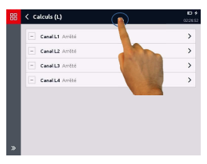 définir et configurer jusqu'à quatre canaux de mesure « virtuels ». 

Les canaux de mesure virtuels sont toujours actualisés toutes les 1 ms. 

Les réglages suivants sont nécessaires 

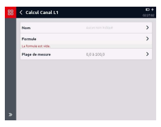 pour les canaux calculés : 
- **Nom** 
- **Formule** 
- **Plage de mesure** 
Nom 

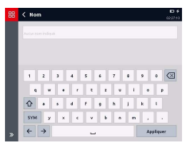 Le nom entré est utilisé comme nom du canal de mesure. 

Si aucun nom n'est entré, le nom de canal « *Formule-canal X »* **est utilisé, où** 
« X » désigne un nombre entre 1 et 4. 

Formule 

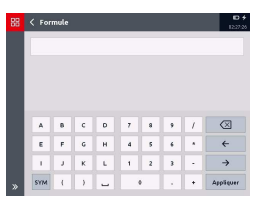 Cette section permet d'entrer une formule, pour laquelle les autres canaux de mesure sont calculés ensemble. Exemple : "(A + B) * C2 + K4" Les canaux sont désignés par leur lettre de port et leur numéro de canal. Si un port n'a qu'un seul canal, le numéro de canal devient superflu. 

 
Les opérations suivantes sont possibles : 
- **+, -, *, /** 

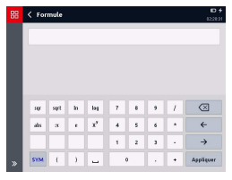

- **abs, sqr, sqrt** 
(valeur absolue, carré, racine carrée) 
- **ln, log, e, x**y
- **Détermination de l'ordre** 
d'évaluation entre parenthèses Si lors du calcul, une *« division par 0* **» apparaît ou si un des canaux de sortie sort** de la plage de mesure, la valeur de mesure est identifiée comme *« non valide »*. 

A la différence des règles mathématiques, la racine d'un nombre négatif ne cause pas d'erreur, mais le résultat correspond à la racine négative de la valeur absolue du radicande. Ainsi, *« sqrt (-4) »* donne la valeur *« -2 »***. Il en va de même pour le** 
logarithme (log, ln). 

Cela correspond en général au contexte technique. 

Par ex. un débit peut être mesuré via la perte de charge au niveau d'un orifice. Ce faisant, la racine est extraite de la différence de pression. Si la différence de pression est négative, cela signifie que le sens de l'écoulement est inverse. Dans ce cas, l'HMG fournit les résultats corrects. 

## 7.7 Autres Réglages De Mesure 

Cette section regroupe les informations suivantes concernant les signaux analogiques et unités employés : 
- **Liste de signaux analogiques** - **Liste des unités** 
- **Unités en cas de détection** 
automatique de capteur 

## 7.7.1 Liste De Signaux Analogiques 

Dans *« Liste de signaux analogiques »,* 
vous voyez les signaux d'entrée actuellement stockés sur l'HMG 4000 et les canaux d'entrée sur lesquels ils sont utilisés. 

Le bouton permet d'ajouter un signal analogique supplémentaire. Via le bouton , il est possible de supprimer un signal analogique de la liste. 

## 7.7.2 Liste Des Unités 

Dans *« Liste des unités »,* **vous voyez les** 
unités physiques actuellement stockées sur l'HMG 4000 et les canaux d'entrée sur lesquels elles sont utilisées. Via le bouton , vous pouvez ajouter une autre unité. Via le bouton , il est possible de supprimer une unité de la liste. 

## 7.7.3 Unités En Cas De Détection Automatique De Capteur

Dans cette section, vous spécifiez 

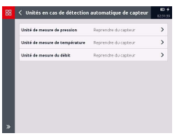 l'unité avec laquelle les valeurs de mesure des capteurs HSI et HCSI avec détection automatique de capteur sont représentées dans l'affichage des valeurs de mesure. 

## 7.7.4 Unité De Mesure De Pression

- **Reprendre du capteur** 

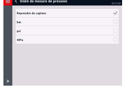

- **bar** 
- **psi** - **MPa** 
Si *« Reprendre du capteur »* **est** 
sélectionné, l'unité correspondante du capteur est représentée. 

Si « bar », « psi » ou *« MPa »* **est actif,** 
la valeur de mesure est convertie dans l'unité correspondante. 

## 7.7.5 Unité De Mesure De 

 Température

- **Reprendre du capteur** 
- °C 
- °F 
- **Kelvin** 
Si *« Reprendre du capteur »* **est** 
sélectionné, l'unité correspondante du capteur est représentée. 

Si « °C », « °F » ou *« Kelvin »* **est actif, la** 
valeur de mesure est convertie dans l'unité correspondante.

## 7.7.6 Unité De Mesure Du Débit

- **Reprendre du capteur** 

- **l/min** - **g/min** 
Si *« Reprendre du capteur »* **est** 
sélectionné, l'unité correspondante du capteur est représentée. 

Si « l/min » ou « USG/min » est actif, la valeur de mesure est convertie dans l'unité correspondante. 

Les réglages dans ce menu s'appliquent toujours pour l'ensemble des canaux de mesure analogiques et des capteurs HSI avec détection automatique de capteur raccordés ! 

Autrement dit, si *« psi »* **par exemple est sélectionné comme unité pour les** 
capteurs de pression, les valeurs de mesure de tous les capteurs de pression HSI 
raccordés à l'HMG sont affichées en psi. Les capteurs de température et de débit HSI se comportent en conséquence. Il en va de même pour les capteurs HCSI raccordés à l'appareil. 

## 8 Enregistrements

L'HMG 4000 offre des possibilités très complètes et conviviales pour l'enregistrement et la conservation d'une mesure sur une durée déterminée. 

Vous accédez au menu d'enregistrement via la vue *« Valeurs de mesure ».*
Dans la vue Valeurs de mesure, effleurez 

le bouton dans la barre de menus/commandes (barre d'outils). Si aucun enregistrement n'est encore stocké sur l'HMG 4000, l'écran ci-contre s'ouvre. Si des enregistrements sont déjà stockés sur l'HMG 4000, ceux-ci sont affichés en conséquence. 

Par le biais du bouton , vous pouvez supprimer individuellement les enregistrements stockés. Le bouton permet d'accéder à la fenêtre *« Paramètres du dossier »*. 

Vous pouvez modifier ici les spécifications pour le tri des fichiers. 

## 8.1 Démarrage De 

 L'Enregistrement

Pour démarrer un enregistrement, effleurez le bouton dans la barre de menus/commandes (barre d'outils). 

La fenêtre *« Démarrer* 

 l'enregistrement » **s'ouvre.** 
Ce menu et tous les autres sous-menus répertorient l'ensemble des paramètres de mesure qu'il est possible de régler pour le type d'enregistrement. 

Concernant les réglages de période d'échantillonnage, il convient en principe 

de respecter ce qui suit : 
La plus petite période d'échantillonnage réglable est, pour toutes les méthodes d'enregistrement, entre autres dépendante du nombre de canaux de mesure actifs et s'échelonne comme suit : 
- *jusqu'à 10 canaux actifs 100 μs* - *11 à 20 canaux actifs 200 μs* - *21 à 50 canaux de mesure actifs 500 μs* - *51 à 100 canaux de mesure actifs 1 ms* - **avec les canaux calculés en général 1 ms** 
Le stockage des valeurs de mesure conformément à la période d'échantillonnage réglée se déroule indépendamment du temps de rafraîchissement du signal des capteurs raccordés.

Si aucun bloc d'alimentation n'est raccordé à l'HMG 4000, la durée d'enregistrement maximale pour toutes les méthodes d'enregistrement est en outre limitée par la capacité et l'état de charge de la batterie. 

Une mesure en cours peut être arrêtée manuellement à tout moment en touchant 

 le bouton dans la barre de menu / barre de commandes (barre de fonctions). 

l'enregistrement est alors terminé immédiatement! Quittez ensuite le menu d'enregistrement en touchant sur le bouton dans la barre d'affichage, ou en appuyant sur la touche "Esc". Vous serez alors interrogé si vous souhaitez sauvegarder ou abandonner l'enregistrement arrêté. 

Si vous tapez sur le bouton lors d'un enregistrement en cours, ou si vous appuyez sur la touche "Esc", la mesure se poursuit. 

Dans ce cas, vous serez d'abord interrogé si vous souhaitez abandonner ou sauvegarder la mesure après avoir arrêté l'enregistrement. 

Tous les réglages d'enregistrement (y compris les réglages de graphique) sont 
« mémorisés » sur l'HMG 4000. Autrement dit, tant qu'aucune modification n'est apportée au niveau des canaux d'entrée, tous les réglages effectués sont conservés. 

Dès que des modifications sont effectuées sur un canal d'entrée (autre capteur avec autre unité et/ou plage de mesure), tous les réglages d'enregistrement pour le canal correspondant sont réinitialisés aux réglages de base.

## 8.2 Procédure 

 D'Enregistrement

Sélectionnez par effleurement dans la section correspondante une des options suivantes : 

## - **Enregistrement Continu**

Signifie qu'après le démarrage de l'enregistrement, l'appareil enregistre en permanence les valeurs de mesure conformément aux préréglages. Ce processus dure jusqu'à ce que l'enregistrement soit arrêté manuellement. A cet égard, seule la durée d'enregistrement max. réglée est conservée dans la mémoire d'enregistrement. 

## - **Enregistrement Ponctuel**

Signifie que l'enregistrement est démarré manuellement et qu'il se termine après l'écoulement de la durée d'enregistrement réglée. Selon le préréglage, l'enregistrement est sauvegardé automatiquement.

## - **Enregistrement Événementiel**

Signifie qu'une courbe de mesure est démarrée et/ou arrêtée automatiquement lorsqu'un ou plusieurs événements prédéfinis surviennent. Il s'agit, par exemple, d'un dépassement ou de la non-réalisation d'une valeur limite spécifiée ou de la sortie d'une fenêtre de mesure, de signaux numériques externes, etc. 

## - **Protocole De Mesure**

Le protocole de mesure offre la possibilité d'enregistrer les valeurs de mesure sous forme de tableau. Une ligne de mesure dans le tableau contient un horodatage, la valeur de mesure actuelle, ainsi que les valeurs minimale et maximale (facultatives) 
de chaque canal actif. Grâce aux réglages de déclencheur, vous déterminez l'événement qui, après le démarrage de la mesure, doit créer une nouvelle ligne de mesure dans le protocole de mesure (par ex. : touche spécifique, limite de valeur de mesure atteinte, etc.).

- **Sur l'affichage, vous voyez à chaque fois les informations sur les données** 
d'enregistrement résultantes (nombre des enregistrements de données et l'espace utilisé). Si vous sélectionnez un réglage non valide, par ex. si le maximum de 8 millions de valeurs de mesure est dépassé avec ces réglages, un message décrivant le réglage non valide apparaît à la place des données d'enregistrement.

## 8.2.1 Enregistrement Continu 

Pour un enregistrement continu, les réglages suivants doivent être définis : 

## - **Réglages De Canal De Mesure**

Cette option permet de spécifier les canaux de mesure à inclure dans l'enregistrement et les canaux *« désactivés »* **pour l'enregistrement.**
- **Période d'échantillonnage** 
Cette option permet de spécifier l'intervalle de temps appliqué par l'HMG 4000 pour lire la valeur de mesure des capteurs *« actifs »* **et pour la stocker dans la** 
mémoire interne. 

Un enregistrement peut comporter au maximum 8 millions de valeurs de mesure. 

La sélection de 1 ms signifie par exemple que, par seconde, 1000 valeurs de mesure de chaque canal de mesure activé peuvent être enregistrées.

Le stockage des valeurs de mesure conformément à la période d'échantillonnage réglée se déroule indépendamment du temps de rafraîchissement du signal des capteurs raccordés. 

Cela signifie, par exemple, que pour une période d'échantillonnage préréglée de 1 ms et un temps de rafraîchissement du signal de 10 ms, la valeur de mesure est enregistrée chaque fois 10 fois avant la modification du signal en entrée. 

## - **Durée D'Enregistrement Maximale**

Cette option permet de sélectionner une durée d'enregistrement par pas de 10 secondes jusqu'à 28 jours.

- **Zoom** 
Le zoom permet, pendant l'enregistrement, de générer une plage d'affichage supplémentaire en mode graphique. 

Autrement dit, l'axe X est, lors du réglage « Zoom **», mis à l'échelle sur la durée** 
réglée dans cette option (désactivé/5 secondes/10 secondes/etc.). 

- **Réglages de stockage** 
Cette option permet de spécifier le mode de stockage, le nom du dossier et le nom du fichier pour chaque enregistrement.

 

## 8.2.2 Enregistrement Ponctuel 

Pour un enregistrement ponctuel, les réglages suivants doivent être définis : 

## - **Réglages De Canal De Mesure**

Cette option permet de spécifier les canaux de mesure à inclure dans l'enregistrement et les canaux *« désactivés »* **pour l'enregistrement.**
- **Période d'échantillonnage** 
Cette option permet de spécifier l'intervalle de temps appliqué par l'HMG 4000 pour lire la valeur de mesure des capteurs *« actifs »* **et pour la stocker dans la** 
mémoire interne. Un enregistrement peut comporter au maximum 8 millions de valeurs de mesure. 

La sélection de 1 ms signifie par exemple que, par seconde, 1000 valeurs de mesure de chaque canal de mesure activé peuvent être enregistrées.

Le stockage des valeurs de mesure conformément à la période d'échantillonnage réglée se déroule indépendamment du temps de rafraîchissement du signal des capteurs raccordés. 

Cela signifie, par exemple, que pour une période d'échantillonnage préréglée de 1 ms et un temps de rafraîchissement du signal de 10 ms, la valeur de mesure est enregistrée chaque fois 10 fois avant la modification du signal en entrée. 

## - **Durée D'Enregistrement Maximale**

Cette option permet de sélectionner une durée d'enregistrement par pas de 10 secondes jusqu'à 28 jours.

- **Zoom** 
Le zoom permet, pendant l'enregistrement, de générer une plage d'affichage supplémentaire en mode graphique. 

Autrement dit, l'axe X est, lors du réglage « Zoom **», mis à l'échelle sur la durée** 
réglée dans cette option (désactivé/5 secondes/10 secondes/etc.). 

- **Réglages de stockage** 
Cette option permet de spécifier le mode de stockage, le nom du dossier et le nom du fichier pour chaque enregistrement. 

## 8.2.3 Enregistrement Événementiel 

Pour un enregistrement événementiel, les réglages suivants doivent être définis : 

## - **Réglages De Canal De Mesure**

Cette option permet de spécifier les canaux de mesure à inclure dans l'enregistrement et les canaux *« désactivés »* **pour l'enregistrement.**

## - **Période D'Échantillonnage**

Cette option permet de spécifier l'intervalle de temps appliqué par l'HMG 4000 pour lire la valeur de mesure des capteurs *« actifs »* **et pour la stocker dans la** 
mémoire interne. 

Le stockage des valeurs de mesure conformément à la période d'échantillonnage réglée se déroule indépendamment du temps de rafraîchissement du signal des capteurs raccordés. 

Cela signifie, par exemple, que pour une période d'échantillonnage préréglée de 1 ms et un temps de rafraîchissement du signal de 10 ms, la valeur de mesure est enregistrée chaque fois 10 fois avant la modification du signal en entrée. 

- **Durée d'enregistrement maximale** 
Cette option permet de sélectionner une durée d'enregistrement par pas de 10 secondes jusqu'à 28 jours.

- **Zoom** 
Le zoom permet, pendant l'enregistrement, de générer une plage d'affichage supplémentaire en mode graphique. 

Autrement dit, l'axe X est, lors du réglage « Zoom **» mis à l'échelle sur la durée** 
réglée dans cette option (désactivé/5 secondes/10 secondes/etc.). 

- **Réglages de stockage** 
Cette option permet de spécifier le mode de stockage, le nom du dossier et le nom du fichier pour chaque enregistrement.

## - **Réglages D'Événements**

Cette option permet de spécifier les réglages pour la gestion événementielle. (Condition de début/Condition de fin/Evénements de déclencheur/ 
Répartition des valeurs de mesure/Action après la fin de l'enregistrement) 
Version 29/03/2021 - V01 R20 [63] **Code article: 669951**

## Réglages D'Événements

Condition de début Si une *« condition de début »* **est présente pour la mesure, vous pouvez l'activer en** 
effleurant la case à cocher correspondante ( ). Pour ce faire, vous pouvez sélectionner les conditions suivantes : 
- **Entrée numérique**
Sélectionnez l'entrée numérique correspondante et entrez l'état de commutation nécessaire. 

- **Limite de valeur de mesure** 
Sélectionnez le canal de mesure correspondant et entrez la position de la valeur de mesure, ainsi que la valeur limite.

- **Fenêtre de valeur de mesure** 
Sélectionnez le canal de mesure correspondant et entrez la position de la valeur de mesure, ainsi que les limites de valeur de mesure inférieure et supérieure.

- **Moment** 
Entrez la date et l'heure du moment souhaité.

La condition de début doit être remplie afin de pouvoir démarrer l'enregistrement. Condition de fin Si une *« condition de fin »* **est présente pour la mesure, vous pouvez l'activer en** 
effleurant la case à cocher correspondante ( ). Pour ce faire, vous pouvez sélectionner les conditions suivantes : 

## - **Entrée Numérique**

Sélectionnez l'entrée numérique correspondante et entrez l'état de commutation nécessaire. 

- **Limite de valeur de mesure** 
Sélectionnez le canal de mesure correspondant et entrez la position de la valeur de mesure, ainsi que la valeur limite.

- **Fenêtre de valeur de mesure** 
Sélectionnez le canal de mesure correspondant et entrez la position de la valeur de mesure, ainsi que les limites de valeur de mesure inférieure et supérieure.

- **Moment** 
Entrez la date et l'heure du moment souhaité.

La condition de fin doit être remplie afin de pouvoir terminer l'enregistrement.

Evénements de déclencheur Vous pouvez définir jusqu'à 4 événements de déclencheur différents (événement 1 à 4) et les activer en effleurant la case à cocher correspondante ( ). Pour ce faire, vous pouvez sélectionner les événements suivants : 
- **Entrée numérique**
Sélectionnez l'entrée numérique correspondante et entrez le sens de commutation souhaité. 

- **Limite de valeur de mesure** 
Sélectionnez le canal de mesure correspondant et entrez la courbe de la valeur de mesure, ainsi que la valeur limite.

- **Fenêtre de valeur de mesure** 
Sélectionnez le canal de mesure correspondant et entrez la courbe de la valeur de mesure, ainsi que les limites de valeur de mesure inférieure et supérieure.

## - **Liaison Des Événements** 

Vous avez en outre la possibilité de combiner des événements. Sans liaison, chacun des quatre événements devient, seul et de manière autonome, un déclencheur de l'enregistrement de mesure. 

A cet égard, il convient de prendre en compte le fait que les événements sont toujours combinables à partir du haut, sinon il convient de modifier leur ordre en conséquence. 

## - **Déclenchement Manuel**

Une autre possibilité de démarrage de l'enregistrement est le déclenchement manuel. Si cette option est sélectionnée, vous pouvez employer le bouton dans la barre de menus/commandes (barre d'outils), pour démarrer manuellement l'enregistrement.

Répartition des valeurs de mesure Après le démarrage de l'enregistrement événementiel, l'HMG 4000 commence à enregistrer les valeurs de mesure pour la durée d'enregistrement réglée. Si l'événement du déclencheur ne se produit pas pendant ce laps de temps, les anciennes valeurs de mesure sont perdues et de nouvelles sont enregistrées. 

Ainsi, la durée d'enregistrement réglée est toujours considérée comme du « passé » 
dans la mémoire de valeurs de mesure. 

L'option *« Répartition des valeurs de mesure »* **permet de spécifier la quote-part de** 
« passé » à conserver en mémoire lorsque l'événement survient, et la quote-part de 
« futur » que vous souhaitez encore enregistrer après l'événement. 

Le réglage 50/50 %, par exemple, signifie que pour une durée d'enregistrement de 30 s, les 15 s précédant immédiatement la survenance de l'événement déclencheur sont conservées et que 15 s supplémentaires après l'événement sont enregistrées. Le réglage 10/90 %, par exemple, signifie que pour une durée d'enregistrement de 30 s, les 3 s précédant immédiatement la survenance de l'événement déclencheur sont conservées et que 27 s supplémentaires après l'événement sont enregistrées. 

Après la fin d'un enregistrement Cette option permet de déterminer la suite du processus après la fin de l'enregistrement. Pour ce faire, les options suivantes sont disponibles : 
- **Arrêter l'enregistrement** 
L'enregistrement est automatiquement arrêté et sauvegardé. Aucun enregistrement supplémentaire n'est démarré automatiquement.

## - **Enregistrer Et Répéter Sans Limitation**

L'enregistrement est arrêté et sauvegardé, et un autre enregistrement est démarré automatiquement avec les mêmes réglages, puis il est sauvegardé avec un numéro séquentiel. Ce processus se répète jusqu'à l'arrêt manuel de l'enregistrement.

- **Enregistrer et répéter avec limitation** 
L'enregistrement est arrêté et sauvegardé, et un autre enregistrement est démarré automatiquement avec les mêmes réglages, puis il est sauvegardé avec un numéro séquentiel. Ce processus se répète pour le nombre prescrit de répétitions ou jusqu'à ce que la mémoire soit pleine, auquel cas il s'arrête automatiquement.

## 8.2.4 Protocole De Mesure 

Le protocole de mesure offre la possibilité d'enregistrer les valeurs de mesure sous forme de tableau. Une ligne de mesure dans le tableau contient la valeur de mesure actuelle, ainsi que, au choix, les valeurs minimale et maximale de chaque canal actif. Grâce aux réglages de déclencheur, vous spécifiez l'événement qui doit créer une nouvelle ligne dans le protocole de mesure après le démarrage d'une mesure. 

## - **Réglages De Canal De Mesure**

Cette option permet de spécifier les canaux de mesure à inclure dans l'enregistrement et les canaux *« désactivés »* **pour l'enregistrement.**
- **Durée d'enregistrement maximale** 
Cette option permet de sélectionner une durée d'enregistrement par pas de 10 secondes jusqu'à 28 jours.

- **Entrées supplémentaires** 
Cette option permet de spécifier si le tableau doit stocker, outre les entrées déclenchées, d'autres entrées temporelles supplémentaires (échelonnées de 1 s à 24 heures).

- **Valeurs à enregistrer** 
Cette option permet de spécifier si, outre les valeurs de mesure actuelles, les valeurs minimale et maximale actuelles doivent aussi être stockées dans le tableau. 

Dès qu'une nouvelle ligne de valeurs de mesure est enregistrée, les valeurs Min. et Max. sont toujours automatiquement réinitialisées.

- **Réglages de stockage** 
Cette option permet de spécifier le mode de stockage, le nom du dossier et le nom du fichier pour chaque enregistrement.

- **Réglages d'événement** 
Cette option permet de spécifier les réglages pour la gestion événementielle. 

(Condition de début/Condition de fin/Evénements de déclencheur/Action après la fin de l'enregistrement) 
Pendant l'enregistrement, une seule vue de tableau est possible. Un protocole de mesure enregistré peut aussi être affiché sous forme de graphique. 

## Réglages D'Événements

Condition de début Si une *« condition de début »* **est présente pour la mesure, vous pouvez l'activer en** 
effleurant la case à cocher correspondante ( ). Pour ce faire, vous pouvez sélectionner les conditions suivantes : 
- **Entrée numérique**
Sélectionnez l'entrée numérique correspondante et entrez l'état de commutation nécessaire. 

- **Limite de valeur de mesure** 
Sélectionnez le canal de mesure correspondant et entrez la position de la valeur de mesure, ainsi que la valeur limite.

- **Fenêtre de valeur de mesure** 
Sélectionnez le canal de mesure correspondant et entrez la position de la valeur de mesure, ainsi que les limites de valeur de mesure inférieure et supérieure.

- **Moment** 
Entrez la date et l'heure du moment souhaité.

La condition de début doit être remplie afin de pouvoir démarrer l'enregistrement. Condition de fin Si une *« condition de fin »* **est présente pour la mesure, vous pouvez l'activer en** 
effleurant la case à cocher correspondante ( ). Pour ce faire, vous pouvez sélectionner les conditions suivantes : 

## - **Entrée Numérique**

Sélectionnez l'entrée numérique correspondante et entrez l'état de commutation nécessaire. 

- **Limite de valeur de mesure** 
Sélectionnez le canal de mesure correspondant et entrez la position de la valeur de mesure, ainsi que la valeur limite.

- **Fenêtre de valeur de mesure** 
Sélectionnez le canal de mesure correspondant et entrez la position de la valeur de mesure, ainsi que les limites de valeur de mesure inférieure et supérieure.

- **Moment** 
Entrez la date et l'heure du moment souhaité.

La condition de fin doit être remplie afin de pouvoir terminer l'enregistrement.

 
Evénements de déclencheur Vous pouvez définir jusqu'à 4 événements de déclencheur différents (événement 1 à 4) et les activer en effleurant la case à cocher correspondante ( ). Pour ce faire, vous pouvez sélectionner les événements suivants : 
- **Entrée numérique**
Sélectionnez l'entrée numérique correspondante et entrez le sens de commutation souhaité. 

- **Limite de valeur de mesure** 
Sélectionnez le canal de mesure correspondant et entrez la courbe de la valeur de mesure, ainsi que la valeur limite.

- **Fenêtre de valeur de mesure** 
Sélectionnez le canal de mesure correspondant et entrez la courbe de la valeur de mesure, ainsi que les limites de valeur de mesure inférieure et supérieure.

## - **Liaison Des Événements** 

Vous avez en outre la possibilité de combiner des événements. Sans liaison, chacun des quatre événements devient, seul et de manière autonome, un déclencheur de l'enregistrement de mesure. 

A cet égard, il convient de prendre en compte le fait que les événements sont toujours combinables à partir du haut, sinon il convient de modifier leur ordre en conséquence. 

## - **Déclenchement Manuel**

Une autre possibilité de démarrage de l'enregistrement est le déclenchement manuel. Si cette option est sélectionnée, vous pouvez employer le bouton dans la barre de menus/commandes (barre d'outils), pour démarrer manuellement l'enregistrement.

Après la fin d'un enregistrement Cette option permet de déterminer la suite du processus après la fin de l'enregistrement. Pour ce faire, les options suivantes sont disponibles : 
- **Arrêter l'enregistrement** 
L'enregistrement est automatiquement arrêté et sauvegardé. Aucun enregistrement supplémentaire n'est démarré automatiquement.

## - **Enregistrer Et Répéter Sans Limitation**

L'enregistrement est arrêté et sauvegardé, et un autre enregistrement est démarré automatiquement avec les mêmes réglages, puis il est sauvegardé avec un numéro séquentiel. Ce processus se répète jusqu'à l'arrêt manuel de l'enregistrement.

- **Enregistrer et répéter avec limitation** 
L'enregistrement est arrêté et sauvegardé, et un autre enregistrement est démarré automatiquement avec les mêmes réglages, puis il est sauvegardé avec un numéro séquentiel. Ce processus se répète pour le nombre prescrit de répétitions et est ensuite arrêté automatiquement.

## 8.3 Utilisation Pendant L'Enregistrement

Après le démarrage de l'enregistrement, la mesure est représentée à l'échelle sur toute la plage temporelle (axe X) et la plage de mesure (axe Y). 

A gauche de l'axe Y, vous voyez le canal de mesure mis à l'échelle momentanément sur l'axe Y. Si plusieurs canaux sont enregistrés 

simultanément, vous pouvez sélectionner le canal ou le capteur à afficher sur l'axe Y. 

Pour ce faire, effleurez le canal de mesure correspondant au-dessus du graphique. 

La représentation des axes reprend à chaque fois la couleur de la courbe de valeurs de mesure associée. 

En effleurant la case de sélection concernée, vous pouvez afficher ou masquer chaque canal de mesure séparément sur le graphique.

Le canal de mesure est enregistré 

sur la plage temporelle complète, même s'il est masqué sur le graphique. 

Dans la barre de menus/commandes (barre d'outils), vous disposez des options 

suivantes pour l'affichage graphique pendant l'enregistrement en cours : 

## 8.3.1 Statut

Le bouton permet d'obtenir des 

informations actuelles sur l'enregistrement en cours. 

## 8.3.2 Valeurs De Mesure

Le bouton permet de représenter les valeurs de mesure actuelles dans des volets correspondants, comme pour l'affichage des valeurs de mesure.

## 8.3.3 Mise À L'Échelle 

Le bouton permet d'accéder au sous-menu *« Mettre à l'échelle »*. 

Dans cette section, vous pouvez effectuer les réglages détaillés pour l'affichage de graphiques. 

Grâce au bouton , l'affichage de graphique revient au mode de vue globale, autrement dit avec la plage temporelle (axe X) et la plage de mesure 
(axe Y) totale. 

## 8.3.4 Réglages 

Le bouton permet d'accéder au sous-menu *« Réglages de vues »*. 

Dans cette section, vous pouvez effectuer les réglages détaillés pour l'affichage de graphique des canaux de mesure individuels. 

## 8.3.5 Ajouter Remarque

Avec le bouton vous pouvez insérer des remarques durant l'enregistrement en cours. 

Les remarques générées sont affichées lors de l'enregistrement comme 
"Marqueur" avec numérotation continue sur le bord supérieur de la fenêtre du graphique d'enregistrement. 

Le traitement supplémentaire des remarques, càd saisie de textes, déplacement, attribution à des canaux et/ou périodes, etc n'est possible que lorsque l'enregistrement est terminé et sauvegardé. 

## 8.3.6 Arrêt

Le bouton permet d'arrêter et de sauvegarder l'enregistrement.

## 8.4 Enregistrements 

L'option *« Enregistrements »* **affiche** 
une liste des enregistrements stockés sur l'HMG 4000. En effleurant la zone correspondante, vous ouvrez l'enregistrement souhaité et pouvez le traiter. L'écran ci-contre apparaît sur l'affichage et représente la mesure à l'échelle sur l'ensemble de la plage temporelle (axe X) et de la plage de mesure (axe Y). 

A gauche de l'axe Y, vous voyez le canal de mesure mis à l'échelle momentanément sur l'axe Y.

Si la mesure est enregistrée avec 

plusieurs canaux simultanément, vous pouvez sélectionner le canal ou le capteur à afficher sur l'axe Y. 

Pour ce faire, effleurez le canal de mesure correspondant au-dessus du graphique. 

La représentation des axes reprend à chaque fois la couleur de la courbe de valeurs de mesure associée. 

En effleurant la case de sélection concernée, vous pouvez afficher ou masquer chaque canal de mesure enregistré sur le graphique. 

Dans la barre de menus/commandes (barre d'outils), vous disposez des options suivantes pour I'affichage et le traitement de I'enregistrement :

## 8.4.1 Vue Précédente/Vue Suivante

Les boutons ( ) et ( ) permettent de faire la navette entre différentes vues traitées.

## 8.4.2 Mettre À L'Échelle 

Le bouton permet d'accéder au sous-menu *« Mettre à l'échelle »*. 

Dans cette section, vous pouvez effectuer les réglages détaillés pour l'affichage de graphique. 

## - **Plage De Temps (Axe X)**

Laisser = la plage temporelle actuellement affichée (zoomée) est conservée Réorienter = la plage horaire est mise à l'échelle aux valeurs arrondies suivantes 
- **Plages de valeurs de mesure**
Laisser = la mise à l'échelle actuellement affichée (zoomée) est conservée Réorienter = l'axe des y est mise à l'échelle aux valeurs arrondies suivantes Mettre à l'échelle maximale = l'axe des y est mis à l'échelle des valeurs mesurées existantes de l'enregistrement 
- **Grille de valeurs de mesure** 
Résolution maximale= trame sur la plage de valeurs de mesure de l'enregistement existante Fine / Grossière= ame fine / grossière de l'axe des y 

## - **Regrouper Les Canaux**

Ne pas regrouper = l'axe des y est mis à l'échelle en fonction du canal sélectionné Tous cannaux avec la mème plage de mesure 
= Tous les canaux avec la même plage de mesure sont mis à l'échelle dans la même plage de mesure Tous cannaux avec la mème unité 
= Tous les canaux avec la même unité sont mis à l'échelle dans la même plage de mesure Cannaux visibles avec la mème plage de mesure 
= Tous les canaux visibles avec la même plage de mesure sont mis à l'échelle dans la même plage de mesure (canaux masqués non pris en compte) Cannaux visibles avec la mème unité 
= Tous les canaux visibles avec la même unité sont mis à l'échelle dans la même plage de mesure (canaux masqués non pris en compte) 

## 8.4.3 Mettre À L'Échelle 100 %

La fonction permet de rétablir la plage de mesure globale de l'axe Y pour le canal de mesure (capteur) sélectionné pour la mise à l'échelle. 

## 8.4.4 Réglages

La fonction ouvre la fenêtre *« Réglages de vues »***. Vous y trouverez regroupées** 
encore une fois toutes les options possibles pour la représentation graphique de l'enregistrement. Vous pouvez effectuer les réglages suivants : 
Axe X 
Mise à l'échelle au niveau du temps/mise à l'échelle au niveau des canaux de mesure enregistrés Axe Y 
Spécification du canal de mesure pour la mise à l'échelle de l'axe Y 
Réglages de l'heure et de la date Représentation temporelle/Format de temps/Limite d'enregistrement inférieure/Limite d'enregistrement supérieure/Limite d'affichage inférieure/Limite d'affichage supérieure Réglages de canal de mesure Couleur (sur l'affichage)/Limite d'affichage supérieure actuelle/Limite d'affichage inférieure actuelle 

## 8.4.5 Suiveur 

Le suiveur « saute » toujours de point de mesure en point de mesure effectivement enregistré et sur l'axe Y 
est indiquée systématiquement la valeur de mesure de chaque canal actif pour ce moment X (axe X). 

Ici aussi, il est possible de représenter et de mesurer la différence entre un point de départ et un point d'extrémité d'une partie de courbe donnée (p. ex. 

pour une impulsion de pression). 

Lorsque dans la fonction 

« Suiveur » **vous effleurez l'axe X,** 
vous pouvez effectuer un zoom sur et déplacer la courbe de mesure en arrière-plan. 

## 8.4.6 Vues Mémorisées 

La fonction permet d'enregistrer des vues de graphiques générées individuellement et de les rappeler comme bon vous semble. Via le bouton , vous pouvez ajouter une vue. 

Par le biais du bouton , vous pouvez de nouveau supprimer individuellement les vues enregistrées. 

## 8.4.7 Commentaires 

La fonction permet de saisir un texte de commentaire pour l'enregistrement, par exemple une description de l'état de fonctionnement de la machine ou de l'installation lors de l'enregistrement de la mesure. 

## 8.4.8 Remarques

Avec la fonction vous pouvez ajouter des remarques ou traiter celles en cours. 

Une description de l'état de fonctionnement ou de l'installation peut par exemple être documentée pour certaines valeurs de mesure ou certaines évolutions de celles-ci. 

## - **Ancrage**

Vous pouvez affecter l'annotation à un moment (valeur de mesure) ou à deux moments (plage de valeurs de mesure). 

- **Affectation** 
Vous pouvez affecter l'annotation à un moment (valeur de mesure) ou à deux moments (plage de valeurs de mesure).

- **Texte** 
Vous pouvez saisier un texte de remarque dans le champ inférieur. 

Les remarques sont affichées comme 

 "Marqueur" avec numérotation continue sur le bord supérieur de la fenêtre du graphique. Elles peuvent être déplacées sur la plage de temps complète. 

En déplaçant les pointes des flèches, la plage de temps de remarques sur deux points peut être modifiée. 

## 8.4.9 Données D'Enregistrement 

Avec la fonction , il est possible d'afficher de manière groupée toutes les données pertinentes concernant l'enregistrement actuel. 

## 8.4.10 Tableau 

Avec la fonction , il est possible de 

représenter toutes les valeurs de mesure enregistrées dans un tableau. La représentation sous forme de tableau convient pour l'affichage de valeurs de mesure individuelles et concrètes. 

Pour une courbe de mesure simple, 

vous obtenez un tableau dans lequel les colonnes contiennent les mesures enregistrées des canaux actifs et les lignes indiquent le moment d'enregistrement correspondant. Selon les réglages de l'affichage, le tableau, comme dans la vue de graphique, indique l'horodatage ou la date et l'heure pour chaque entrée. 

Dans le menu Enregistrement, vous pouvez à tout moment alterner entre la vue de graphique et la vue de tableau, même pour les protocoles de mesure. 

## 9 Application « Réglages De L'Appareil »

Dans le menu *« Réglages de* 

l'appareil », **vous pouvez effectuer** 
différents réglages de base **pour** 
l'HMG 4000 et gérer différents réglages de l'appareil. 

## 9.1 Réglages De La Région Et De La Langue

Cette option permet d'effectuer les réglages suivants pour l'affichage et la saisie de textes, nombres et valeurs : 
- **Langue** 

 - **Format de la date** - **Séparateur décimal** - **Configuration du clavier** 

## 9.2 Réglages De La Date Et De 

 L'Heure

Cette option permet d'entrer les valeurs actuelles pour la date et l'heure. 

## 9.3 Réglages D'Affichage 

Cette option permet d'effectuer les réglages des propriétés suivantes de l'affichage : 
- **Luminosité** 
(10 % à 100 %) 
- **Désactivation automatique** 
(durée de désactivation jusqu'à 8 heures) 
- **Palette de couleurs** 
(clair, foncé) 
- **Ecran de démarrage** 
(Spécifique à l'utilisateur / Standard) 

 
Le réglage « *Ecran de démarrage - Spécifique à l'utilisateur* **» permet de remplacer** 
le fenêtre de démarrage standard par un graphique quelconque. Pour ce faire, un fichier JPG avec les propriétés suivantes doit être enregistré dans le dossier « HMG/ Customized » : 
- Nom: start.jpg 
- Résolution: 640 x 480 pixels - Taille: max. 250 kB 

## 9.4 Réglages De Graphiques 

Cette option permet d'effectuer les réglages suivants pour l'affichage de graphiques d'enregistrements : 
- **Arrière-plan** 
(Comme la palette de couleurs réglés, toujours clair, toujours foncé) 
- **Epaisseur du trait** 
(fin, épais) 
- **Liste des couleurs** 
(pour la représentation des canaux de mesure individuels) 

## 9.5 Informations Sur L'Appareil 

Cette option permet d'afficher les informations suivantes sur l'appareil : 
- **Logiciel de l'appareil** 
- **Code article/Numéro de série** 
- **Version du logiciel** 
(éventuellement les fichiers de mise à jour présents sur le disque interne, voir chap. *17.4 Mise à jour* du logiciel) 
- **Etat de charge de batterie** - **Espace utilisé** 

## 9.6 Gérer Les Réglages 

Tous les réglages de canal de mesure et de l'appareil qui ont été effectués pour la dernière mesure sur l'HMG 
4000 peuvent être enregistrés, puis être de nouveau chargés ultérieurement, par exemple lorsque la même mesure doit être répétée plusieurs fois. 

Par ailleurs, vous pouvez ici supprimer de manière ciblée les réglages enregistrés ou aussi rétablir les réglages usine. 

## 9.6.1 Enregistrement 

Le bouton permet d'enregistrer les réglages actuels. 

Sélectionnez ou créez à cet effet le dossier cible souhaité et entrez un nom de fichier. Terminez ensuite le processus avec 
« Enregistrer » **ou annulez vos entrées** 
avec *« Annuler »*. 

 
Le répertoire standard prédéfini pour les réglages enregistrés est le dossier 
« Général ». 

Vous pouvez toutefois ajouter autant de dossiers que vous le souhaitez à celui-ci, par exemple une affectation aux ateliers ou machines. Pour charger les réglages de l'appareil enregistrés, sélectionnez le fichier souhaité 

et terminez le processus avec *« Appliquer »*. 

## 9.6.2 Suppression

Par le biais du bouton , vous pouvez supprimer les réglages enregistrés. Sélectionnez les réglages à supprimer 
(une coche correspondante apparaît sur le côté droit de l'écran). Terminez ensuite le processus avec 
« Supprimer » **ou annulez le processus** 
avec *« Annuler »*. 

## 9.6.3 Réinitialisation

Le bouton permet de réinitialiser l'HMG 4000. Pour ce faire, il existe deux possibilités de sélection : 
- **Rétablir les réglages usine** 
(Tous les fichiers, réglages et enregistrements enregistrés sont conservés) 
- **Rétablir l'état à la livraison** 
(Tous les fichiers, réglages et enregistrements enregistrés sont supprimés) 
Sélectionnez la fonction souhaitée et terminez ensuite le processus avec 
« Réinitialiser » **ou annulez le** 
processus avec *« Annuler »*. 

Après la réinitialisation, un message correspondant s'affiche pendant un court laps de temps ou, dans l'état à la livraison, l'écran de bienvenue apparaît. 

## 9.6.4 Réglages 

Le bouton permet d'accéder à la fenêtre *« Paramètres du dossier »*. 

Vous pouvez modifier ici les spécifications pour le tri des fichiers. 

## 10 Application 

 « Chronomètre »

Le chronomètre permet de mesurer le temps écoulé, les temps intermédiaires et les temps entre deux ou plusieurs événements. 

Dans la barre de menus/commandes 
(barre d'outils), les fonctions suivantes sont intégrées à cet effet : 
 Départ Démarrage de la mesure Arrêt 

 Fin de la mesure Réinitialiser Remise à zéro de l'affichage Temps intermédiaire Enregistrement des temps intermédiaires (temps additionnel) 

## 11 Application "Outils Io-Link"

Dans cette application, les capteurs standard IO-Link (p.ex. HDA 4000, HPT 1000), les capteurs intelligents IO-Link (par ex. HPT 1000S, ETS 4000S) et les contacteurs électroniques programmables de pression, de température et de niveau, les capteurs d'état de l'huile et les capteurs d'humidité avec connexion IO-Link d'anciennes séries 
(EDS 82x/ ExS 3xxx, HxS 3xxx, HLB 1400, AS 3xxx), ainsi que l'appareil de programmation HPG P1-000 peuvent être programmés et paramétrés de manière conviviale. Les exécutions suivantes se réfèrent à titre d'exemple à un certain capteur, mais peuvent toutefois être transférées sans problème à d'autres appareils. 

## 11.1 Connecter Le Capteur Io-Link

 Pour se connecter au capteur 

IO-Link, un fichier "HEDD" 
spécifique à l'appareil et appartenant à chaque capteur est nécessaire. 

Celle-ci doit être stockée dans l'HMG dans le dossier "HMG/IoLink/HEDD". 

Le fichier HEDD peut être soit téléchargé à partir de la page d'accueil HYDAC, soit généré avec l'outil logiciel HYDAC 
"HEWIN" à partir du fichier IODD appartenant au capteur. 

La désignation du fichier "HEDD" dans la version 20 s'intitule 

par ex. 348-9258300.heddf et se trouve dans le dossier **"HMG\IoLink\Hedd"** 
La désignation du fichier "HEDD" jusqu'à la version 16 s'intitule par ex. HE-20190523-9258300.heddf **et se trouve dans le dossier** "HMG\Hedd\Heddf\Généralités" Selon la version, la désignation peut être renommée par l'utilisateur. 

 
Connecter le capteur à la prise "P**" (prise** 

jaune), puis ouvrir le menu "*Outils IOLink*". 

Dans la fenêtre qui s'ouvre, appuyer sur 
"Connecter". 

Lors de la connexion, le système vérifie s'il y a un fichier HEDD approprié dans le dossier correspondant. Ce fichier peut être alors chargé et la connexion est générée. 

Si aucun fichier HEDD approprié n'est disponible, un message correspondant apparaît et l'appareil connecté ne peut être utilisé que de manière générique. 

## 11.2 Capteur Io Standard

Une fois la connexion établie avec le capteur IO-Link standard raccordé, l'écran ci-contre s'ouvre. 

La structure de ce menu et de tous 

les suivants est donnée par la spécification IO-Link, mais le contenu peut varier en fonction du capteur connecté. 

## 11.2.1 Paramètres Directs 

Ce menu montre les informations suivantes spécifiques IO-Link sur le capteur raccordé : 
- **Durée de cycle (master)** - **Durée de cycle minimale (appareil)** 
- **Propriétés M-sequence** 
- **Version de protocole** 
- **Longueur de données reçues** - **Longueur de données de sortie** 
- **ID du fabricant** 
- **ID de l'appareil** 

## 11.2.2 Données D'Entrée Du Process 

Ce menu montre les informations suivantes spécifiques IO-Link sur le capteur raccordé : 
- **Pressure (valeur de mesure actuelle)** - **SSC2 (état de commutation Schéma 2)** 
- **SSC1 (état de commutation Schéma 1)** - **Valide (oui/non)** 

## 11.2.3 Données Appareil 

Ce menu montre les informations/paramètres suivants spécifiques IO-Link concernant le capteur raccordé : 

 
- **Identification** 
- **Paramètres** - **Surveillance** 
- **Diagnostic** - **Gérer les réglages** 
- **Sauvegarder les données** 
d'exploitation 
(les données d'exploitation actuelles peuvent être sauvegardées ici au format HTML) 
Après avoir sélectionné "*Paramètres***", les valeurs individuelles des paramètres** 

pour les données de sortie peuvent être chargées et modifiées en appuyant sur le bouton associé. 

## 11.2.4 Evénements

Ce menu montre des événements spécifiques à l'IO-Link qui sont enregistrés dans le capteur. 

Vous trouverez des informations détaillées sur les différentes données dans la documentation respective de l'appareil IO-Link connecté. 

## 11.3 Capteur Io-Link Intelligent

Une fois la connexion établie avec le capteur IO-Link intelligent raccordé, l'écran ci-contre s'ouvre. 

La structure de ce menu et de tous 

 les suivants est donnée par la spécification IO-Link, mais le contenu peut varier en fonction du capteur connecté. 

## 11.3.1 Paramètres Directs

Ce menu montre les informations suivantes spécifiques IO-Link sur le capteur raccordé : 
- **Durée de cycle (master)** 

 - **Durée de cycle minimale (appareil)** 
- **Propriétés M-sequence** - **Version de protocole** - **Longueur de données reçues** 
- **Longueur de données de sortie** 
- **ID du fabricant** - **ID de l'appareil** 

## 11.3.2 Données D'Entrée Du Process 

Ce menu montre les informations suivantes spécifiques IO-Link sur le capteur raccordé : 
- **Pressure (valeur de mesure actuelle)** 

 - **SSC2 (état de commutation Schéma 2)** 
- **SSC1 (état de commutation Schéma 1)** - Valide (oui/non) 

## 11.3.3 Données Appareil 

Ce menu montre les informations/paramètres suivants spécifiques IO-Link concernant le capteur raccordé : 
- **Identification** - **Paramètres** 
- **Surveillance** - **Diagnostic** 
- **Gérer les réglages** - **Mémoriser données techniques** 
Après avoir sélectionné "*Paramètres***", les valeurs individuelles des paramètres** 

pour les données de sortie peuvent être chargées et modifiées en appuyant sur le bouton associé. 

Après avoir sélectionné "*Surveillance***", les données d'utilisation du capteur** 
peuvent être lues en appuyant sur le bouton correspondant. 

Les données d'utilisation du capteur sont affichées dans la fenêtre qui s'ouvre : 
- **Process data** 
- **Lifetime Operating Data** 
(données d'utilisation non effaçables) 
- **Lifetime Operating Data** 
(données d'utilisation effaçables) 
L'exemple ci-contre montre les données d'utilisation pour l'impression. Toutes les autres données d'utilisation peuvent être montrées de la même façon. 

Les données d'utilisation actuelles peuvent être enregistrées sous forme de fichier HTML via Enregistrer les données d'exploitation". 

## 11.3.4 Evénements 

Ce menu montre des événements spécifiques à l'IO-Link qui sont enregistrés dans le capteur. 

 
Vous trouverez des informations détaillées sur les différentes données dans la documentation respective de l'appareil IO-Link connecté. 

## 11.4 Contacteurs 

 Programmables (Anciennes Séries*)

Une fois la connexion établie avec le connecteur paramétrable raccordé, l'écran ci-contre s'ouvre. 

La structure de ce menu et de tous les suivants est donnée par la spécification IO-Link, mais le contenu peut varier en fonction du capteur connecté. 

* appartiennent aux anciennes séries: EDS 82x, ExS 3xxx, HxS 3xxx, HLB 1400, AS 3xxx

## 11.4.1 Paramètres Directs 

Ce menu montre les informations suivantes spécifiques IO-Link sur le capteur raccordé : 
- **Durée de cycle (master)** 
- **Durée de cycle minimale (appareil)** - **Propriétés M-sequence** 
- **Version de protocole** - **Longueur de données reçues** 
- **Longueur de données de sortie** 
- **ID du fabricant** 
- **ID de l'appareil** 

## 11.4.2 Données D'Entrée Du 

 Process

Ce menu montre les informations suivantes spécifiques IO-Link sur le capteur raccordé : 
- **BDC1 (état de commutation Bit de** 
commutation 1) 
- **BDC2 (état de commutation Bit de** 
commutation 2) 
- **PDV1 (valeur mesurée actuelle)** 
- Valide (oui/non) 

## 11.4.3 Données Appareil 

 Ce menu montre les informations/paramètres suivants spécifiques IO-Link concernant le capteur raccordé: 
- **Identification** 
- **Paramètres** - **Surveillance** 
- **Diagnostic** - **Gérer les réglages** 
- **Sauvegarder les données d'exploitation** 
(les données d'exploitation actuelles peuvent être sauvegardées ici au format HTML) 
Après avoir sélectionné "*Paramètres***", les valeurs individuelles des paramètres** 

pour les données de sortie et les fonctions de commutation peuvent être chargées et modifiées en appuyant sur le bouton associé. Vous trouverez des informations détaillées sur les différentes données dans la documentation respective de l'appareil IO-Link connecté. 

## 11.4.4 Evénements

Ce menu montre des événements spécifiques à l'IO-Link qui sont enregistrés dans le capteur. 

## 12 Application « Outils Hydac Hsi »

Les capteurs de Condition Monitoring (capteurs CM) sont des capteurs HSI HYDAC 
pouvant éditer plusieurs valeurs de mesure qui sont affichées sous forme de souscanaux d'un canal de mesure au niveau de HMG. En fonction du type de capteur, ces valeurs de mesure sont enregistrées plus ou moins longtemps dans la mémoire interne. 

Il est en outre possible de régler les paramètres selon le type de capteur utilisé. 

Pour les conditions et schémas de connexion des capteurs CM, veuillez 

 vous reporter à la notice d'utilisation concernée du capteur. 

Les mises en œuvre suivantes font, par exemple, référence au capteur CM HYDACLAB 
HLB 1400, mais peuvent toutefois être transposables à d'autres capteurs. 

L'affichage des mesures des capteurs CM se présente comme sur la figure cicontre (à l'exemple du HLB 1400). 

Selon le capteur CM raccordé, le nombre et le contenu des signaux de sortie varient et il en va de même pour le nombre et le contenu des valeurs de mesure affichées. 

Les réglages d'affichage et les réglages de valeur de mesure peuvent être modifiés, comme décrit dans le chap. 

7.2 « Réglages de l'affichage des valeurs de mesure ».

 
Etant donné que chaque capteur CM exécute une phase d'initialisation jusqu'à l'affichage des valeurs de mesure actuelles, nous recommandons de réinitialiser les valeurs Min/Max au terme de cette phase. 

## 12.1 Connexion Des Capteurs 

 Cm

Cette option permet de spécifier et de modifier les réglages de connexion pour chaque capteur CM raccordé à l'HMG 
4000.

## - **Connexion**

Canal de mesure auquel le capteur CM est connecté (A à H)

## - **Adresse** 

En option, vous pouvez indiquer une 
« adresse de bus de capteur » **(a à z).** 
Le réglage par défaut et préréglage est *« Sans adresse »*. 

Des adresses de bus doivent être attribuées lorsque le capteur CM doit fonctionner sur un système de bus. 

(Cette fonction ne sera pas décrite plus en détail ici.)
- **Etablir la connexion** 

Ce bouton permet de connecter l'HMG 4000 et le capteur CM raccordé.

## - **Travailler Hors Ligne**

Ce bouton permet de gérer les réglages du capteur CM et enregistrements lus à partir d'un contacteur et enregistrés sur l'HMG. 

## 12.2 Menu Capteur Cm

Une fois la connexion établie avec le capteur CM raccordé, l'écran ci-contre s'ouvre. 

Le contenu de ce menu et de tous 

les menus suivants peut varier selon le capteur CM raccordé.

## 12.2.1 Informations

Ce menu vous donne les informations suivantes sur le capteur CM raccordé : 
- **Désignation de l'appareil** 

 - **Code article/Numéro de série** - **Etat** - **Informations sur les différents** 
canaux de mesure, en fonction du type et de la plage de mesure. 

## 12.2.2 Valeurs De Mesure 

C'est ici que s'affichent les mesures 

actuelles ainsi que les unités correspondantes du capteur CM 
raccordé. 

Le bouton permet d'accéder à la 

fenêtre *« Réglages de l'affichage des* valeurs de mesure »**. Ici vous pouvez** 
modifier les spécifications de représentation des valeurs de mesure 
(voir Application *« Valeurs de mesure »*). 

## 12.2.3 Gérer Les Enregistrements

Cette option permet de gérer les enregistrements enregistrés sur le capteur CM. 

Les enregistrements peuvent être importés, affichés et modifiés sur l'HMG 4000 (voir le chap. 8 
« Enregistrements »). 

Le bouton permet d'accéder à la fenêtre *« Réglages »*. 

Vous pouvez modifier ici les spécifications pour l'importation des enregistrements. 

## 12.2.4 Réglages 

Ce menu varie selon le capteur CM raccordé. 

Les réglages possibles, préréglages, etc. 

sont disponibles dans le manuel du capteur CM employé. 

## 12.2.5 Gérer Les Réglages

Vous pouvez enregistrer les réglages de 

 l'appareil et les charger de nouveau ultérieurement. 

Le bouton permet d'enregistrer les réglages actuels. Par le biais du bouton , vous pouvez supprimer individuellement les réglages enregistrés. 

Le bouton permet d'accéder à la fenêtre *« Paramètres du dossier »*. 

Vous pouvez modifier ici les spécifications pour le tri des fichiers. 

## 12.2.6 Réglages D'Adresse 

Ce menu permet d'attribuer une adresse de bus au capteur. Pour ce faire, sélectionnez une valeur dans la liste. 

Terminez ensuite le processus avec 
« Appliquer » **ou annulez le processus** avec *« Annuler »*. 

Des adresses de bus doivent être attribuées lorsque le capteur CM doit être utilisé dans un système de bus. (Cette fonction ne sera pas décrite plus en détail ici.) 

## 13 Application « Fonctionnalité Can »

Lors de la connexion de l'HMG 4000 à un système de bus CAN externe existant, il 

convient en principe de respecter les consignes de sécurité suivantes : 
Le bus CAN peut uniquement être connecté à l'HMG 4000 via le connecteur « CAN » (K) ! 

L'HMG 4000 doit toujours être connecté à un système de bus CAN 
conformément au mode sélectionné. En cas de raccordement simultané des bus CAN et USB, une connexion 

 directe des deux potentiels de masse ou l'utilisation d'un isolateur USB au niveau de l'esclave USB est obligatoire. Ce chapitre s'adresse aux ingénieurs, aux programmeurs, aux personnes 

chargées de la mise en service, ainsi qu'au personnel de maintenance et de réparation ayant les connaissances correspondantes dans le domaine de l'automatisation industrielle, notamment dans les systèmes de bus CAN. Avant de connecter l'HMG 4000 sur un système de bus CAN opérationnel, il faut, selon le type et la topologie du système de bus CAN, ainsi que le mode de connexion, effectuer les préréglages et spécifications de paramètres correspondants sur l'HMG 4000. Une connexion de l'HMG 4000 avec des préréglages erronés sur un système de bus CAN actif peut provoquer des perturbations ou une défaillance du bus, ainsi que des dysfonctionnements, et aboutir à des dommages matériels 
(machine et installation) et corporels. 

Dans cette application, les capteurs standard CAN (p.ex. HDA 4000, HPT 1000) ou les capteurs intelligents CAN HYDAC (par ex. HPT 1000S, ETS 4000S) peuvent être lus et programmés de manière conviviale. 

L'application *« Outils CAN »* **est prévue principalement pour les deux tâches suivantes :** 
- **Configuration et paramétrage**
La fonction « Outils CAN » de l'HMG 4000 est capable d'éditer le « dictionnaire des objets » à l'aide de fichiers EDS, de configurer l'ID du nœud et la vitesse de transmission via le protocole LSS et d'interpréter et d'enregistrer les messages entrants via la connexion CAN. Ainsi l'HMG 4000 offre presque toutes les fonctionnalités des analyseurs et configurateurs CAN courants dans un appareil de mesure maniable et robuste de qualité « outdoor ». 

Version 29/03/2021 - V01 R20 [102] **Code article: 669951**
- **Journalisation du trafic des messages sur le système de bus**
Vous pouvez activer l'HMG 4000 sur un système de bus CAN et journaliser l'ensemble du trafic des messages. 

- **Visualisation et enregistrement des PDOs**
L'HMG 4000 est capable de visualiser et d'enregistrer les valeurs de procès des appareils. Ceci est particulièrement utile lorsque des signaux provenant de capteurs analogiques doivent être enregistrés simultanément avec des informations CAN. Il est ainsi possible, par exemple, de mettre en relation les informations sur la puissance d'entraînement d'un moteur à combustion avec les valeurs de pression dans l'hydraulique de la fonction de travail de la machine. 

- **Dans l'application « Fonctionnalité CAN », il est impossible d'afficher des valeurs** 
de mesure ou des informations similaires à partir de messages individuels. 

Cette opération est uniquement possible dans l'application « Valeurs de mesure ». 

## 13.1 Réglages De Base 

Avant le raccordement d'un participant ou la connexion sur un système de bus CAN externe, les préréglages suivants doivent avoir été effectués sur l'HMG 4000 : 

## - **Vitesse De Transmission**

Pour la configuration de participants ou la journalisation des messages, l'HMG 4000 doit être réglé sur la vitesse de transmission du participant ou du système de bus externe. Les vitesses de transmission possibles vont de 10 kbit/s à 1 Mbit/s.

- **Résistance de terminaison interne** 
La résistance de terminaison interne doit ensuite être activée, lorsque l'HMG 4000 n'est pas connecté avec un câble de dérivation mais constitue le « dernier participant » à l'extrémité du système de bus CAN.

Si l'HMG 4000 est connecté avec un câble de dérivation, la résistance de 

terminaison interne ne doit pas être activée. 

 « Ne pas » « Activer » 

## - **Acquittement Des Messages**

L'acquittement des messages doit, selon l'application, être désactivé ou activé. Ecoute passive, ne rien acquitter Ce réglage doit toujours être sélectionné lorsque l'HMG 4000 est connecté à un système de bus CAN, afin d'analyser passivement des messages prédéfinis. 

Ecoute active, acquitter les messages Aux fins de test ou pour la mise en service de participants individuels sur le bus, il est par exemple souvent nécessaire d'acquitter de manière ciblée la réception de messages. Dans ce type de situation, il est nécessaire de sélectionner ce réglage.

## 13.2 Etablir La Connexion 

Ce menu offre les possibilités suivantes 

pour établir une connexion avec le participant raccordé ou le système de bus : 

## 13.2.1. Messages 

Dans cette fenêtre vous pouvez suivre 

 le trafic actuel des messages. 

Selon les préréglages, tous les messages ou des messages individuels seulement sont affichés. 

"T" = Messages envoyés 

 "R" = Messages recus "S" = Valeur d'état "Warning" = Messages CAN (erreur de bus) "Passive" = Messages d'état Le bouton permet de réinitialiser la liste des messages. 

Avec le bouton , vous pouvez changer les réglages du mode d'affichage et de l'ordre de classement. Le bouton permet de stocker la liste actuelle des messages sous forme de fichier. Après de sauvegarder, une nouvelle liste de messages sera immédiatement initialisée. 

Par le biais du bouton , vous 

pouvez configurer et envoyer des messages. 

Si le réglage *"Transfert Cyclique"* a été choisi, vous pouvez activer ou désactiver le processus de transfert cyclique en effleurant la ligne correspondante du message. 

Si le réglage *"Transfert Cyclique"* **n'a** 
pas été choisi, vous pouvez manuellement envoyer le message en effleurant la ligne correspondante du message. Avec le bouton , vous pouvez faire afficher un sommaire des informations de la liste actuelle des messages. 

## 13.2.2 Enregistrements 

Sous ce point de menu vous pouvez administrer les listes de messages sauvegardés dans votre HMG 4000. 

Par le biais du bouton , vous pouvez de nouveau supprimer individuellement les enregistrements stockés. 

Le bouton permet d'accéder à la fenêtre *« Paramètres du dossier »*. 

Vous pouvez modifier ici les spécifications pour le tri des fichiers.

## 13.2.3 Electronic Data Sheet 

Avec la fonction *« Electronic Data Sheet* (EDS) », **vous pouvez de manière ciblée** 
accéder à des participants individuels du bus, pour apporter des modifications à la configuration. 

Sur l'HMG 4000, aucun fichier EDS 

n'est enregistré par défaut. 

Tous les fichiers EDS nécessaires doivent d'abord être transférés d'une clé USB ou d'un PC sur l'HMG, dans le répertoire « *CAN Tools/EDS/… »* ! 

(Voir le chap. **16 Application** 
« Gestionnaire de fichiers ») 
Sélectionnez d'abord le protocole de communication correspondant et entrez l'ID de nœud du participant. 

Ouvrir Cette fonction permet de sélectionner de manière ciblée le fichier EDS du participant. 

Effleurez pour ouvrir dans la zone correspondante. 

Certains fichiers EDS d'autres éditeurs ne peuvent, selon les circonstances, pas 

être traités ! 

## Rechercher

Cette fonction est disponible uniquement pour les appareils d'HYDAC 
ELECTRONIC GMBH ! L'HMG 4000 « recherche » 
automatiquement et ouvre le fichier EDS associé au participant. Les données associées sont générées à partir du paramètre *« 1018, IdentityObject »*. 

Sous la fonction "Electronic Data Sheet 

 (EDS)" il y a deux assistants pour la configuration de PDOs 
-Process Data Objectset SRDOs 
-Safety Relevant Data Objects- 
(seulement pour CANopen Safety) 
Tous les paramètres nécessaires pour la 

transmission des données de process sont rassemblés de manière claire et conviviale dans cet assistant. 

Chaque configuration doit être transmise à l'appareil via le bouton "Appliquer" et ensuite enregistrée dans l'appareil à l'aide du bouton "Enregistrer". 

L'appareil raccordé passe, lors de la 

transmission de la configuration, automatiquement à l'état NMT "Pre-Operational". 

 

## 13.2.4 Layer Settings Service 

La fonction **« Layer Settings Service** (LSS) » **permet, sur le bus CAN, de** 
modifier la vitesse de transmission et l'ID de nœud d'un ou de plusieurs participants pour lesquels aucun fichier EDS n'est enregistré sur l'HMG 4000. 

Il est possible d'entrer les données manuellement. Elles correspondent aux données du paramètre 1018. 

Cette fonction n'est pas disponible pour CANopen Safety ! 

 

## 13.2.5 Network Management 

Avec la fonction *« Network* Management (NMT) »**, vous pouvez** 
spécifier les services globaux de la gestion de réseau. Cela inclut le démarrage et l'arrêt de participants individuels pendant le fonctionnement et la gestion des exceptions. 

Vous pouvez affecter les états suivants à un ou à tous les participants : 
- **Start remote node** 
- **Stop remote node** 
- **Reset node** 
- **Reset communication** 
- **Enter pre-operational** 

## 13.2.6 Assistant 

Cette fonction est disponible uniquement pour les appareils d'HYDAC 
ELECTRONIC GMBH ! Avec l'aide de l'Assistant, vous pouvez configurer ou modifier rapidement et simplement l'ID de nœud et la vitesse de transmission des appareils CANopen ou J1939. Pour cela, seul un appareil sans résistance de terminaison active doit être 

 
raccordé à l'HMG 4000. 

Les valeurs actuelles réglées sur l'appareil pour l'ID de nœud et la vitesse de 

transmission, ainsi que l'état de l'appareil et la configuration ne doivent pas être connus pour la fonction de recherche ! Toutes les indications sont lues avec la fonction de recherche de l'HMG 4000. 

Après avoir effleuré *« Suivant »,* **l'HMG** 
commence à chercher le participant raccordé. 

Si l'appareil raccordé est « trouvé » 

(détecté), vous pouvez modifier l'ID de nœud et la vitesse de transmission conformément aux exigences. 

Après avoir effleuré *« Suivant »*, 

l'appareil raccordé est configuré avec les réglages modifiés. 

Terminez ensuite le processus avec 

« Terminer » **ou effleurez** « Précédent » **pour apporter d'autres** 
modifications à l'appareil raccordé. 

## 14 Application Des "Outils Match"

L'HMG 4000 peut être connecté directement via l'interface CAN à un contrôleur HY-TTC 
dont le logiciel d'application a été créé avec l'outil logiciel HYDAC *"MATCH"*. 

Le HMG4000 prend en charge les contrôleurs à partir de la version du protocole 0.3.0. 

Cela nécessite un *"fichier MPF"* (MATCH Project File) créé dans *"MATCH"*. Sur la base du conteneur MPF "**.mpf*", un fichier de projet binaire "**.hempf***" est créé.** 
Celui-ci doit être copié dans le HMG dans le répertoire "*Match / Mpf / ...***", par exemple** 
"*Match / Mpf /General*". 

Le HMG utilise le niveau d'accès utilisé dans le fichier de projet binaire. 

Actuellement, le DEV (1) y est toujours stocké. 

Dans le HMG, le niveau de débogage des différents contrôleurs n'est réglé que lorsque cela est nécessaire et uniquement pour chaque contrôleur séparément. Après l'ouverture d'un fichier de projet, les niveaux de débogage de tous les contrôleurs sont désactivés par défaut pour éviter une charge de bus inutile. 

Les informations concernant la suite logicielle MATCH HYDAC se trouve sous : 

 https://www.hydac.com/de-de/produkte/software-suite.html 

## 14.1 Page De Démarrage

Le débit en bauds et la résistance de terminaison sont définis sur la page d'accueil. Les réglages ne prennent effet que lorsque la connexion est établie. 

 

## 14.2 Menu Principal

Dans le menu principal, il est 

possible de rechercher les contrôleurs disponibles sur le bus CAN ou d'ouvrir un projet en sélectionnant un MPF. S'il n'existe pas de MPF, un MPF 
temporaire peut être créé. Toutefois, cela limite fortement le champ d'application. 

Aucun paramétrage, aucun pin, aucune répartition des erreurs n'est disponible. 

## 14.2.1 Pilotages Disponibles 

Toutes les commandes disponibles sur le Bus CAN sont présentées ici. À cette fin, les informations les plus importantes pour l'identification, telles que les identifiants CAN et les sommes de contrôle, sont énumérées. 

 

## 14.2.2 Ouvrir Mpf 

Ici, on peut sélectionner le dossier et le MPF à ouvrir. Dans ce document, on utilise le MPF "*wheelloader_1_0_0_0_0_1"*
comme exemple. 

## 14.2.3 Aucun Mpf Disponible

Dans ce cas, le MPF est créé 

 temporairement, mais ne comprend pas de paramètres, de pins, de textes multilingues ou de décomposition des messages d'erreur. 

 
On utilise "*Customer"* **comme menu** 
d'accès. 

## 14.3 Menu Machine 

Après le chargement du fichier MPF, 
le menu de la machine affiche tous les contrôles existants et leur état. 

 
En outre, il existe une option de 

 niveau supérieur pour le paramétrage et l'appel des listes d'erreurs. Si le contrôleur est déconnecté du bus CAN, l'HMG revient au menu de la machine et affiche "*Offline*" 
comme état. 

## 14.3.1 Paramétrage

Les paramètres peuvent être 

 hiérarchiquement filtrés par fonction, assemblage et composant. 

Ceci n'est possible qu'à partir du menu de la machine. Après avoir sélectionné le filtre, les paramètres peuvent être chargés en appuyant sur le bouton correspondant. 

 
Dans cet exemple, deux paramètres appartiennent à la fonction 
"*Chargeur frontal*". 

Les variables sont affichées 

directement avec leur valeur, les tableaux sont ensuite imbriqués dans l'affichage. 

Les valeurs de la vue actuelle peuvent être lues à nouveau via la barre d'outils. 

En tapant sur une variable, sa valeur 

peut être modifiée. Le niveau d'accès utilisé est déjà pris en compte dans l'affichage des autorisations de lecture et d'écriture. 

Les valeurs de la vue actuelle peuvent être lues à nouveau via la barre d'outils. La modification d'une valeur se fait 

 via le clavier visualisé. 

Cette dernière dépend du type de donnée. Après avoir appuyé sur le bouton pour accepter la valeur, la valeur est écrite et stockée de façon permanente. 

 

## 14.3.2 Liste D'Erreurs

Toutes les erreurs sont répertoriées 

ici pour l'ensemble des contrôleurs. 

Les listes d'erreurs sont automatiquement rechargées en fonction des événements. En outre les listes d'erreur sont toujours actualisées à l'ouverture de la page. La pression sur une erreur permet d'afficher tous les détails concernant cette dernière . 

Les erreurs peuvent être désactivées ou effacées via la barre d'outils. 

 

## 14.4 Menu De Commande 

Chaque commande peut également être sélectionnée individuellement dans le menu de la machine. Il y a ici un menu de contrôle pour chaque contrôle existant. Des informations générales, la version du logiciel, l'heure du système, les paramètres, les erreurs, les pins d'E/S et les journaux y sont disponibles. 

 

## 14.4.1 Informations Générales 

Les informations générales contiennent une brève description ainsi que les informations les plus importantes pour l'identification du contrôleur sélectionné, par exemple les ID CAN, les sommes de contrôle, etc. 

## 14.4.2 Version Du Software 

La version du logiciel du contrôleur sélectionné est lue et décomposée en détail. 

## 14.4.3 Heure Du Système 

L'heure système de la commande sélectionnée, composée de "*Heure* commande" et de "*Heure moteur*", 
est automatiquement lue et affichée dans une cadence d'1 s. 

 

## 14.4.4 Paramètres 

Tous les paramètres contenus dans 

le contrôleur sélectionné sont énumérés ici. 

Toutefois, la liste n'est pas établie à cet endroit par fonction, assemblage ou composant. 

La modification d'un paramètre s'effectue de la même manière qu'au chap. *14.3.1 Paramétrage*. 

## 14.4.5 Liste D'Erreurs 

Toutes les erreurs contenues dans 

le contrôleur sélectionné sont énumérées ici. 

La désactivation ou la suppression d'erreur s'effectue de la même manière qu'au chap. *14.3.2 Liste* d'erreurs. 

## 14.4.6 E/S 

Tous les pins du pilotage sélectionné sont affichés à cet endroit. Les valeurs sont automatiquement lues sur le contrôleur toutes les secondes. 

Les pins sans cartographie fixe sont également mis à jour. 

Après avoir sélectionné un pin, les détails associés peuvent être affichés par une pression. Les détails d'un pin comprennent le 

type, la cartographie, la valeur, le statut et aussi un commentaire optionnel. 

Pour les pins avec rétroaction, le type de rétroaction et sa valeur sont affichés en plus du type. 

## 14.4.7 Logs

Tous les Logs du pilotage sélectionné 

 sont affichés à cet endroit. Les textes longs sont abrégés dans l'aperçu. 

Ils peuvent cependant être rappelés par une pression sur la ligne. 

Le niveau de debug (debug level) 
peut être paramétré via la barre d'outils. L'ordre de tri peut également être paramétré. La réinitialisation des logs est aussi possible. Pour les textes longs il est 

 recommandé d'effectuer une pression sur la ligne pour en voir la totalité. 

## 15 Application « Captures D'Écran »

Dans ce menu, vous pouvez gérer l'ensemble des captures d'écran générées sur l'HMG 4000. 

Pour afficher une capture d'écran, effleurez brièvement le fichier correspondant. En mode affichage, vous pouvez naviguer avec les boutons et entre les captures d'écran enregistrées. Par le biais du bouton , vous pouvez 

 sélectionner et supprimer individuellement des captures d'écran enregistrées. Le bouton permet d'accéder à la 

fenêtre *« Réglages »*. 

Vous pouvez modifier ici les spécifications pour le tri des fichiers, ainsi que l'emplacement de stockage et le nom des fichiers. 

## 16 Application « Gestionnaire De Fichiers »

Dans cette application, vous gérez de manière simple et conviviale tous les fichiers utilisateurs enregistrés sur l'HMG 4000, notamment les enregistrements, réglages, jeux de paramètres, etc. 

## 16.1 Utilisation Du Gestionnaire 

 De Fichiers

L'appareil dispose d'un disque interne et d'une interface USB Host pour un disque externe (clé USB). Après le démarrage du Gestionnaire de données, la sélection du disque interne 
« HMG » ou du disque externe *« USB »*
apparaît (dans la mesure où un disque externe a été détecté). 

Si aucun disque USB n'est présent, le 

répertoire *« HMG »* **apparaît directement.** 
Le Gestionnaire de fichiers permet de travailler au *« niveau fichiers »***, autrement dit** 
tous les dossiers et fichiers sont affichés et vous pouvez ainsi travailler comme dans un Explorateur. 

Pour ce faire, les outils suivants sont à votre disposition dans la barre de menus/commandes : 
- **Tout sélectionner** 
- **Effacer les sélections** 
- **Supprimer** 
- **Copier** 
- **Déplacer** 
- **Renommer** 
- **Nouveau dossier** 

Pour ouvrir un dossier, effleurez la zone correspondante. 

Pour modifier un dossier ou un fichier, 

sélectionnez la ligne correspondante en effleurant la case à droite (une coche correspondante apparaît). 

Pour effacer la sélection, effleurez une nouvelle fois la case (la coche disparaît). 

Le niveau d'imbrication du Gestionnaire de fichiers se limite sur l'HMG 4000 généralement à deux ou trois niveaux pour CanTools, SmartSensors et Switches. 

Autrement dit, dans tous les dossiers « de niveau supérieur » (CanTools, Recordings, Screenshots, etc.), il existe chaque fois seulement un ou deux niveaux dans lesquels il est possible de créer d'autres sous-dossiers. 

Le répertoire standard (sous-dossier 1) et l'emplacement d'enregistrement prédéfini pour les fichiers utilisateurs est dans tous les dossiers de niveau supérieur le dossier *« Général »*. 

Exception : Updates, ici les fichiers sont enregistrés directement dans le dossier. 

## :

CanTools *(dossier)* 
EDS
 Général **(sous-dossier 1)** 
 Sous-dossier 2 : 
 Sous-dossier n Traces Général *(sous-dossier 1)* 
 Sous-dossier 2 
 : 
 Sous-dossier n Recordings *(dossier)* 
Général **(sous-dossier 1)** Sous-dossier 2 
: 
Sous-dossier n Updates *(dossier)* Fichier de mise à jour 1 
: 
Fichier de mise à jour n Dans chaque dossier, vous pouvez créer jusqu'à 1000 sous-dossiers avec chaque fois jusqu'à 10 000 fichiers, par exemple pour créer les affectations aux ateliers ou machines, etc. (Exception : Updates, Customized) 
Le temps de chargement d'un dossier dépend du nombre de sous-dossiers et fichiers qu'il contient. (Les fichiers > 2 Go ne sont pas affichés !) 
Tous les fichiers enregistrés peuvent être transférés via l'interface USB Device de l'HMG 
4000 sur un PC, puis être retransférés sur l'HMG 4000. 

## 16.2 Limitations Liées Au Gestionnaire De Fichiers

Le Gestionnaire de fichiers analyse, pour les noms de dossiers et de fichiers, uniquement les 55 premiers caractères. Les noms plus longs sont tronqués. Les fichiers d'une taille supérieure à 2 Go ne sont également pas affichés. 

Dans les applications normales, seuls 31 caractères sont autorisés pour les noms de dossiers et de fichiers. Ici, un horodatage ou un numéro séquentiel est encore suffixé au nom entré. 

## 16.3 Connexion À Un Pc 

Si vous connectez l'HMG 4000 avec le câble USB fourni à un PC, l'appareil est détecté et représenté automatiquement comme un lecteur USB standard. Vous pouvez désormais, dans l'Explorateur de votre PC, créer de nouveaux dossiers, copier, ajouter, renommer et supprimer des fichiers, etc. 

Pendant le temps où la connexion avec 

le PC est active, l'HMG 4000 est en 
« Mode PC ». 

Dans ce mode, seules les valeurs de mesure actuelles et, selon le réglage, la courbe ainsi que les valeurs minimale et maximale sont représentées en continu. 

En *« Mode PC »,* **aucune utilisation de l'HMG 4000 n'est possible.** 
- Dans cet état, l'écran tactile et les touches de fonction ne sont pas opérationnels ! 

- Si l'HMG est connecté à un PC pendant un enregistrement en cours, ce dernier est automatiquement arrêté et sauvegardé ! 

## 17 Nettoyage/Maintenance/Mise À Jour 17.1 Nettoyage

Avant le nettoyage, mettez l'HMG 4000 hors tension et débranchez l'appareil de l'alimentation électrique. 

Pour le nettoyage, n'utilisez pas de substances agressives, notamment des solvants, de l'alcool, du produit nettoyant pour écrans, du white spirit ou d'autres produits chimiques similaires. 

L'utilisation de ces substances peut endommager le boîtier et l'écran ! 

En cas de salissure légère, essuyez l'appareil avec un chiffon doux légèrement humidifié. En cas de salissure tenace, vous pouvez employer en plus un nettoyant ménager doux. 

Faites attention à éviter toute pénétration d'humidité dans l'appareil. 

## 17.2 Maintenance/Calibrage

Les appareils de mesure portables de la série HMG 4000 ne nécessitent aucun entretien et fonctionnent parfaitement dans les conditions d'utilisation spécifiées (voir les caractéristiques techniques). Nous recommandons toutefois de faire procéder régulièrement à un calibrage de l'appareil. 

Selon l'utilisation et le domaine d'application, un calibrage cyclique de l'HMG 4000 est impératif, voire prescrit (par ex., sur les bancs d'essai). 

## 17.3 Réparation

HYDAC Service se tient à votre disposition pour toute question concernant les réparations : 

## Hydac Service Gmbh

Hauptstr. 27 D-66128 Saarbrücken Germany Tél.: +49-(0)6897-509-1936 Fax: +49-(0)6897-509-1933 

## 17.4 Mise À Jour Du Logiciel 

L'accès à la fonction **« Mise à jour du** 
logiciel » **s'effectue via** 
Menu Démarrer 
 ∟Réglages de l'appareil ∟Informaaons d'appareil 
 ∟Version du logiciel Si aucun fichier de mise à jour n'est présent, le message ci-contre apparaît. 

Les fichiers de mise à jour pour l'appareil doivent toujours être transférés 

manuellement du PC sur l'HMG 4000 dans le dossier « HMG/*Updates »***. Il est** 
possible d'enregistrer plusieurs fichiers de mise à jour simultanément sur l'appareil. 

Si un ou plusieurs fichiers de mise à jour sont enregistrés sur l'HMG 4000, la fenêtre ci-contre s'ouvre. Sélectionnez le fichier de mise à jour souhaité. 

Il est possible d'enregistrer plusieurs fichiers de mise à jour (et donc 

 différentes versions du logiciel) sur l'HMG 4000. 

Dans certaines circonstances, il peut être nécessaire d'installer une version antérieure à la version installée du logiciel.

Dans ce cas, faites attention aux instructions correspondantes ! Il est ensuite possible que vous ne puissiez plus accéder aux fichiers plus récents enregistrés, tels que des enregistrements, réglages, etc.

Si l'HMG 4000 n'est pas raccordé au 

bloc d'alimentation et si l'état de charge de la batterie est trop faible, le message ci-contre apparaît. 

Dans ce cas, la mise à jour du logiciel ne peut démarrer que lorsque le bloc d'alimentation est raccordé à l'HMG 4000. 

 
Après la confirmation par *« Suivant »,*

la mise à jour du logiciel démarre. Pour ce faire, le message ci-contre apparaît d'abord. Terminez ensuite le processus avec 
« Démarrer » **ou annulez le processus** 
avec *« Annuler »*. 

Une fois la mise à jour du logiciel effectuée avec succès, l'HMG 4000 redémarre automatiquement. 

# 17.5 Remplacement De La Batterie 

Desserrez et retirez la vis de fixation du couvercle de logement de batterie. 

Faites coulisser vers le bas le couvercle de logement de batterie en utilisant l'encoche. Débranchez la fiche de la batterie. 

Branchez la nouvelle batterie, Faites coulisser le couvercle de logement de batterie dans la glissière (jusqu'à l'encliquetage) et refixez le couvercle avec la vis de fixation. 

Les batteries ne doivent pas être mises au rebut avec les ordures ménagères. 

Confiez la batterie à une filière de recyclage des piles et accumulateurs usagés.

## 17.6 Compensation De Potentiel Cc-Cc

L'HMG 4000 réalise en interne une isolation galvanique de la tension d'alimentation CC 
fournie par le bloc d'alimentation. Dans de rares situations, il peut, en cas de topologies de réseau défavorables, arriver que les mesures avec le bloc d'alimentation raccordé enregistrent des « tensions d'ondulation » (par ex., « ronflement secteur » 50 Hz). 

Dans ce cas, vous avez la possibilité d'insérer un fusible rapide 100 mA (fourni !) sur le support prévu à cet effet dans le compartiment de batterie de l'HMG 4000, afin de contourner l'isolation galvanique. 

Ce faisant, une mise à la masse est réalisée entre la tension d'alimentation du bloc 

d'alimentation et la tension d'alimentation interne pour les capteurs, ce qui élimine la tension d'ondulation. 

Après la mesure avec contournement de l'isolation galvanique, retirez le 

fusible, afin d'éviter des dommages ou des erreurs de mesure pendant le fonctionnement normal. 

## 18 Accessoires 18.1 Capteurs

[table_4][{0: '•', 1: 'Transmetteur de pression avec interface HSI :  -1 ... 9 bar HDA 4748-H-0009-000 (-1 à +9 bar)', 2: 'Code art. 909429', 3: ''}, {0: '0 ... 16 bar', 1: 'HDA 4748-H-0016-000', 2: 'Code art.', 3: '909425'}, {0: '0 ... 60 bar', 1: 'HDA 4748-H-0060-000', 2: 'Code art.', 3: '909554'}, {0: '0 ... 100 bar', 1: 'HDA 4748-H-0100-000', 2: 'Code art.', 3: '909426'}, {0: '0 ... 160 bar', 1: 'HDA 4748-H-0160-000', 2: 'Code art.', 3: '922944'}, {0: '0 ... 250 bar', 1: 'HDA 4748-H-0250-000', 2: 'Code art.', 3: '909337'}, {0: '0 ... 400 bar', 1: 'HDA 4748-H-0400-000', 2: 'Code art.', 3: '909427'}, {0: '0 ... 600 bar', 1: 'HDA 4748-H-0600-000', 2: 'Code art.', 3: '909428'}, {0: '0…1000 bar', 1: 'HDA 4748-H-1000-000', 2: 'Code art.', 3: '924580'}, {0: '•', 1: 'Transmetteur de pression HCSI :  -1 ... 9 bar HDA 4748-HC-0009-000 (-1 à +9 bar)', 2: 'Code art.', 3: '925287'}, {0: '0 ... 16 bar', 1: 'HDA 4748-HC-0016-000', 2: 'Code art.', 3: '925298'}, {0: '0 ... 60 bar', 1: 'HDA 4748-HC-0060-000', 2: 'Code art.', 3: '925305'}, {0: '0 ... 100 bar', 1: 'HDA 4748-HC-0100-000', 2: 'Code art.', 3: '925299'}, {0: '0 ... 160 bar', 1: 'HDA 4748-HC-0160-000', 2: 'Code art.', 3: '925286'}, {0: '0 ... 250 bar', 1: 'HDA 4748-HC-0250-000', 2: 'Code art.', 3: '925304'}, {0: '0 ... 400 bar', 1: 'HDA 4748-HC-0400-000', 2: 'Code art.', 3: '925303'}, {0: '0 ... 600 bar', 1: 'HDA 4748-HC-0600-000', 2: 'Code art.', 3: '925301'}, {0: '0…1000 bar', 1: 'HDA 4748-HC-1000-000', 2: 'Code art.', 3: '925300'}, {0: '•', 1: 'Transmetteur de température avec interface HSI  -25 à +100 °C ETS 4148-H-006-000', 2: 'Code art.', 3: '923398'}, {0: '•', 1: 'Transmetteur de température HCSI :  -25 à +100 °C ETS 4148-HC-006-000', 2: 'Code art.', 3: '925302'}, {0: '•', 1: 'Transmetteur de débit avec interface HSI : Aluminium  1,2 … 20 l/min EVS 3108-H-0020-000', 2: 'Code art.', 3: '909405'}, {0: '6,0 … 60 l/min', 1: 'EVS 3108-H-0060-000', 2: 'Code art.', 3: '909293'}, {0: '15 … 300 l/min', 1: 'EVS 3108-H-0300-000', 2: 'Code art.', 3: '909404'}, {0: '40 … 600 l/min', 1: 'EVS 3108-H-0600-000', 2: 'Code art.', 3: '909403'}, {0: 'Acier inoxydable  1,2 … 20 l/min EVS 3118-H-0020-000', 1: 'Code art.', 2: '909409', 3: ''}, {0: '6,0 … 60 l/min', 1: 'EVS 3118-H-0060-000', 2: 'Code art.', 3: '909406'}, {0: '15 … 300 l/min', 1: 'EVS 3118-H-0300-000', 2: 'Code art.', 3: '909408'}, {0: '40 … 600 l/min', 1: 'EVS 3118-H-0600-000', 2: 'Code art.', 3: '909407'}][/table_4]

- **Capteurs de vitesse de rotation** 
HDS 1000-002 (connecteur M12x1 pour HMG 3x/4x) Code art. 909436 Kit de film de réflexion HDS 1000 Code art. 904812 HSS 210-3-050-000 (en association avec ZBE 46) Code art. 923193 HSS 220-3-046-000 (en association avec ZBE 46) Code art. 923195 

## 18.2 Câbles De Capteur 18.3 Accessoires Divers

[table_5][{0: 'Raccordement Push-Pull (côté connecteur) :   2 m de long ZBE 40-02 (CABLE M12X1/5P, PUSH-PULL) 2M', 1: 'Code art.', 2: '6177158'}, {0: '5 m de long ZBE 40-05 (CABLE M12X1/5P, PUSH-PULL) 5M', 1: 'Code art.', 2: '6177159'}, {0: '10 m de long ZBE 40-10 (CABLE M12X1/5P, PUSH-PULL) 10M', 1: 'Code art.', 2: '6177160'}, {0: 'Raccord à vis :   2 m de long ZBE 30-02 (câble de capteur M12x1, 5 pôles) 2m', 1: 'Code art. 6040851', 2: ''}, {0: '5 m de long ZBE 30-05 (câble de capteur M12x1, 5 pôles) 2m', 1: 'Code art. 6040852', 2: ''}][/table_5]

## 18.4 Pièces De Rechange

[table_6][{0: 'Valise pour HMG 4000 et accessoires', 1: 'Code art. 6179836', 2: ''}, {0: 'ZBE 31 (câble de charge véh. pour HMG 2x/3x/4x)', 1: 'Code art. 909739', 2: ''}, {0: 'Répartiteur en Y HCSI', 1: 'Code art.', 2: '6178196'}, {0: 'Terminaison de bus HCSI', 1: 'Code art.', 2: '6178198'}, {0: 'Adaptateur ZBE 46 HMG (pour signaux 3 conducteurs, AS, etc.)', 1: 'Code art. 925725', 2: ''}, {0: 'Adaptateur ZBE 100 pour TFP 100', 1: 'Code art. 925726', 2: ''}, {0: 'ZBE 38 (adaptateur en Y noir pour connecteur I/J)', 1: 'Code art. 3224436', 2: ''}, {0: 'ZBE 41 (adaptateur en Y jaune pour CS 1000)', 1: 'Code art. 910000', 2: ''}, {0: 'Adaptateur UVM 3000 (pour capteurs tiers)', 1: 'Code art. 909752', 2: ''}, {0: 'Kit d'adaptateur hydraulique pour HMG', 1: 'Code art. 903083', 2: ''}, {0: 'SSH 1000 (simulateur de capteur pour HMG 2x/3x/4x)', 1: 'Code art. 909414', 2: ''}, {0: 'Idéal pour formations et apprentissages  ZBE I2-000 Sonde de mesure de courant (± 5 A AC/DC)', 1: 'Code art. 927183', 2: ''}, {0: 'Fixation magnétique (80 N force de retenue)', 1: 'Code art. 4227226', 2: ''}, {0: 'Film de protecion écran', 1: 'Code art. 4470677', 2: ''}][/table_6]

Bloc d'alimentation pour HMG 2x/3x/4x Code art. 6054296 Câble USB (1x connecteur A - 1x connecteur B) Code art. 6040585 

Sangle pour HMG 4000 Code art. : 4070365 

Batterie pour HMG 4000 Code art. 3956715 

# 19 Caractéristiques Techniques

## 19.1 Canaux D'Entrée 19.1.1 Entrées Analogiques

[table_7][{0: 'Nombre', 1: '8 canaux via huit connecteurs à bride Ultra-Lock M12x1 (5 pôles)'}, {0: 'Désignation', 1: 'Canal A à canal H'}, {0: 'Signaux d'entrée', 1: 'HYDAC Capteurs analogiques HSI / capteurs HSI-CM  Capteurs analogiques standard avec  Plages de tension : 0 à 50 V, 0 à 10 V, 0 à 4,5 V, -10 à +10 V  Plages d'intensité : 0 à 20 mA, 4 à 20 mA  PT 100/PT 1000 (uniquement canal H)'}, {0: 'Résolution', 1: '12 bit'}, {0: 'Courant de sortie', 1: 'max. 200 mA par canal  max. 500 mA au total'}, {0: 'Précision', 1: '≤ ± 0,1 % de la valeur finale de plage d'entrée concernée  (Exemples :   Signal de capteur = 0 à 5 V → Plage d'entrée 0 à 10 V   Signal de capteur = 0 à 15 V → Plage d'entrée 0 à 50 V)  ≤ ± 1 % pour PT 100/PT 1000'}][/table_7]

## 19.1.2 Entrées Numériques

[table_8][{0: 'Nombre', 1: '2 canaux via un connecteur à bride Ultra-Lock M12x1 (5 pôles)'}, {0: 'Désignation', 1: 'Canal I, J'}, {0: 'Signaux d'entrée', 1: 'Entrée numérique (High/Low)  Fréquence (0,01 à 30 000 Hz)  Rapport cyclique MLI (1 Hz à 1 kHz)'}, {0: 'Niveau', 1: 'Seuil de commutation/Seuil de retour : 2 V/1 V  Tension d'entrée max. : 50 V'}, {0: 'Précision', 1: '≤ ± 0,1 %'}][/table_8]

## 19.1.3 Canaux Calculés

[table_9][{0: 'Nombre', 1: '4 canaux sur le port virtuel L'}, {0: 'Désignation', 1: 'Canal L1 à canal L4'}, {0: 'Opérations possibles', 1: '+, -, *, /  sqr, sqrt, ln, log  abs, π, e, xy ( )'}, {0: 'Taux d'actualisation', 1: '1 ms'}][/table_9]

19.2 CAN 

[table_10][{0: 'Nombre', 1: '28 canaux via un connecteur à bride Ultra-Lock M12x1 (5  pôles)'}, {0: 'Désignation', 1: 'Canal K1 à K28'}, {0: 'Signaux d'entrée', 1: 'Capteurs HCSI HYDAC  CAN  J1939  CANopen PDO / CANopen SDO'}, {0: 'Vitesse de', 1: '10 kbit/s à 1 Mbit/s'}, {0: 'transmission  Précision', 1: '≤ ± 0,1 %'}][/table_10]

19.3 IO-Link 

[table_11][{0: 'Nombre', 1: '1 canal via un connecteur à bride Ultra-Lock M12x1 (5 pôles)'}, {0: 'Désignation', 1: 'P'}, {0: 'Signaux d'entrée', 1: 'IO-Link V1.1, COM 2'}, {0: 'Appareils', 1: 'Tous les appareils HYDAC avec technique de signal "…-F31-'}, {0: 'paramétrables', 1: '…"Appareils tiers'}][/table_11]

[table_12][{0: '19.4 Tension d'alimentation  Alimentation secteur 9 à 36 V CC via le connecteur rond standard 2,1 mm  Batterie Oxyde de lithium-nickel-cobalt-aluminium  3,6 V ; 9300 mAh  Etat de charge Surveillance par le système, affichage par DEL  Vert : Batterie chargée  Orange : Chargement en cours  Rouge : Etat défectueux  Temps de  env. 5 heures  chargement  Durée de  fonctionnement de  la batterie  sans capteurs, env. 11 heures  avec 2 capteurs, env. 9 heures  avec 4 capteurs, env. 7 heures  avec 8 capteurs, env. 4 heures  (Indications pour les capteurs HSI HYDAC,  les valeurs pour les capteurs analogiques varient!)'}][/table_12]

## 19.5 Affichage

Type Ecran tactile LCD TFT Taille 5,7 '' 

Résolution VGA 640 x 480 pixels Rétro-éclairage Réglable entre 10 et 100 % 

## 19.6 Interfaces 19.6.1 Usb Host 19.6.2 Usb Device 19.7 Mémoire

[table_13][{0: 'Connecteur', 1: 'Connecteur USB, Type A, blindé'}, {0: 'Norme USB', 1: '2.0 (USB Full speed)'}, {0: 'Vitesse de transmission', 1: '12 Mbit/s'}, {0: 'Alimentation en', 1: '5 V DC'}, {0: 'courant  Alimentation', 1: '100 mA max.'}, {0: 'électrique  Protection', 1: 'Protection contre les courts-circuits à la masse (GND) (0 V)'}][/table_13]

## 19.8 Normes Techniques

[table_14][{0: 'Connecteur', 1: 'Connecteur USB, Type B, blindé'}, {0: 'Norme USB', 1: '2.0 (USB High speed)'}, {0: 'Vitesse de transmission', 1: '480 Mbit/s'}, {0: 'Alimentation en', 1: '5 V DC'}, {0: 'courant  Alimentation', 1: '100 mA max.'}, {0: 'électrique  Protection', 1: 'Protection contre les courts-circuits à la masse (GND) (0 V)'}][/table_14]

CEM CEI 61000-4-2 / -3 / -4 / -5 / -6 / -8 Sécurité EN 61010 

Indice de protection IP 40 

[table_15][{0: 'Processeur principal', 1: '2 Mo de mémoire flash intégrée/260 ko de RAM interne'}, {0: 'Capacité mémoire', 1: '16 Go pour au min. 500 mesures avec chaque fois 8 millions  de valeur de mesure'}][/table_15]

## 19.9 Conditions Ambiantes

[table_16][{0: 'Température de service', 1: '0 á 50 °C'}, {0: 'Température de stockage', 1: '-20 á 60 °C'}, {0: 'Humidité relative', 1: '0 á 70 %'}, {0: 'Altitude de', 1: '2000 m'}, {0: 'fonctionnement max.', 1: ''}][/table_16]

 

## 19.10 Affectation Des Canaux

[table_17][{0: 'Connecteur', 1: '', 2: 'Couleur', 3: 'Canal', 4: 'Broche', 5: 'Broche', 6: 'Broche', 7: 'Broche', 8: 'Broche'}, {0: '1', 1: '2', 2: '3', 3: '4', 4: '5', 5: '', 6: '', 7: '', 8: ''}, {0: 'A à G', 1: 'noir', 2: 'A à G', 3: '+UB', 4: 'n.c.', 5: 'Signal', 6: 'GND', 7: 'HSI', 8: ''}, {0: '+UB', 1: 'n.c.', 2: 'Signal', 3: 'GND', 4: 'HIS', 5: '', 6: '', 7: '', 8: ''}, {0: 'H', 1: 'noir', 2: 'H', 3: 'n.c.', 4: 'PT 100', 5: 'PT 100', 6: 'PT 100', 7: 'n.c.', 8: ''}, {0: 'Force +', 1: 'Sense +', 2: 'GND', 3: '', 4: '', 5: '', 6: '', 7: '', 8: ''}, {0: 'I/J', 1: 'bleu', 2: 'I/J', 3: '+UB', 4: 'Digital\x02IN I', 5: 'Digital\x02IN J', 6: 'GND', 7: 'n.c.', 8: ''}, {0: 'CAN/HCSI', 1: 'rouge', 2: 'K', 3: 'n.c.', 4: '+UB', 5: 'GND', 6: 'CANH', 7: 'CANL', 8: ''}, {0: 'P', 1: 'jaune', 2: 'IO-Link', 3: '+UB', 4: 'Q2', 5: 'GND', 6: 'Q1/C', 7: 'n.c.', 8: ''}, {0: 'Prog', 1: '+UB', 2: 'n.c.', 3: 'GND', 4: 'Q/C', 5: 'n.c.', 6: '', 7: '', 8: ''}][/table_17]

## 19.10.2 Interfaces :

[table_18][{0: 'Max. 12 Mbit/s', 1: 'Connexion d'esclaves'}, {0: '(USB Full speed)', 1: '(Clé USB)'}, {0: 'Max. 480 Mbit/s  (USB High speed)', 1: 'Liaison PC'}][/table_18]

## 19.10.3 Tension D'Alimentation

0V

--- 

Alimentation en courant (80 à 250 V CA, 50/60 Hz) 

[table_19][{0: 'Connecteur', 1: '', 2: 'Vitesse de transmission', 3: 'Fonction'}, {0: 'CC', 1: '+UB', 2: '', 3: ''}, {0: 'IN', 1: '---', 2: '', 3: ''}, {0: '0V', 1: '', 2: '', 3: ''}][/table_19]

## 19.11 Dimensions Et Masse

[table_20][{0: 'Dimensions', 1: 'env. 285 x 189 x 87 mm (l x H x P)'}, {0: 'Masse', 1: 'env. 1850 g'}, {0: 'Matière du boîtier', 1: 'Plastique (Elastollan® R 3000 - TPU-GF)'}][/table_20]

## A1 Schéma Fonctionnel

## A2 Déclaration Conformité Ce

[table_21][{0: 'HYDAC'}][/table_21]

[table_22][{0: 'ELECTRONIC'}][/table_22]

Hiermit erkären wir, dass das nachfolgend bezeichnete Produkt auf Grund seiner Konzeption und Bauart, sowe in der von uns in Verkehr gebrachten Ausführung, den grundlegenden Sicherheits- und Gesundneitsanforderungen der unten autgerunten Normen entspricit.

Bel einer nicht mit uns schriftich abgestimmten Änderung des Produktes verliert diese Erklärung ihre Giltigkeit.

We herewith declare that, with regard to its design and construction and to the model brought onto the market by us, the product designated below conforms with the fundamental safety and health requirements of the standards listed below.

This declaration ceases to be valid if the product is modified without our written consent.

Version 29/03/2021 - V01 R20 Code article: 669951
# A3 Certificat De Test Onu (Pour Le Transport Des Batteries)

OMNITRON GRIESE GMBH
Muhlstraße 20 65388 Schlangenbad Deutschland Tel. 0049 - 6129 - 5053-0 ww.omnitron.de / info@cmnitron.de

[table_23][{0: 'UN-Transporttest Zertifikat', 1: 'Seite: 1 von 1', 2: '', 3: '', 4: ''}, {0: 'Zortifikat Nr.:', 1: 'Zertifikat Datum:', 2: '', 3: '', 4: ''}, {0: 'N°S 4/2015/1', 1: '27.02.15', 2: '', 3: '', 4: ''}, {0: 'Auftraggeber:', 1: 'Projekt-Nr.: 351', 2: '', 3: '', 4: ''}, {0: 'Auftrags-Nr.: 029-4503530884', 1: '', 2: '', 3: '', 4: ''}, {0: 'Firmen-Name: Hydac Electronic GmbH', 1: '', 2: '', 3: '', 4: ''}, {0: 'Adresse: Hauptstraße 27 66128 Saarbrücken', 1: 'Auftrag vom: 26.11.2014.', 2: '', 3: '', 4: ''}, {0: 'Pruflabor:', 1: '', 2: '', 3: '', 4: ''}, {0: 'Lukasiewicz Research Network - Institute of Non Ferrous Metal', 1: '', 2: '', 3: '', 4: ''}, {0: 'ul. Forteczna 12 - 61-362 Poznan / Polen', 1: '', 2: '', 3: '', 4: ''}, {0: 'Tel. 0048 61 27 97 882 - www.claio.poznan.pl - claio@claio.coznan.pl', 1: '', 2: '', 3: '', 4: ''}, {0: 'Test Objekt (Artikel-Nr. und Kurz-Beschreibung); Lithium-Ionen Batteriepack 1s3p NCR18650A #30789', 1: '', 2: '', 3: '', 4: ''}, {0: 'Nominal Kapazität: 9,3 Ah - Nominal Spannung: 3,6 V / 33,48 Wh - Gewicht 0,200 kg', 1: '', 2: '', 3: '', 4: ''}, {0: 'Testmethode', 1: 'Anforderungen', 2: '', 3: '', 4: ''}, {0: 'Pos.', 1: 'Test', 2: 'Verfahren', 3: 'Musterplan', 4: 'Testergebnis'}, {0: 'gmaB', 1: '', 2: '', 3: '', 4: ''}, {0: 'gemäß', 1: '', 2: '', 3: '', 4: ''}, {0: 'Absatz', 1: 'Absatz', 2: 'Muster', 3: '', 4: ''}, {0: '1', 1: 'Hohensimulation', 2: 'pass', 3: '', 4: ''}, {0: '38.3.4.1.2', 1: '3.3.4.1.3', 2: '1. bis 8', 3: '', 4: ''}, {0: 'Absatz', 1: 'Absatz', 2: 'Muster', 3: '', 4: ''}, {0: '2', 1: 'Thermischer Test', 2: 'pass', 3: '', 4: ''}, {0: '38.3.4.2.2', 1: '38.3.4.2.3', 2: '1. bis 8', 3: '', 4: ''}, {0: 'Absalz', 1: 'Absalz', 2: 'Muster', 3: '', 4: ''}, {0: '3', 1: 'Vibration', 2: '38.3.4.3.3', 3: 'pass', 4: ''}, {0: '38.3.4.3.2', 1: '1. bis 8', 2: '', 3: '', 4: ''}, {0: 'Absatz', 1: 'Absatz', 2: 'Muster', 3: '', 4: ''}, {0: '4', 1: 'Schlagtost', 2: 'pour', 3: '', 4: ''}, {0: '38.3.4.4.2', 1: '38.3.4.4.3', 2: '1. bis 8', 3: '', 4: ''}, {0: 'Externer', 1: 'Absalz', 2: 'Absalz', 3: 'Muster 1.+2.,', 4: ''}, {0: '5', 1: '38.3.4.5.2', 2: '38.3.4.5.3', 3: 'pass', 4: ''}, {0: 'Kurzschluss', 1: '5.+6.', 2: '', 3: '', 4: ''}, {0: 'Absatz', 1: 'Absalz', 2: 'Muster 3.+4.', 3: '', 4: ''}, {0: '6', 1: 'Oberladen', 2: '38.3.4.7.2', 3: '3.3.4.7.3', 4: 'pass'}, {0: '7.+8.', 1: '', 2: '', 3: '', 4: ''}][/table_23]

## End-Ergebnis: Pass

Rechtsgrundlage und Einstufung nach Gefahrgutverordnung 11 UN Nr. 3480 Lithium Ionen-Batterien einschließlich, Lithium Ionen-Polymer Batterien; Klasse 9; Verpackungsgruppe II
Lithium longs-Batterien cinschfreßlich, Lithium form-Polymer Batterien
[] UN Nr. 3481 mit Ausrüstungen verpackt bzw. in Ausrüstungen verpackt; Klasse 9; Verpackungsgruppe II
Dis angewandten Testmethoden entsprechen den Empfehlungen der Vereinten Nationen zur Beforderung gefahrlicher Guten UN-Manual "Tosts and Critoria" 38.3 Lithium Batterien Fünite überarbeitete Auflage, Änderung 1 Vereinte Nationen New York und Genf, 2011

[table_24][{0: 'Titel/Name', 1: '', 2: '', 3: '', 4: ''}, {0: 'Datum', 1: 'Position', 2: 'Clunterschafteries', 3: '', 4: ''}, {0: '000', 1: '', 2: '', 3: '', 4: ''}, {0: '03.12.2019', 1: 'Reinhardt Griese', 2: 'Geschäftsführer __', 3: 'Info@or', 4: 'dKon.de'}][/table_24]

Die hier aufgeführten Testergebnisse beziehen sich susschließlich auf die getesteten Muster,

____________________________________________ ____________________________________________ ____________________________________________ ____________________________________________

____________________________________________

____________________________________________ ____________________________________________

____________________________________________

____________________________________________

____________________________________________

____________________________________________ ____________________________________________ ____________________________________________ ____________________________________________ ____________________________________________ ____________________________________________

____________________________________________

____________________________________________

____________________________________________

____________________________________________ ____________________________________________ ____________________________________________ ____________________________________________ ____________________________________________ ____________________________________________ ____________________________________________

HYDAC SERVICE GMBH 
Hauptstr. 27 D-66128 Saarbrücken Germany Web: www.hydac.com E-Mail: electronic@hydac.com Tél.: +49-(0)6897-509-01 Fax: +49-(0)6897-509-1726 

## Hydac Systems & Services Gmbh

HYDAC Service se tient à votre disposition pour toute question concernant les réparations : 

## Hydac Service Gmbh

Hauptstr. 27 D-66128 Saarbrücken Germany Tél.: +49-(0)6897-509-1936 Fax: +49-(0)6897-509-1933 

## Remarque

Les indications dans ce manuel se réfèrent aux conditions d'exploitation et d'utilisation décrites. Pour des cas d'utilisation autres ou des conditions de fonctionnement différentes, veuillez-vous adresser au service technique compétent. Pour toute question technique, demande de conseils ou en cas de panne, veuillez-vous mettre en relation avec votre représentant HYDAC. Sous réserve de modifications techniques. 